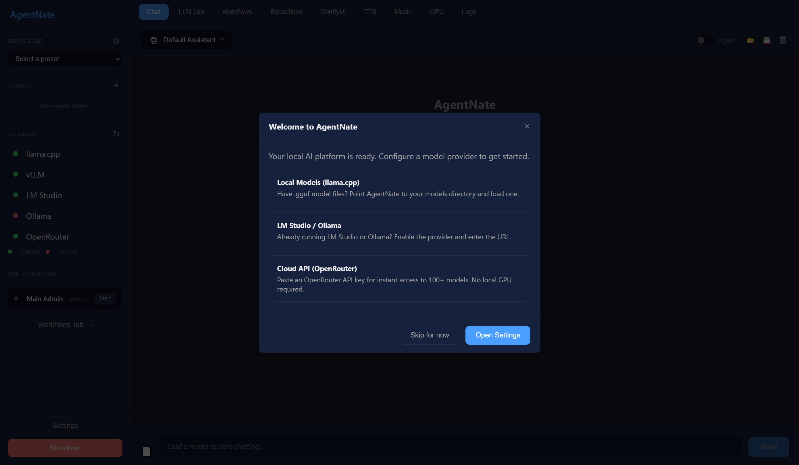
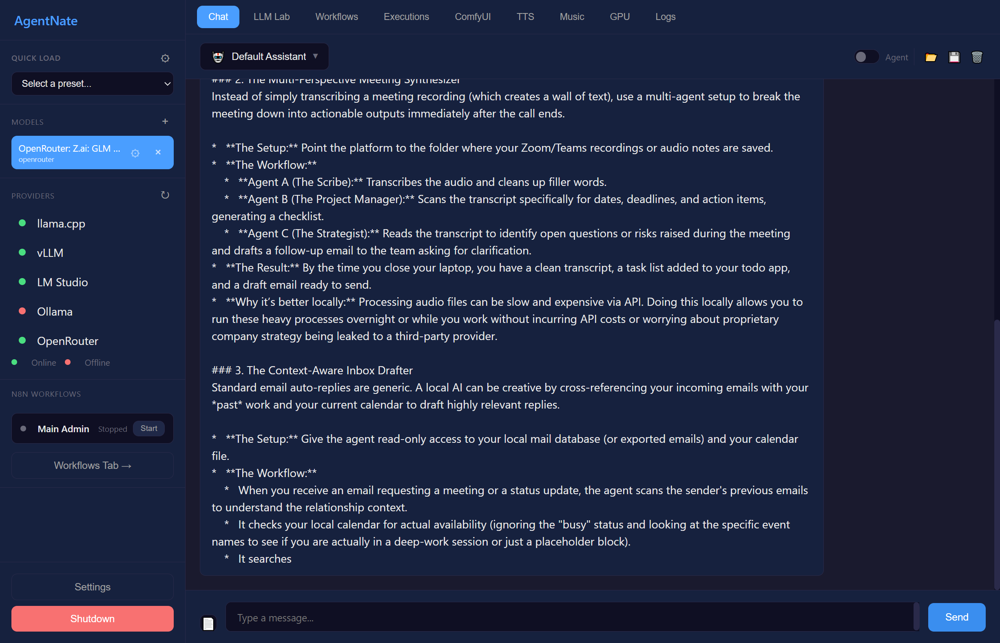
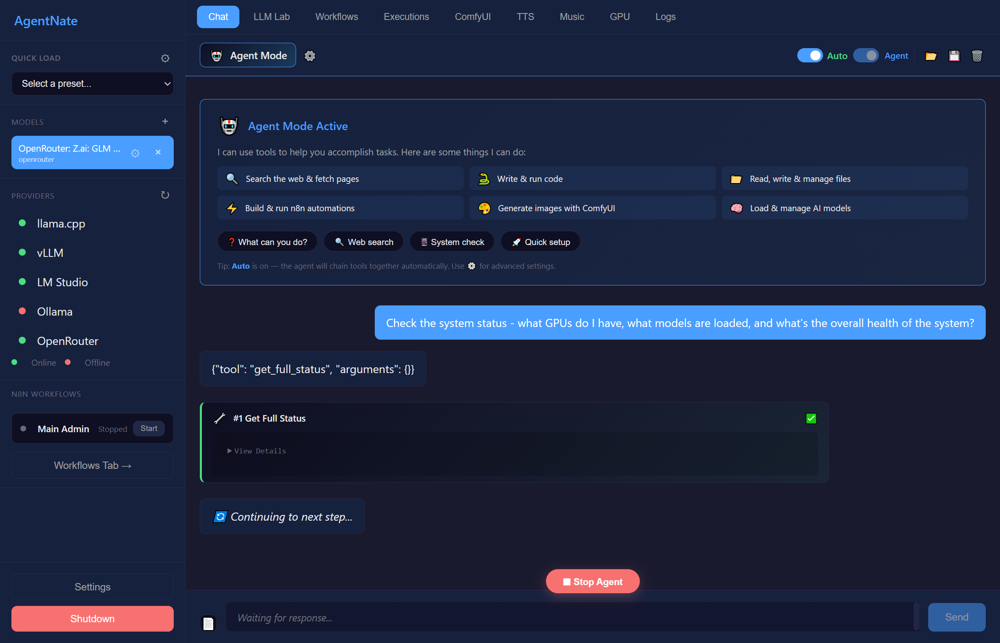
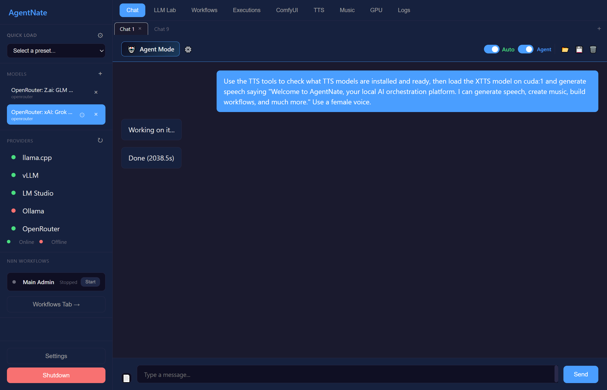
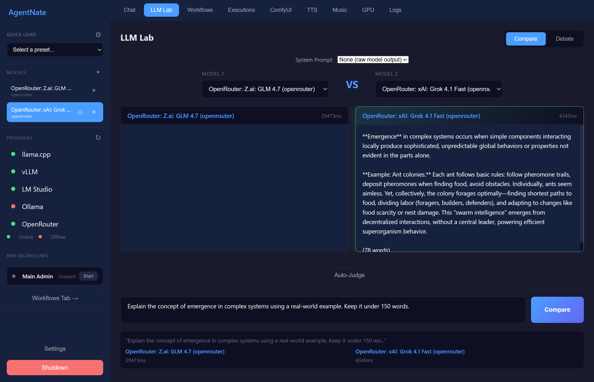
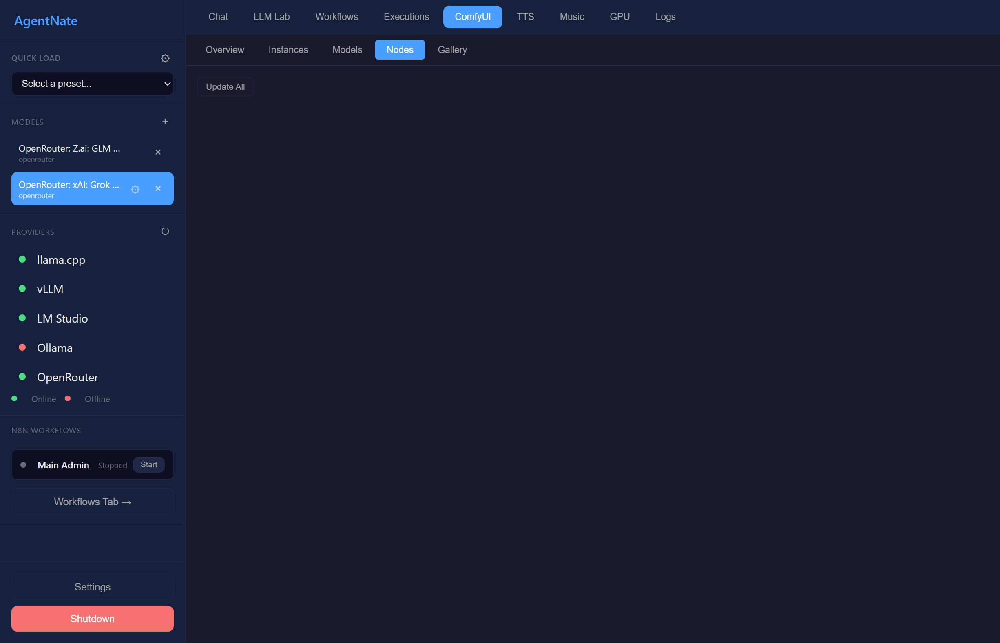
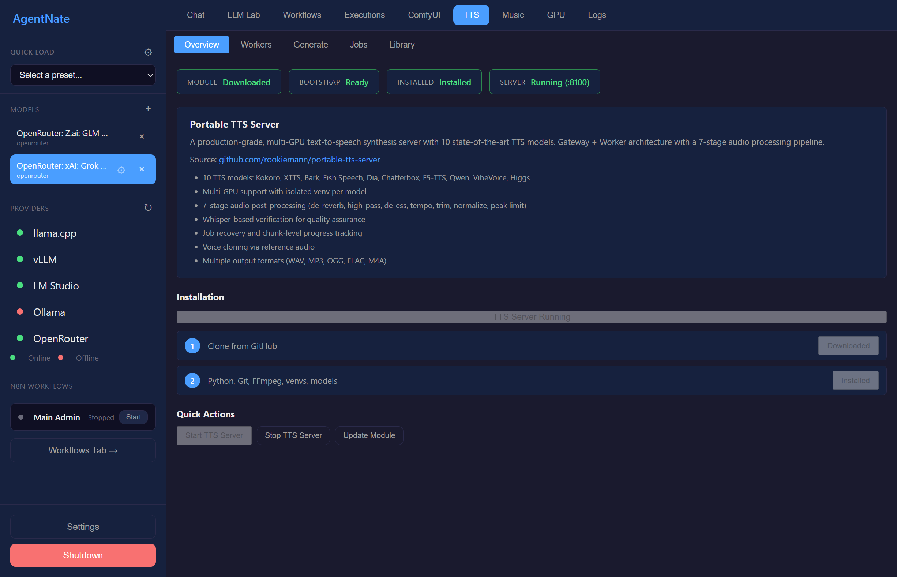
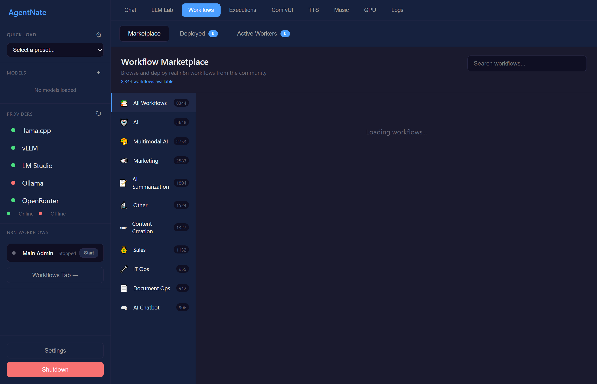
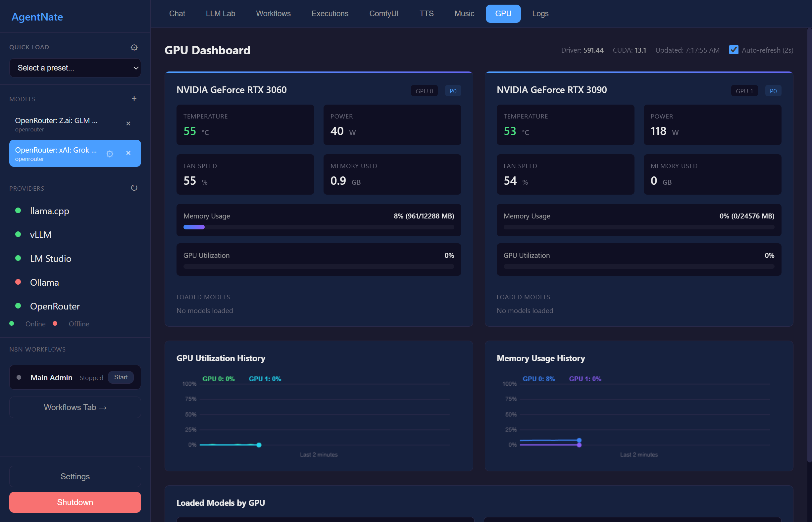

# AgentNate


**Your entire AI stack in one portable folder. No install. No Docker. No admin rights. Just double-click and go.**



**AgentNate** is a local-first AI orchestration platform that brings together large language models, workflow automation, image/video generation, text-to-speech, and music generation into a single unified interface. Everything runs on your machine — no cloud required.

The name comes from **n8n** (pronounced "n-eight-n" → "Nate"), the open-source workflow engine at the platform's core. AgentNate wraps n8n with an AI layer so agents can build, deploy, execute, and tear down workflows from natural language — no visual editor required.

---

## Highlights

- **100% Portable** -- One folder. Copy it to a USB drive, another PC, a network share — it still works. No system Python, no system Node.js, no PATH changes, no registry entries, no Docker, no WSL, no admin rights. Delete the folder and it's gone.
- **One-Click Install** -- Run `install.bat`. It downloads Python, Node.js, all dependencies, Playwright Chromium, and n8n automatically. Walk away and come back to a working system.
- **Multi-Provider LLMs** -- Load models from llama.cpp (local GGUF), LM Studio, Ollama, vLLM, or OpenRouter. Run multiple models simultaneously across multiple GPUs. Hot-swap between providers mid-conversation.
- **Autonomous AI Agents** -- Agents with 187+ tools across 19 categories. Web search, code execution, file management, browser automation, workflow building, image generation, and more. Agents plan, reason, delegate to sub-agents, and remember across sessions.
- **n8n Workflow Engine** -- Full n8n integration with 72 node types. Agents build and deploy complete workflows from natural language. Webhook endpoints, HTTP APIs, LLM chains, conditional logic, scheduling — all without touching the visual editor.
- **ComfyUI Creative Engine** -- Image generation, video synthesis, upscaling, inpainting, ControlNet, and more. 11 workflow templates with automatic model downloads. Agents craft custom ComfyUI pipelines from text descriptions.
- **Text-to-Speech** -- XTTS v2, Fish Speech, and Kokoro engines with voice cloning, multilingual support, and real-time streaming. 12 agent tools for programmatic voice generation.
- **Music Generation** -- Stable Audio Open and ACE-Step engines for text-to-music and lyrics-to-song. Genre detection, CLAP scoring, and batch generation. 12 agent tools.
- **Multi-Panel Chat** -- Run independent conversations side-by-side, each with its own model, persona, and routing configuration. Compare models, test prompts, or run different tasks concurrently.
- **Tool-Level Race Execution** -- When an agent calls a creative tool, race N candidates in parallel and pick the best result. Better outputs without manual re-prompting.
- **OpenAI-Compatible API** -- Drop-in `/v1/chat/completions` endpoint. Works with Continue.dev, Open WebUI, LangChain, n8n's AI nodes, and any OpenAI SDK client.

---

## Quick Start

### Requirements

- **Windows 10 or 11** (x64)
- **NVIDIA GPU** recommended (CUDA-capable, 8GB+ VRAM for local models)
- **Internet connection** for first-time setup (downloads ~500MB of dependencies)

That's it. No Python, no Node.js, no Git, no Docker, no Visual Studio, no CUDA toolkit.

### Install

```
git clone https://github.com/rookiemann/AgentNate.git
cd AgentNate
install.bat
```

Or download the ZIP from [Releases](https://github.com/rookiemann/AgentNate/releases), extract anywhere, and double-click `install.bat`.

The installer runs 7 stages automatically:

| Stage | What It Does | Size |
|-------|-------------|------|
| 1 | Downloads Python 3.14.2 embedded from python.org | ~11 MB |
| 2 | Configures `._pth` for site-packages, installs pip | ~3 MB |
| 3 | Installs all Python packages from requirements.txt | ~200 MB |
| 4 | Installs Playwright Chromium (browser automation) | ~150 MB |
| 5 | Downloads Node.js 24.12.0 portable from nodejs.org | ~45 MB |
| 6 | Installs n8n workflow engine via npm | ~100 MB |
| 7 | Installs llama-cpp-python CUDA wheel (GPU inference) | ~50 MB |

Every stage is **idempotent** — if interrupted, just run `install.bat` again. It skips already-completed stages.

> **No NVIDIA GPU?** Run `install.bat --no-llama` to skip the CUDA wheel. You can still use LM Studio, Ollama, or OpenRouter as providers.

### Launch

```
launcher.bat              :: Opens in your default browser
launcher.bat --server     :: API server only (no browser)
launcher.bat --desktop    :: Desktop window (PyWebView)
```

The launcher auto-detects if dependencies are missing and runs the installer if needed. On subsequent launches, it starts instantly.

### Update

```
update.bat                :: Update everything
update.bat --python       :: Python packages only
update.bat --node         :: n8n only
update.bat --cuda         :: Reinstall CUDA wheel
```

---

## What's Inside

```
AgentNate/
├── install.bat              # One-click installer (7 stages)
├── launcher.bat             # Start the app (auto-installs if needed)
├── update.bat               # Update all components
├── run.py                   # Python entry point
├── requirements.txt         # Python dependencies
│
├── backend/                 # FastAPI server (port 8000)
│   ├── server.py            # Main server with CORS, WebSocket, static files
│   ├── agent_loop.py        # Reusable agent execution loop
│   ├── personas.py          # 15 AI personas with tool groups
│   ├── tools/               # 187+ tools in 19 categories
│   │   ├── tool_router.py   # Central dispatcher
│   │   ├── agent_tools.py   # Sub-agent spawn, routing, memory
│   │   ├── workflow_tools.py# n8n workflow building (19 tools)
│   │   ├── comfyui_tools.py # ComfyUI creative tools (36 tools)
│   │   ├── tts_tools.py     # Text-to-speech (12 tools)
│   │   ├── music_tools.py   # Music generation (12 tools)
│   │   └── ...              # Browser, vision, GGUF, codebase, etc.
│   └── routes/              # REST API endpoints
│
├── providers/               # LLM provider integrations
│   ├── llamacpp_provider.py # Local GGUF via llama-cpp-python
│   ├── lmstudio_provider.py # LM Studio HTTP API
│   ├── ollama_provider.py   # Ollama HTTP API
│   ├── vllm_provider.py     # vLLM OpenAI-compat API
│   └── openrouter_provider.py # OpenRouter cloud API
│
├── ui/                      # Frontend (vanilla JS, no build step)
│   ├── index.html           # Single-page application
│   ├── js/                  # 18 ES modules
│   └── styles.css           # All styles
│
├── modules/                 # External engines (auto-cloned on first use)
│   ├── comfyui/             # → rookiemann/comfyui-portable-installer
│   ├── tts/                 # → rookiemann/portable-tts-server
│   └── music/               # → rookiemann/portable-music-server
│
├── models/                  # Downloaded model files
│   └── gguf/                # GGUF models (searched + downloaded from HuggingFace)
│
├── python/                  # Portable Python 3.14.2 (auto-installed)
├── node/                    # Portable Node.js 24.12.0 (auto-installed)
├── node_modules/            # n8n and npm packages (auto-installed)
│
├── manual/                  # User manual (4,000+ lines, 89 screenshots)
│   ├── AgentNate-Manual.md  # Full documentation source
│   ├── AgentNate-Manual.pdf # PDF version (140+ pages)
│   ├── build_pdf.py         # MD → PDF converter
│   ├── build_wiki.py        # MD → GitHub Wiki splitter
│   └── screenshots/         # All manual screenshots
│
├── data/                    # Runtime data (conversations, settings, manifests)
├── settings/                # Configuration manager
├── workflows/               # Pre-built workflow templates
└── orchestrator/            # Request queue and health monitoring
```

---

## The Agent System

AgentNate agents aren't simple chatbots. They have access to **187 tools across 19 categories** and can autonomously chain them together to accomplish complex tasks.

### What Agents Can Do

| Category | Tools | Examples |
|----------|-------|---------|
| **Chat & Reasoning** | 8 | Conversation management, system prompts, context control |
| **Web & Research** | 12 | DuckDuckGo search, URL fetching, content extraction, web scraping |
| **Code Execution** | 6 | Run Python/JS/Bash, manage virtual environments, install packages |
| **File Management** | 10 | Read, write, search, organize files on disk |
| **Browser Automation** | 8 | Navigate pages, click elements, fill forms, take screenshots |
| **Vision & Analysis** | 6 | Describe images, extract text, compare visuals, detect objects |
| **n8n Workflows** | 19 | Build, deploy, activate, execute, monitor, delete workflows |
| **ComfyUI Creative** | 36 | Generate images/video, build pipelines, manage models, batch process |
| **Text-to-Speech** | 12 | Generate speech, clone voices, stream audio, manage engines |
| **Music Generation** | 12 | Compose music, generate sound effects, manage models |
| **GGUF Models** | 5 | Search HuggingFace, download GGUF models, track progress |
| **Sub-Agents** | 8 | Spawn workers, delegate tasks, coordinate parallel work |
| **Memory** | 6 | Persistent memory across conversations |
| **Codebase** | 11 | Self-awareness via structured manifest |
| **And more...** | | Marketplace, routing, settings, GPU monitoring |

### Agent Walkthrough

```
You:    "Generate a landscape painting of mountains at sunset,
         then create a workflow that emails me when new images are generated"

Agent:  [Thinking] This requires two tasks: image generation and workflow creation.
        I'll delegate image generation to a sub-agent and build the workflow myself.

        → spawn_agent("ai_creative", "Generate mountain sunset landscape painting")
        → comfyui_generate_image(prompt="majestic mountain range at golden hour sunset...")
        → comfyui_await_result(instance_id=1, prompt_id="abc123")
        → build_workflow(nodes=[webhook, comfyui_trigger, email_send], deploy=true)

Agent:  Done! I've generated your landscape painting (saved to ComfyUI output folder)
        and deployed an n8n workflow that watches for new generations and sends an email.
```

---

## Providers

AgentNate supports loading models from multiple providers simultaneously. Mix local and cloud, switch mid-conversation, or compare them in LLM Lab.

| Provider | Type | GPU Required | Notes |
|----------|------|-------------|-------|
| **llama.cpp** | Local GGUF | Yes (CUDA) | Direct model loading, full control over GPU layers and context |
| **LM Studio** | Local HTTP | Depends | Connect to running LM Studio instance, any model it supports |
| **Ollama** | Local HTTP | Depends | Connect to running Ollama instance |
| **vLLM** | Local HTTP | Yes | High-throughput serving, continuous batching |
| **OpenRouter** | Cloud API | No | Access to 200+ models (GPT-4, Claude, Gemini, Llama, etc.) |

---

## Screenshots

<details>
<summary><strong>Click to expand screenshots</strong></summary>

### Chat & Agent Mode
| | |
|---|---|
|  |  |
| Chat with streaming responses | Agent executing tools autonomously |

### Multi-Panel & LLM Lab
| | |
|---|---|
|  |  |
| Side-by-side independent conversations | Compare models head-to-head |

### ComfyUI & Creative Tools
| | |
|---|---|
|  |  |
| ComfyUI instance management | AI-generated artwork |

### TTS & Music
| | |
|---|---|
|  |  |
| Text-to-Speech with voice cloning | Music generation studio |

### Workflows & System
| | |
|---|---|
|  |  |
| n8n workflow management | Real-time GPU monitoring |

</details>

---

## Documentation

- **[User Manual (Wiki)](https://github.com/rookiemann/AgentNate/wiki)** -- Full documentation with 89 screenshots covering every feature
- **[PDF Manual](manual/AgentNate-Manual.pdf)** -- 140+ page printable manual (included in repo)
- **[API Docs](http://localhost:8000/docs)** -- Interactive Swagger UI (available when server is running)
- **[OpenAI-Compatible API](https://github.com/rookiemann/AgentNate/wiki/22-API-and-Developer-Reference)** -- Drop-in replacement for OpenAI SDK clients

---

## Portability — How It Works

AgentNate achieves true portability by bundling self-contained runtimes that never touch the host system:

| Component | How | Why |
|-----------|-----|-----|
| **Python 3.14.2** | [Embeddable distribution](https://docs.python.org/3/using/windows.html#the-embeddable-package) with `._pth` configured for site-packages | No system Python, no PATH, no registry |
| **Node.js 24.12.0** | Pre-built binary extracted to `node/` | No system Node, no nvm, no global installs |
| **n8n** | Installed via npm into local `node_modules/` | Workflow engine stays in the folder |
| **Playwright** | Chromium installed to `python/.playwright-browsers/` | Browser automation without system Chrome |
| **llama-cpp-python** | Pre-built CUDA wheel from [custom build](https://github.com/rookiemann/llama-cpp-python-py314-cuda131-wheel) | GPU inference without building from source |
| **ComfyUI** | Managed in `modules/comfyui/` with portable Git | Full creative pipeline, isolated |
| **TTS / Music** | Managed in `modules/tts/` and `modules/music/` | Audio engines with their own Python environments |

**Everything** lives inside the AgentNate folder. Copy it. Move it. Back it up. Put it on a different machine. It just works.

---

## External Modules

AgentNate's creative and audio capabilities are powered by three companion projects that are **automatically cloned on first use**. When you enable ComfyUI, TTS, or Music from the UI, AgentNate pulls the corresponding repo into `modules/` and runs its installer — no manual setup required.

| Module | Repository | What It Provides | Installed To |
|--------|-----------|-----------------|-------------|
| **ComfyUI** | [comfyui-portable-installer](https://github.com/rookiemann/comfyui-portable-installer) | Multi-GPU ComfyUI with 101 pre-built models, custom nodes, multi-instance management | `modules/comfyui/` |
| **TTS** | [portable-tts-server](https://github.com/rookiemann/portable-tts-server) | XTTS v2, Fish Speech, Kokoro TTS engines with voice cloning and real-time streaming | `modules/tts/` |
| **Music** | [portable-music-server](https://github.com/rookiemann/portable-music-server) | Stable Audio Open and ACE-Step music generation with CLAP scoring | `modules/music/` |

Each module is fully self-contained with its own portable Python environment, dependencies, and models. They run as separate processes managed by AgentNate's backend — start, stop, health check, and proxy are all handled automatically.

> **Already have these installed standalone?** AgentNate will detect an existing installation in `modules/` and use it directly. You can also point to a custom path in Settings.

---

## Related Projects

AgentNate builds on and integrates these projects by the same author:

| Project | Description |
|---------|-------------|
| [auto-portable-python-deployer](https://github.com/rookiemann/auto-portable-python-deployer) | The tool that generates portable Python deployment packages (used to bootstrap AgentNate) |
| [comfyui-portable-installer](https://github.com/rookiemann/comfyui-portable-installer) | One-click portable ComfyUI with multi-GPU, 101 models, custom nodes |
| [LocalSoundsAPI](https://github.com/rookiemann/LocalSoundsAPI) | Portable all-in-one audio studio (TTS, music, transcription, video production) |
| [portable-tts-server](https://github.com/rookiemann/portable-tts-server) | Standalone portable TTS server (XTTS, Fish Speech, Kokoro) |
| [portable-music-server](https://github.com/rookiemann/portable-music-server) | Standalone portable music generation server (Stable Audio, ACE-Step) |
| [llama-cpp-python-py314-cuda131-wheel](https://github.com/rookiemann/llama-cpp-python-py314-cuda131-wheel) | Pre-built CUDA wheel for llama-cpp-python on Python 3.14 |
| [n8n-python-portable](https://github.com/rookiemann/n8n-python-portable) | Portable n8n with embedded Python runtime |
| [vllm-windows-build](https://github.com/rookiemann/vllm-windows-build) | vLLM compiled for Windows with CUDA support |

---

## Credits & Acknowledgments

AgentNate is built on the shoulders of incredible open-source projects:

**Core Infrastructure**
- [FastAPI](https://fastapi.tiangolo.com/) -- High-performance async Python web framework
- [n8n](https://n8n.io/) -- Fair-code workflow automation engine
- [ComfyUI](https://github.com/comfyanonymous/ComfyUI) -- Modular Stable Diffusion pipeline
- [llama.cpp](https://github.com/ggerganov/llama.cpp) / [llama-cpp-python](https://github.com/abetlen/llama-cpp-python) -- Local LLM inference

**LLM Providers**
- [LM Studio](https://lmstudio.ai/) -- Local model management and serving
- [Ollama](https://ollama.com/) -- Run LLMs locally
- [vLLM](https://github.com/vllm-project/vllm) -- High-throughput LLM serving
- [OpenRouter](https://openrouter.ai/) -- Unified API for 200+ models

**Creative Engines**
- [Stable Diffusion](https://stability.ai/) / [Flux](https://blackforestlabs.ai/) -- Image generation models
- [Stable Video Diffusion](https://stability.ai/) -- Video synthesis
- [XTTS v2](https://github.com/coqui-ai/TTS) -- Multilingual voice cloning
- [Fish Speech](https://github.com/fishaudio/fish-speech) -- Fast expressive TTS
- [Kokoro](https://huggingface.co/hexgrad/Kokoro-82M) -- Lightweight English TTS
- [Stable Audio Open](https://stability.ai/) -- Text-to-music generation
- [ACE-Step](https://github.com/ace-step/ACE-Step) -- Advanced music generation

**Tools & Libraries**
- [Playwright](https://playwright.dev/) -- Browser automation
- [DuckDuckGo Search](https://github.com/deedy5/ddgs) -- Web search (no API key required)
- [Pydantic](https://docs.pydantic.dev/) -- Data validation
- [httpx](https://www.python-httpx.org/) -- Async HTTP client with streaming and resume support
- [PyMuPDF](https://pymupdf.readthedocs.io/) -- PDF text extraction for RAG
- [HuggingFace](https://huggingface.co/) -- Model hub and GGUF repository

**Built by one person with an AI assist, made possible by thousands of open-source contributors.**

---

## Contributing

Contributions are welcome! See [CONTRIBUTING.md](CONTRIBUTING.md) for guidelines.

- **Bug reports**: [Open an issue](https://github.com/rookiemann/AgentNate/issues/new?template=bug_report.yml)
- **Feature requests**: [Open an issue](https://github.com/rookiemann/AgentNate/issues/new?template=feature_request.yml)
- **Questions & ideas**: [Start a discussion](https://github.com/rookiemann/AgentNate/discussions)

This is an actively developed project. New features ship regularly and feedback directly shapes the roadmap.

---

## License

[MIT](LICENSE) -- Use it, modify it, ship it. Just include the license.
