# AgentNate User Manual

**Version 2.0** | **GitHub**: [github.com/rookiemann/AgentNate](https://github.com/rookiemann/AgentNate)

---

## Table of Contents

1. [Introduction](#1-introduction)
2. [Installation & Getting Started](#2-installation-getting-started)
3. [Dashboard Overview](#3-dashboard-overview)
4. [Model Management](#4-model-management)
5. [Chat & Agent System](#5-chat-agent-system)
6. [Multi-Panel Chat](#6-multi-panel-chat)
7. [Sub-Agent System](#7-sub-agent-system)
8. [Routing Presets](#8-routing-presets)
9. [Agent Intelligence](#9-agent-intelligence)
10. [Tool-Level Race Execution](#10-tool-level-race-execution)
11. [Agent Memory](#11-agent-memory)
12. [LLM Lab](#12-llm-lab)
13. [n8n Workflow Integration](#13-n8n-workflow-integration)
14. [Workflow Bridge Patterns](#14-workflow-bridge-patterns)
15. [ComfyUI Creative Engine](#15-comfyui-creative-engine)
16. [Text-to-Speech (TTS)](#16-text-to-speech-tts)
17. [Music Generation](#17-music-generation)
18. [GPU Monitoring](#18-gpu-monitoring)
19. [Settings & Configuration](#19-settings-configuration)
20. [Provider Architecture](#20-provider-architecture)
21. [Batch Concurrency & Scaling](#21-batch-concurrency-scaling)
22. [API & Developer Reference](#22-api-developer-reference)
23. [Personas Reference](#23-personas-reference)
24. [Tools Reference](#24-tools-reference)
25. [Architecture Overview](#25-architecture-overview)
26. [Troubleshooting](#26-troubleshooting)
27. [Quick Reference Card](#quick-reference-card)
28. [Acknowledgments](#28-acknowledgments)

---

## 1. Introduction

### What is AgentNate?

AgentNate is a **local-first AI orchestration platform** that brings together large language models, workflow automation, image generation, text-to-speech, and music generation into a single unified interface. It runs entirely on your machine with no cloud dependencies required (though cloud providers like OpenRouter are supported).

The name **"AgentNate"** comes from **n8n** (pronounced "n-eight-n" → "Nate") — the open-source workflow automation engine at the platform's core. n8n isn't just a plugin; it's the backbone that powers workflow building, multi-step automation, credential management, and concurrent execution. AgentNate wraps n8n with an AI layer so agents can spin up, deploy, execute, and tear down workflows from natural language — no visual editor required.

### Key Capabilities

- **Multi-Provider LLM Orchestration** - Run models via llama.cpp, LM Studio, Ollama, vLLM, or OpenRouter
- **187+ Agent Tools** - Web search, file operations, code execution, browser automation, database queries, and more
- **15 Specialized Personas** - Pre-configured AI identities (System Agent, Researcher, Coder, Automator, etc.)
- **n8n Workflow Automation** - Build and deploy 72 node types for automated pipelines
- **ComfyUI Creative Engine** - Multi-instance image, video, and media generation with model pool and smart routing
- **Text-to-Speech** - 10 TTS models (Kokoro, XTTS, Dia, Bark, Fish Speech, and more)
- **Music Generation** - 8 music models (ACE-Step, MusicGen, Riffusion, Stable Audio, and more)
- **Sub-Agent System** - Spawn parallel AI workers with automatic model routing
- **Multi-Panel Chat** - Run concurrent conversations with different models side by side
- **100% Portable** - Everything runs from a single directory, no system-wide installation

### System Requirements

| Component | Minimum | Recommended |
|-----------|---------|-------------|
| OS | Windows 10+ | Windows 10/11 |
| RAM | 16 GB | 32 GB |
| GPU | 8 GB VRAM (RTX 3060) | 24 GB VRAM (RTX 3090/4090) |
| Storage | 20 GB (base) | 100+ GB (with models) |
| CPU | 4 cores | 8+ cores |

---

## 2. Installation & Getting Started

### Overview

AgentNate is **100% portable** — zero system-level installs required. The auto-installer downloads and configures everything into a single self-contained directory. No admin rights needed, no PATH modifications, no registry entries.

### Quick Start (New Install)

1. Clone or extract AgentNate to any directory (e.g., `E:\AgentNate\`)
2. Double-click **`launcher.bat`** — it auto-installs on first run, then starts the app
3. Open `http://127.0.0.1:8000` in your browser

That's it. The launcher detects missing dependencies and runs `install.bat` automatically.

### Auto-Installer (`install.bat`)

The installer handles everything in 7 stages:

| Stage | Component | Size | What it does |
|-------|-----------|------|-------------|
| 1 | Python 3.14.2 | ~20 MB | Downloads embedded Python from python.org |
| 2 | pip | ~3 MB | Bootstraps pip via get-pip.py, configures `._pth` for site-packages |
| 3 | Python packages | ~180 MB | Installs 65+ packages from `requirements.txt` (llama-cpp filtered out) |
| 4 | Playwright Chromium | ~150 MB | Downloads Chromium for browser automation tools |
| 5 | Node.js 24.12.0 | ~70 MB | Downloads portable Node.js from nodejs.org |
| 6 | n8n workflow engine | ~1 GB | Installs n8n and all npm dependencies |
| 7 | llama-cpp-python | ~250 MB | Pre-built CUDA 13.1 wheel for local LLM inference |

**Total install size: ~1.5 GB** (including all runtimes and dependencies)

**Usage:**
```bash
install.bat              # Full install (all 7 stages)
install.bat --no-llama   # Skip CUDA llama-cpp-python (stages 1-6 only)
```

**Idempotent stages** — Each stage checks for marker files before running. Re-running `install.bat` skips already-completed stages. To force a stage to re-run, delete the corresponding marker:

| Marker file | Stage |
|-------------|-------|
| `python\python.exe` | Stage 1 (Python) |
| `python\Scripts\pip.exe` | Stage 2 (pip) |
| `python\.packages-installed` | Stage 3 (Python packages) |
| `python\.playwright-installed` | Stage 4 (Playwright) |
| `node\node.exe` | Stage 5 (Node.js) |
| `node_modules\n8n\bin\n8n` | Stage 6 (n8n) |
| `python\.llama-cuda-installed` | Stage 7 (llama-cpp CUDA) |

### Launcher (`launcher.bat`)

The launcher is the recommended way to start AgentNate. It checks 5 dependency markers and runs `install.bat` automatically if any are missing:

```bash
launcher.bat              # Auto-install + start (browser mode, default)
launcher.bat --server     # API server only (no browser auto-open)
launcher.bat --browser    # Start and open in default browser
launcher.bat --desktop    # Start in PyWebView desktop window
launcher.bat --no-llama   # Pass to install.bat if install is needed
```

### Updater (`update.bat`)

Selectively updates installed components without reinstalling everything:

```bash
update.bat                # Update all (Python packages + n8n + Playwright)
update.bat --python       # Update Python packages only
update.bat --node         # Update n8n only
update.bat --playwright   # Update Playwright Chromium only
update.bat --cuda         # Reinstall CUDA llama-cpp-python wheel
update.bat --python --cuda  # Combine flags
```

### Manual Start (without launcher)

```bash
cd E:\AgentNate
python\python.exe run.py --mode server
```

**Launch modes:**

| Mode | Command | Description |
|------|---------|-------------|
| Server | `--mode server` | API only (open browser manually) |
| Browser | `--mode browser` | Starts server and opens browser automatically |
| Desktop | `--mode desktop` | Launches in a PyWebView desktop window |

**Additional flags:**

- `--host 0.0.0.0` - Bind to all interfaces (LAN access)
- `--port 9000` - Use a different port
- `--reload` - Auto-reload on code changes (development)

### Directory Structure

```
E:\AgentNate\
  install.bat           # Auto-installer (7 stages)
  launcher.bat          # Auto-install + start
  update.bat            # Selective updater
  run.py                # Python server launcher
  requirements.txt      # Python package list
  package.json          # n8n npm dependency
  python\               # Embedded Python 3.14.2 (created by installer)
    python.exe          #   Python interpreter
    Scripts\pip.exe     #   pip package manager
    Lib\site-packages\  #   Installed packages
    .playwright-browsers\  # Chromium (portable, not in AppData)
    .packages-installed #   Stage 3 marker
    .playwright-installed  # Stage 4 marker
    .llama-cuda-installed  # Stage 7 marker
  node\                 # Embedded Node.js 24.12.0 (created by installer)
    node.exe            #   Node.js runtime
    npm.cmd             #   npm package manager
  node_modules\         # n8n and npm dependencies (~1 GB)
  backend\              # FastAPI backend server
  ui\                   # Web frontend (HTML/CSS/JS)
  providers\            # LLM provider adapters
  orchestrator\         # Model orchestrator
  settings\             # Settings manager
  models\               # Downloaded GGUF models (auto-created by downloader)
    gguf\               #   GGUF model files (.gguf)
  data\                 # Persistent data (conversations, memory, manifests)
  workflows\            # Pre-built workflow templates
  modules\              # Optional modules (ComfyUI, TTS, Music)
  envs\                 # Virtual environments (vLLM)
  manual\               # This manual and screenshots
```

### Portability

AgentNate can be copied to a USB drive, another machine, or a different directory and will work immediately. Everything is self-contained:

- **Python** — Embedded distribution with `._pth` file pointing to local `Lib\site-packages`
- **Node.js** — Standalone portable binary
- **Playwright browsers** — Stored in `python\.playwright-browsers\` (not system-level `%LOCALAPPDATA%`)
- **No system PATH changes** — launcher.bat sets PATH locally per session
- **No registry entries** — Nothing written outside the app directory
- **No admin rights** — Everything runs in user space

### Troubleshooting

**Windows Defender warnings during npm install** — You may see `TAR_ENTRY_ERROR` warnings during Stage 6. This is Windows Defender real-time scanning interfering with npm file extraction. The install completes successfully despite the warnings. To speed up the install, temporarily add the AgentNate directory to Defender exclusions.

**Playwright browser install fails** — Stage 4 is non-critical. Browser automation tools won't work, but everything else functions normally. Retry later with: `python\python.exe -m playwright install chromium`

**Force full reinstall** — Delete the `python\` and `node\` directories, then run `launcher.bat` or `install.bat` again.

### First Launch

On first launch, you'll see the welcome modal with quick-start guidance:

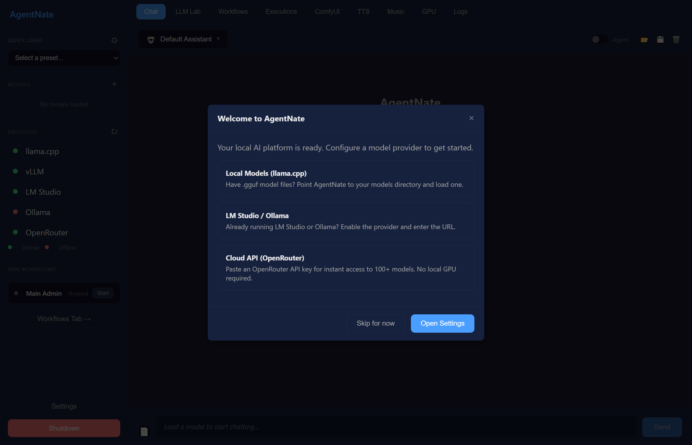

The modal guides you through the initial setup: loading your first model, choosing a provider, and understanding the interface.

---

## 3. Dashboard Overview

### Main Interface

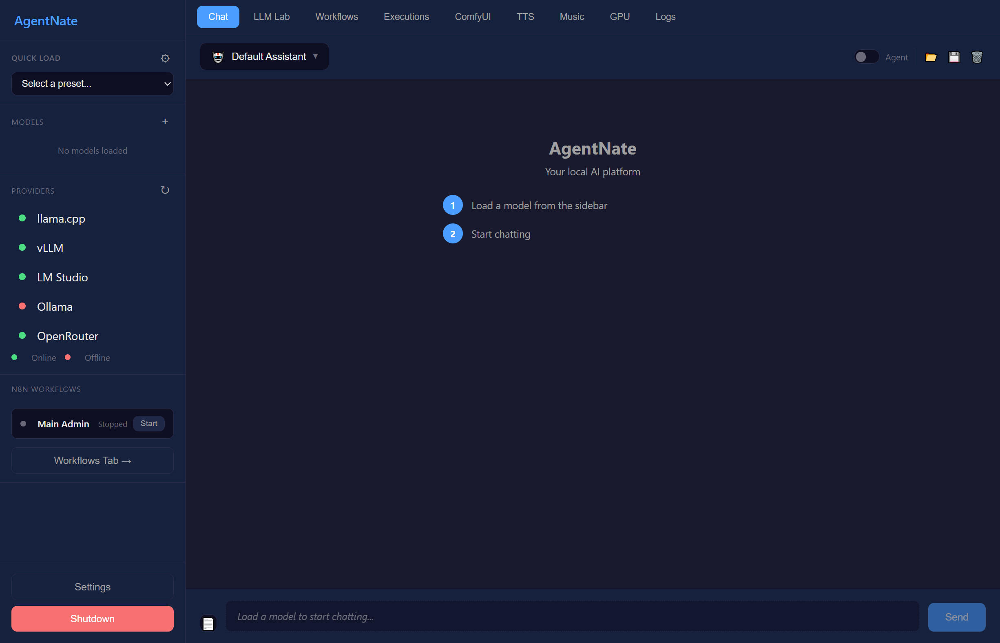

When you first open AgentNate with no models loaded, you see the clean dashboard. The chat area displays a welcome message prompting you to load a model:


Once models are loaded and services are running, the dashboard fills in with live status indicators:


The AgentNate interface consists of three main areas:

#### Sidebar (Left)

The sidebar provides quick access to core system controls:

- **Quick Load** - Dropdown of saved model presets for one-click model loading. Presets are saved server-side and polled every 2 seconds on page load (5-minute timeout)
- **Models** - Currently loaded models with status indicators (green circle = loaded, spinner = loading). Click **+** to open the Load Model modal
- **Providers** - Status of all configured providers (green = online, red = offline). Providers are auto-detected on startup and polled periodically
- **n8n Workflows** - n8n instance status with Start/Stop control. Shows "Running on port 5678" when active
- **Settings** button (gear icon) - Opens the configuration modal with 7 categories
- **Shutdown** button (red) - Gracefully unloads all models, stops n8n, ComfyUI, TTS, and Music servers

#### Tab Bar (Top)

Nine main tabs organize all features:

| Tab | Purpose |
|-----|---------|
| **Chat** | Primary AI conversation interface with agent mode |
| **LLM Lab** | Compare and debate models side-by-side |
| **Workflows** | n8n marketplace and deployed workflow management |
| **Executions** | Workflow execution history and debugging |
| **ComfyUI** | AI image, video, and media generation |
| **TTS** | Text-to-speech interface |
| **Music** | AI music generation interface |
| **GPU** | Real-time GPU monitoring dashboard |
| **Logs** | Application log viewer |

#### Content Area (Center)

The main content area changes based on the selected tab. By default, it shows the Chat tab.

### Tab Visual Tour

Each tab provides a focused interface for its feature area. Here's what each major tab looks like:

**ComfyUI Tab** — Manages AI media generation instances, models, and gallery:

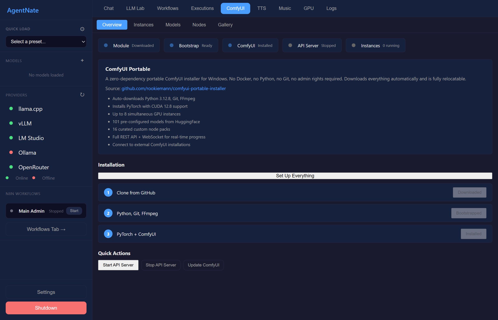

**TTS Tab** — Text-to-speech model management, generation, and audio library:

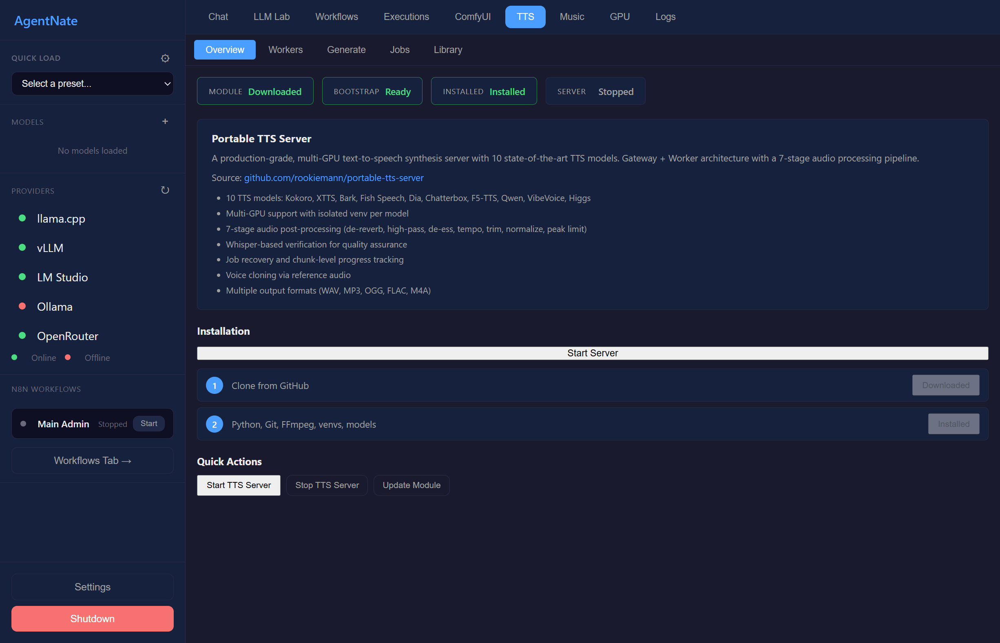

**Music Tab** — AI music generation with model workers and output library:

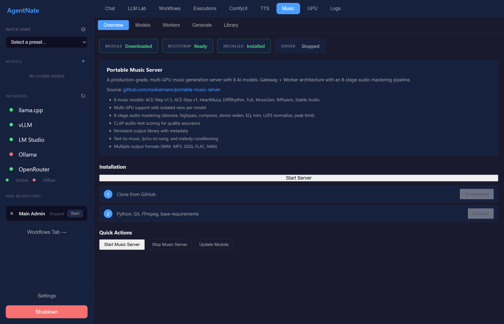

**GPU Tab** — Real-time GPU metrics with utilization charts and model mapping:

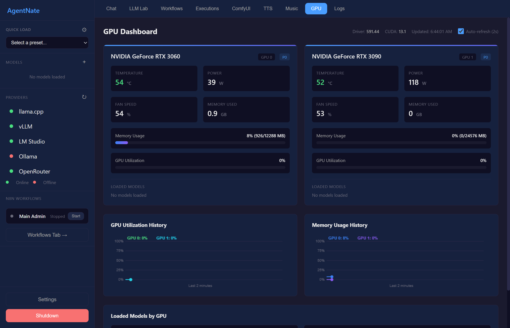

**Logs Tab** — Live application logs with level filtering and auto-scroll:

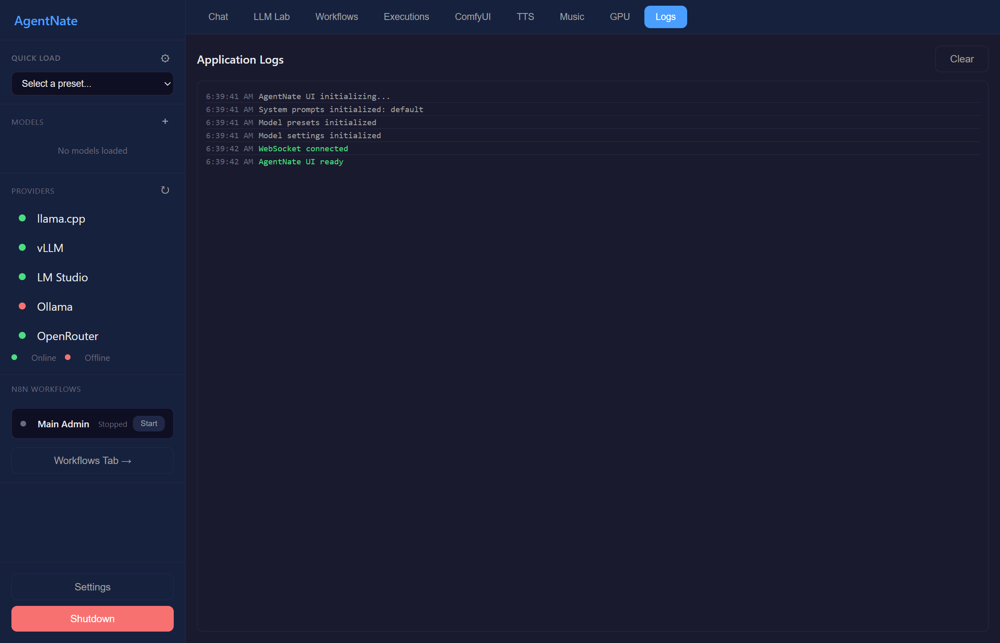

The Chat, LLM Lab, Workflows, and Executions tabs are covered in detail in their respective sections below.

---

## 4. Model Management

### Loading a Model

There are two ways to load a model:

**Method 1: Quick Load Presets** — Select a saved preset from the "Quick Load" dropdown in the sidebar. The model loads immediately with pre-configured settings. This is the fastest path from zero to chatting.

**Method 2: Load Model Dialog** — Click the **+** button in the sidebar Models section to open the Load Model modal with full configuration options.

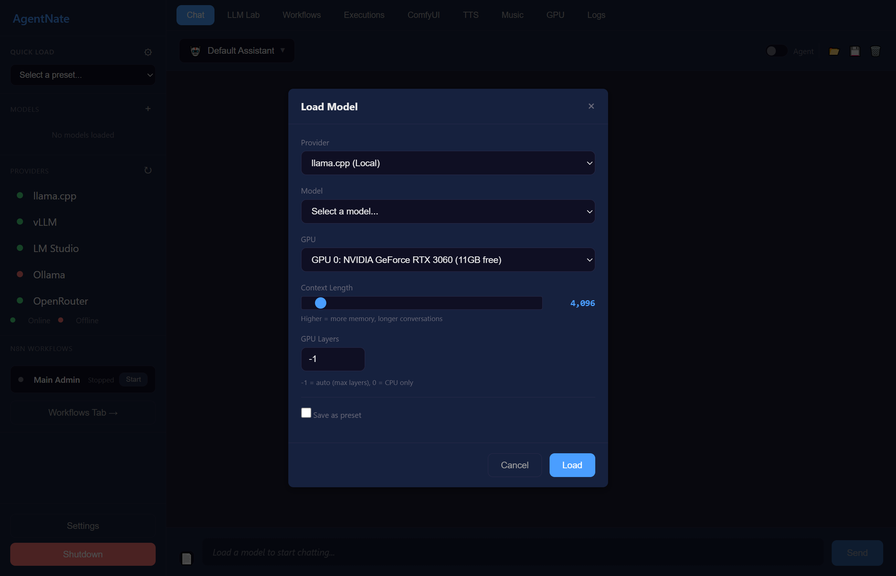

AgentNate supports multiple providers, each with its own configuration:

#### llama.cpp (Local)

The built-in llama.cpp provider runs GGUF models directly on your GPU.

**Configuration:**
- **Model Path** - Path to a `.gguf` file on disk
- **Context Size** - Token context window (default: 4096, max varies by model)
- **GPU Layers** - Number of layers to offload to GPU (`-1` = all layers)
- **GPU Device** - Which GPU to use (0, 1, etc.)
- **Threads** - CPU threads for computation

> **Tip**: If you have multiple GPUs, load models on your highest-VRAM GPU. Use the **GPU Device** selector to choose which GPU receives the model. The GPU tab shows live VRAM usage to help you decide.

#### LM Studio

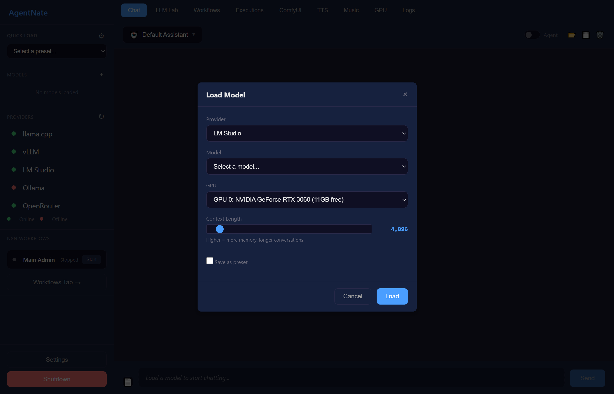

Connect to a running LM Studio server:

- **Host** - LM Studio server address (default: `http://127.0.0.1`)
- **Port** - LM Studio port (default: `1234`)
- **Model Name** - The model identifier as shown in LM Studio

#### OpenRouter (Cloud)

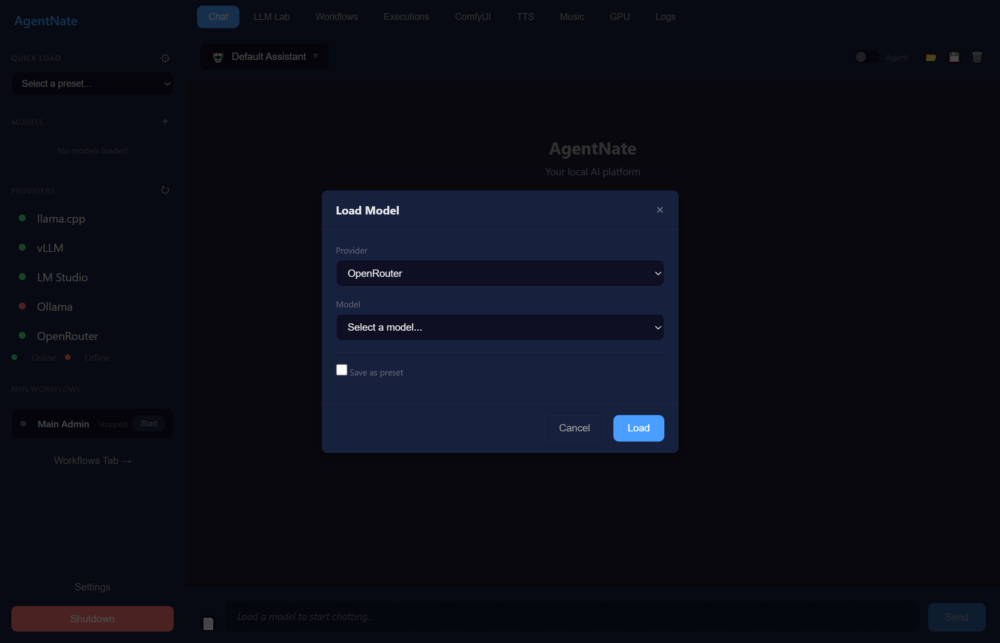

Access cloud models via OpenRouter API:

- **API Key** - Your OpenRouter API key
- **Model** - Select from available cloud models (GPT-4, Claude, Mixtral, etc.)

#### Other Providers

- **Ollama** - Connect to a running Ollama server
- **vLLM** - High-throughput inference server (requires separate vLLM environment)

### Model Presets

Save frequently-used model configurations as presets for one-click loading:

1. Load a model with your preferred settings
2. Click **Save as Preset** and give it a name (e.g., "Fast Coding Setup")
3. The preset appears in the **Quick Load** dropdown in the sidebar
4. Use the gear icon next to Quick Load to manage, rename, or delete presets

**What's saved in a preset:**
- Provider type (llama.cpp, LM Studio, OpenRouter, etc.)
- Model identifier (file path or model ID)
- Context length (`n_ctx`)
- GPU layers (`n_gpu_layers`, -1 = all)
- GPU index (which GPU to load on)
- Display name

Presets persist server-side and load instantly. The sidebar Quick Load dropdown shows the model name and key parameters as a tooltip (e.g., "granite-3.3-8b-instruct (ctx: 25088, layers: -1)").

### Model Loading

When you load a model, a loading indicator appears:

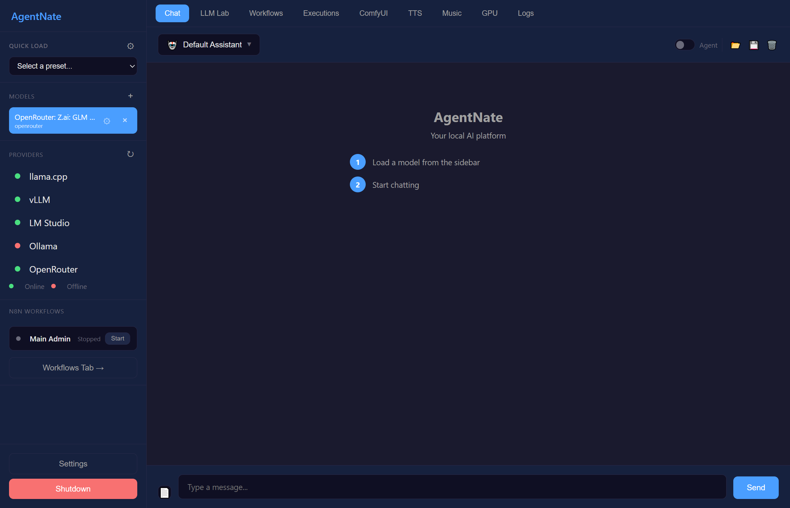

Local models (llama.cpp, vLLM) may take 30-120 seconds depending on model size and storage speed. Cloud models (OpenRouter) connect in 1-2 seconds. The preset loader polls every 2 seconds until the model is ready, with a 5-minute timeout.

### Model Loaded State

Once a model loads successfully, it appears in the sidebar Models section with its provider tag and control buttons:


Each loaded model shows:
- **Model name** (e.g., "OpenRouter: Z.ai: GLM 4.7")
- **Provider badge** (e.g., "openrouter")
- **Settings gear** — adjust parameters for this instance
- **X button** — unload the model

You can load multiple models simultaneously. Here's the sidebar with two models loaded:

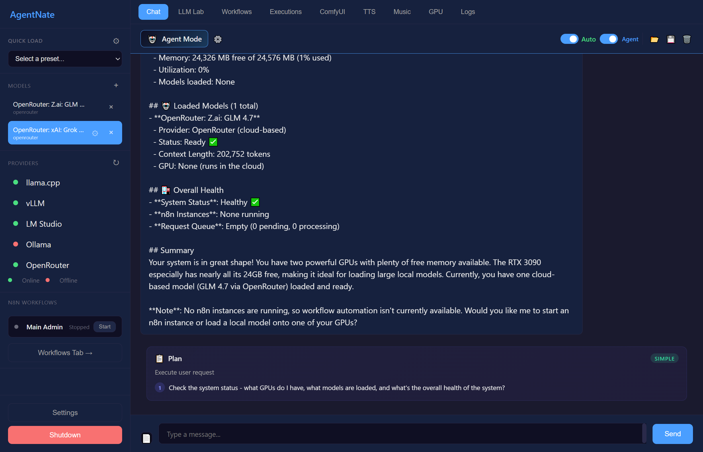

### Unloading Models

Click the **X** next to any loaded model in the sidebar to unload it and free GPU memory.

### GGUF Model Search & Download

Don't have any local models yet? AgentNate includes a built-in **GGUF model browser** that searches HuggingFace directly from the Load Model dialog — no need to visit external websites, use `git clone`, or manually download files.

#### Finding Models

When you select **llama.cpp** as the provider in the Load Model dialog, a search bar appears:

1. Type a model name (e.g., "Llama 3.1 8B", "Qwen2.5 Coder", "Mistral")
2. Click **Search** or press Enter
3. Results show matching GGUF repositories with download counts and authors

The search queries the HuggingFace API filtered to GGUF-format models. Results are sorted by download count, so popular quantized models from well-known publishers (bartowski, unsloth, QuantFactory, TheBloke, mradermacher) appear first.

#### Choosing a Quantization

Click a result to see all available GGUF files in that repository. Each file shows:

- **Filename** — includes the quantization level (e.g., `Q4_K_M`, `Q8_0`, `IQ4_XS`)
- **File size** — in GB
- **Quantization badge** — extracted from the filename
- **Recommended** badge — marks `Q4_K_M` as the best balance of quality and size

**Quantization guide:**

| Level | Quality | Size | Best for |
|-------|---------|------|----------|
| Q8_0 | Highest | ~8 GB per 8B model | Maximum quality, plenty of VRAM |
| Q6_K | Very high | ~6.5 GB | Near-lossless, moderate VRAM |
| **Q4_K_M** | **Good (recommended)** | **~5 GB** | **Best quality/size balance** |
| Q4_K_S | Good | ~4.5 GB | Slightly smaller than Q4_K_M |
| Q3_K_M | Acceptable | ~3.5 GB | Tight VRAM budgets |
| IQ4_XS | Good | ~4 GB | Importance-weighted, efficient |
| Q2_K | Low | ~3 GB | Minimum viable quality |

Files are sorted by quality (best first) so the top options are always the highest fidelity.

#### Downloading

Click the **Download** button next to any file. The download starts immediately with:

- **Progress bar** — real-time percentage
- **Speed indicator** — MB/s (rolling 10-second average)
- **ETA** — estimated time remaining
- **Cancel button** — stop the download at any time

Downloads use HTTP streaming with **resume support** — if a download is interrupted (network drop, app restart), restarting the same download continues from where it left off rather than starting over. This is important for large files (7B models are typically 4-8 GB, 70B models can be 40+ GB).

**Concurrent downloads** are limited to 2 at a time. Additional downloads queue automatically.

#### After Download

Downloaded models are saved to the `models/gguf/` directory inside your AgentNate folder. Once a download completes:

- If the llama.cpp provider is currently selected, the **model list auto-refreshes** so the new model appears immediately
- The model file path is ready to use — select it and click Load
- No manual path entry needed

#### Agent-Driven Downloads

In agent mode, the AI can search for and download models on your behalf using 5 dedicated tools:

1. **`gguf_search`** — Search HuggingFace for GGUF models by name
2. **`gguf_list_files`** — List available files and quantizations in a repository
3. **`gguf_download`** — Start downloading a specific GGUF file
4. **`gguf_download_status`** — Check download progress (percentage, speed, ETA)
5. **`gguf_cancel_download`** — Cancel an active download

The tools include hint chains so the agent follows the natural workflow: search → list files → download → poll status → load model. When the download completes, the status hint includes the exact `load_model` call with the correct file path and GPU assignment.

**Example agent interaction:**
> **You:** "Download a good coding model around 8B parameters"
>
> **Agent:** *Searches for "coder 8B GGUF" → finds Qwen2.5-Coder-7B-Instruct-GGUF → lists files → recommends Q4_K_M (4.7 GB) → starts download → polls until complete → loads the model*

#### GGUF Download REST API

For programmatic access, 8 REST endpoints are available under `/gguf/`:

| Method | Endpoint | Description |
|--------|----------|-------------|
| GET | `/gguf/search?query=...&limit=20` | Search HuggingFace for GGUF repos |
| GET | `/gguf/files/{owner}/{repo}` | List GGUF files in a repository |
| POST | `/gguf/download` | Start a download (body: `repo_id`, `filename`) |
| GET | `/gguf/downloads` | List all active and recent downloads |
| GET | `/gguf/downloads/{id}` | Get status of a specific download |
| DELETE | `/gguf/downloads/{id}` | Cancel an active download |
| GET | `/gguf/directory` | Get models directory info |
| POST | `/gguf/directory/ensure` | Create models directory if missing |

---

## 5. Chat & Agent System

### Basic Chat

The Chat tab is the primary interaction interface. It supports both simple chat and full agent mode.

**Sending Your First Message:**

1. Ensure at least one model is loaded (the input will be disabled until a model is available)
2. Type your message in the input area at the bottom
3. Press Enter or click **Send**

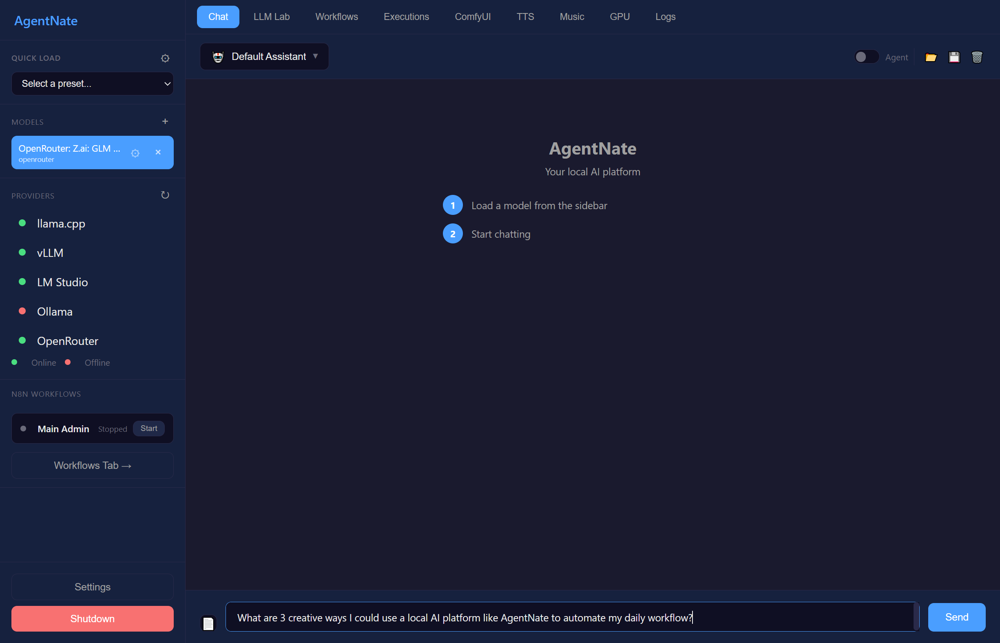

4. The response streams in real-time via WebSocket — you'll see tokens appear as they're generated:

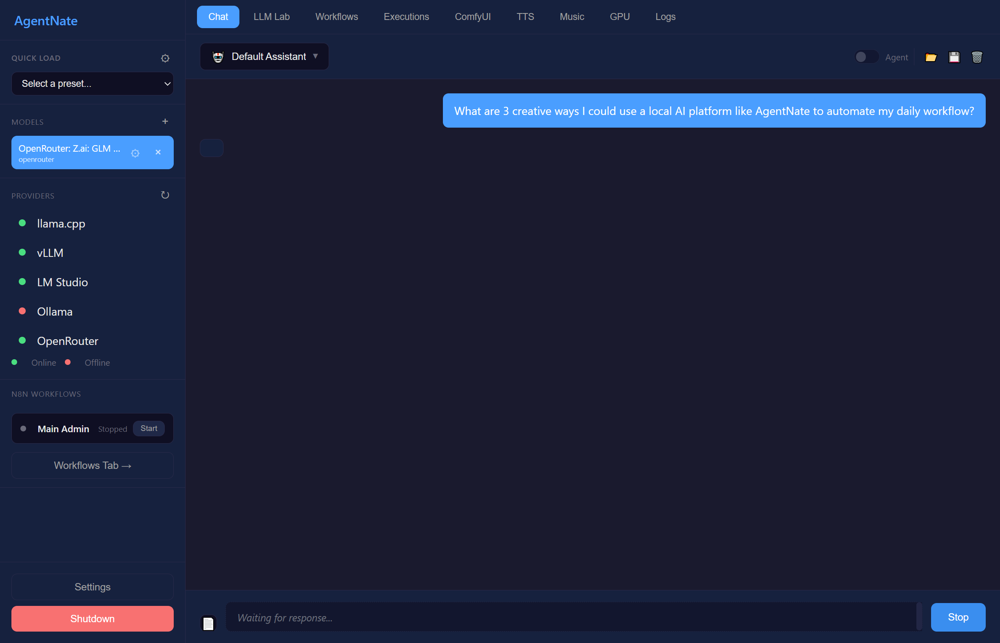

5. Once complete, the full response renders with formatted markdown (headers, bold, lists, code blocks):


6. Here's what a multi-turn conversation looks like with full message history:

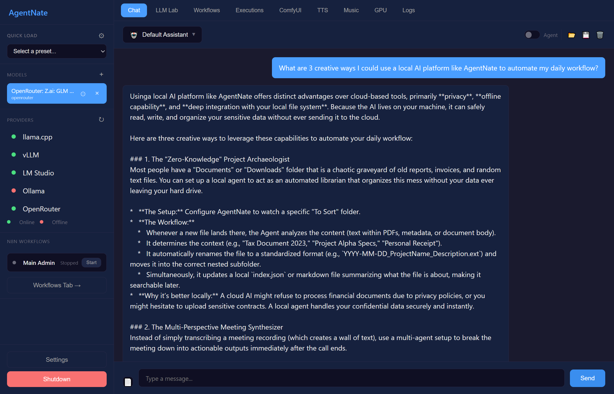

**Chat features:**
- **System Prompt** selector - Choose from a library of 40+ system prompts organized by category
- **Persona** selector - Switch between different AI personas
- **Model** selector - Choose which loaded model to use
- **Conversation history** - Messages persist within the session
- **Save/Load** - Save conversations to disk and reload them later
- **PDF attachment** - Attach PDF documents for the model to analyze (text is extracted via PyMuPDF, chunked into ~500-token segments with overlap, and injected into the conversation context for RAG-style Q&A — supports up to 200 pages)

### System Prompts Library

Click the persona button (top-left of chat area) to open the System Prompts Library:

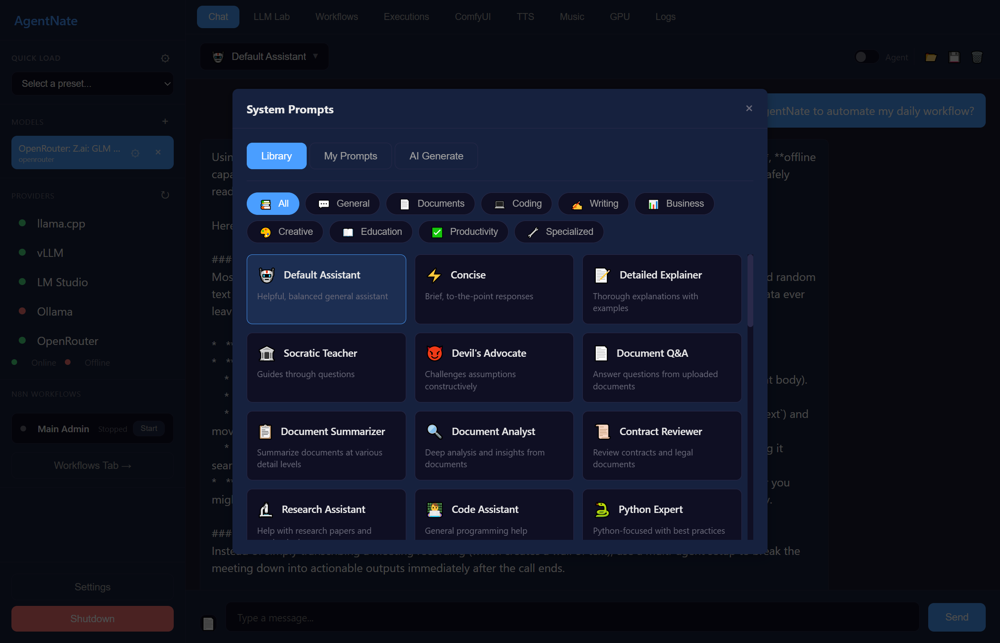

The library contains **40+ system prompts** organized into categories:
- **General** — Default Assistant, Concise, Detailed Explainer, Socratic Teacher, Devil's Advocate
- **Documents** — Document Q&A, Summarizer, Analyst, Contract Reviewer, Research Assistant
- **Coding** — Code Assistant, Python Expert, JavaScript/TypeScript, Code Reviewer, Debugger, Algorithm Designer, System Architect, DevOps Engineer
- **Writing** — Writing Coach, Copywriter, Technical Writer, Editor, Storyteller, Academic Writer
- **Business** — Business Analyst, Product Manager, Marketing Strategist, Sales Coach, Startup Advisor
- **Creative** — Creative Director, Worldbuilder, Character Designer, Brainstorm Partner, Game Designer
- **Education** — Tutor, Language Teacher, Math Mentor, Science Explainer
- **Productivity** — Task Planner, Meeting Facilitator, Decision Helper, Goal Coach
- **Specialized** — Legal Assistant, Data Analyst, UX Designer, Research Assistant, Translator

### Agent Mode

Agent mode transforms the AI from a simple chatbot into an autonomous agent with access to 187+ tools.

**Activating Agent Mode:**

Click the **Agent** checkbox in the chat header. The interface transforms to show agent capabilities:

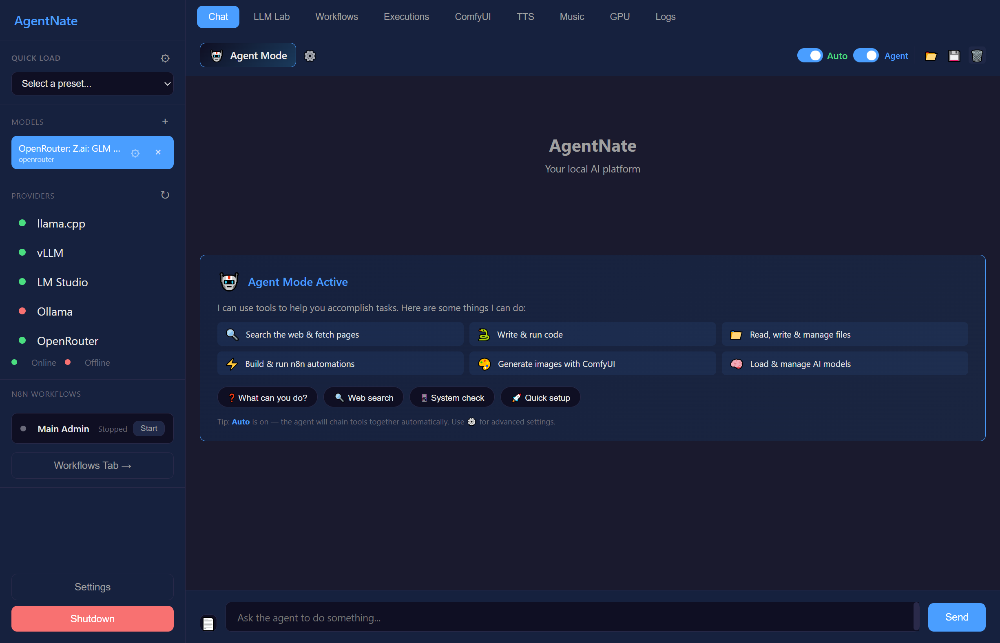

The agent mode panel shows:
- **Available capabilities** — Web search, code execution, file management, n8n automation, ComfyUI media generation, model management
- **Quick action buttons** — "What can you do?", "Web search", "System check", "Quick setup"
- **Auto mode toggle** — When enabled, the agent chains tools automatically without asking permission for each step
- **Advanced settings gear** — Configure agent behavior, tool limits, and delegation

**Example: System Status Check**

Here's what happens when you ask the agent to check system status:

1. The agent determines it needs the `get_full_status` tool and executes it. While running, the tool card shows a spinner:


2. Once complete, each tool call appears as a numbered card with a green checkmark on success. The card header shows the tool name:

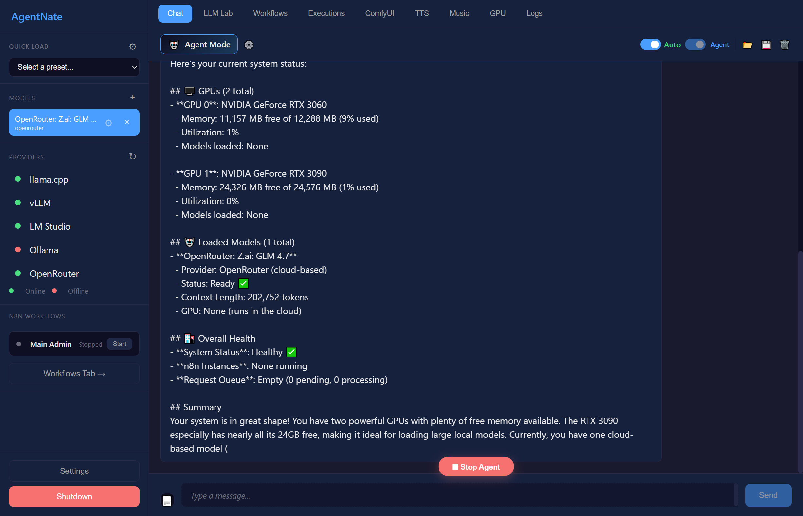

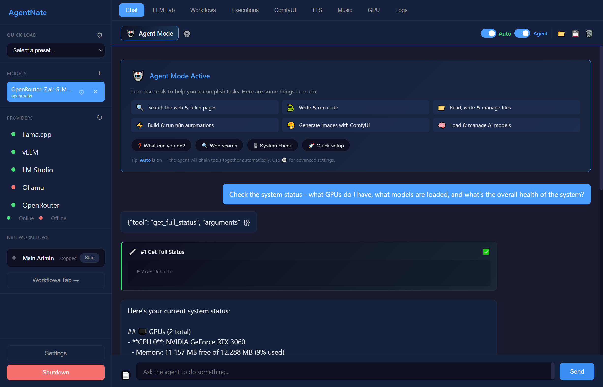

3. Click **View Details** on any tool card to expand and see the raw JSON input/output:


4. The agent interprets the tool results and provides a human-readable summary. A **Plan** section at the bottom shows the agent's reasoning:

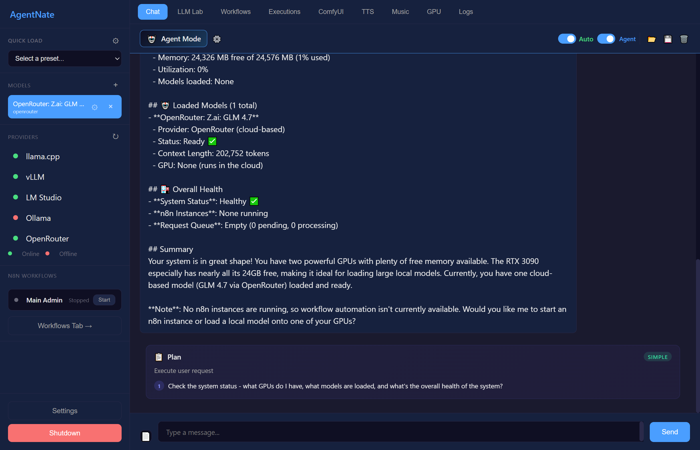

5. The complete agent interaction — from request through tool execution to final response:

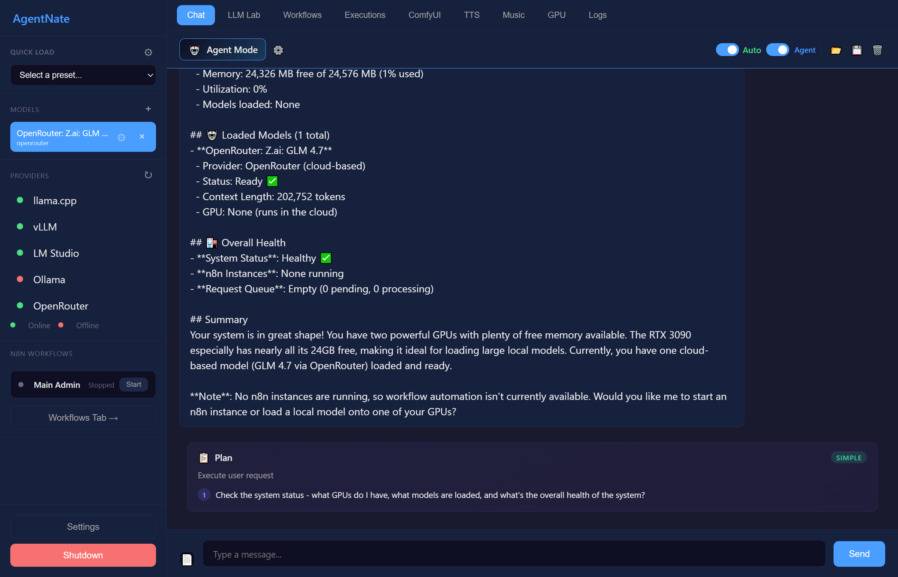

6. The agent's final formatted response with all the information synthesized from tool results:

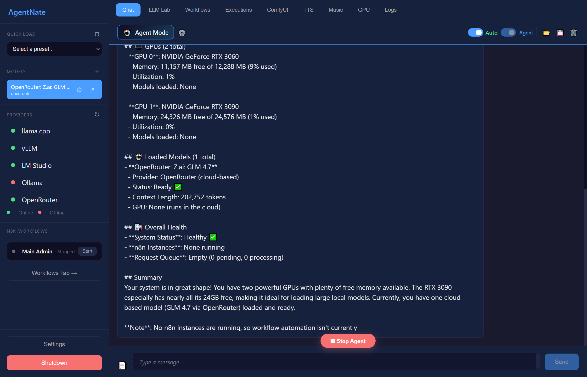

**What agents can do:**
- Search the web and browse websites
- Read, write, and manipulate files
- Execute Python, JavaScript, and shell commands
- Send messages via Discord, Slack, email, Telegram
- Create and deploy n8n workflows
- Generate images via ComfyUI
- Generate speech and music
- Spawn sub-agents for parallel work

### Sub-Agent System

The agent can spawn independent sub-agents that work in parallel:

- **spawn_agent** - Create a new sub-agent with a specific persona and task
- **check_agents** - Monitor sub-agent progress
- **get_agent_result** - Collect completed sub-agent results

Sub-agents appear as dedicated panels with their own tool call history and status.

### Model Routing

When multiple models are loaded, you can configure automatic routing that maps personas to specific models:

1. **recommend_routing** - The system analyzes loaded models and suggests optimal mapping
2. **save_routing_preset** - Save the routing configuration (auto-activates)
3. **activate_routing** - Switch between saved routing presets

Example: Route the "Coder" persona to a code-specialized model, while "Researcher" uses a general model.

### Multi-Panel Chat

AgentNate supports concurrent chat panels:

- Click **+** in the panel tab bar to create a new panel
- Each panel has independent model selection, persona, and conversation history
- Run multiple conversations simultaneously with different models
- The tab bar shows at the top when 2+ panels are open (hidden with 1 panel for backward compatibility)

### Smart Delegation

When using agent mode, the system intelligently classifies your request:

- **Simple queries** (GPU status, model lists, system health) - Handled directly by the head agent
- **Complex tasks** (build workflows, generate images, research topics) - Automatically delegated to a specialized worker agent

### Conversation Management

- **Save** - Save the current conversation to disk with full message history
- **Load** - Browse and restore previous conversations
- **Clear** - Clear the current panel's message history

### Agent in Action: Interactive Demos

The following walkthroughs show AgentNate's agent mode handling real tasks end-to-end, demonstrating the Worker panel system, Plan display, and tool card progression.

#### Web Search Demo

When you ask the agent to research a topic, the system delegates to a specialized Worker and executes a multi-step plan:

1. **Type your request** in the chat panel with Agent mode enabled. For example: "Research the latest AI trends for 2026."

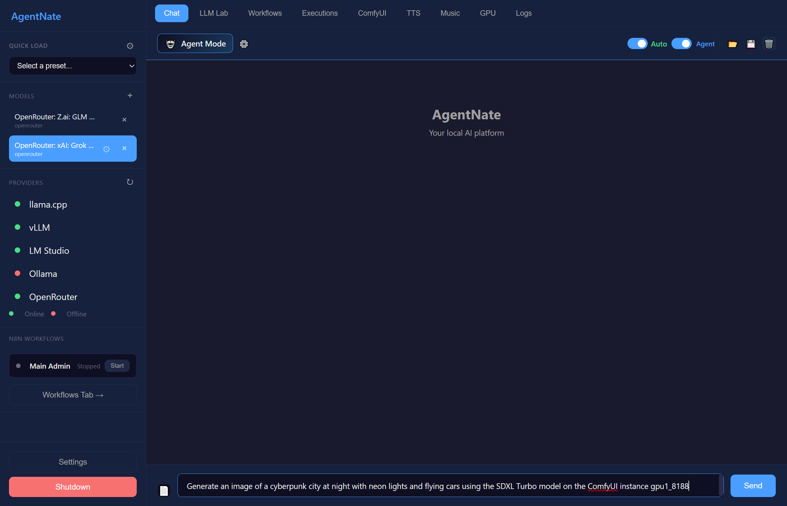

2. **A Worker tab spawns** automatically. The agent creates a Plan and begins executing tools. Here, tool #1 (Web Search) completes and the agent moves on to fetching additional URLs:

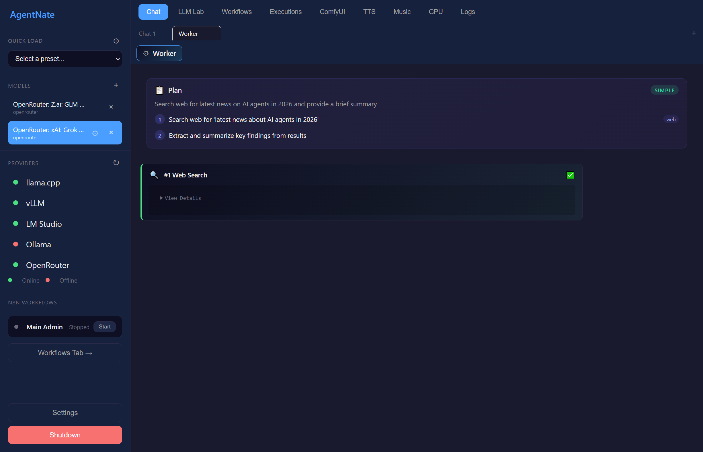

3. **The response streams in** with structured content — headings, bullet points, and source citations. The Worker panel shows intermediate results as URLs are fetched:

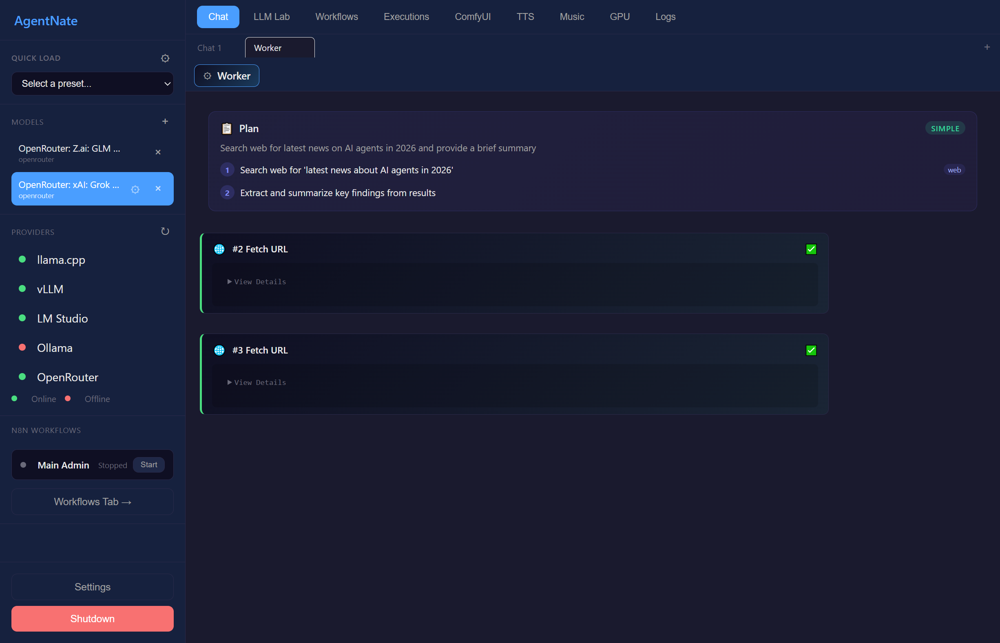

4. **The agent synthesizes findings** into a comprehensive summary with analysis and source URLs:

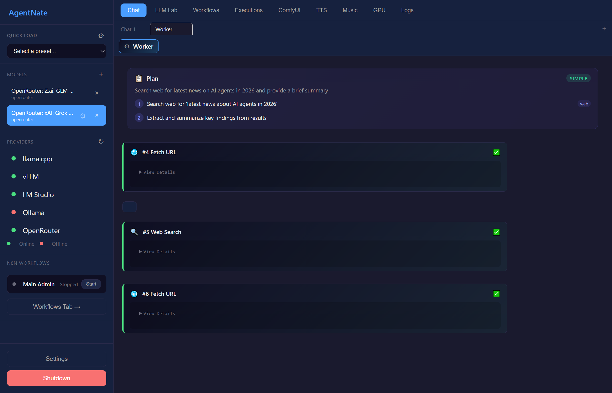

5. **The Worker finishes** with a polished conclusion and formatted citations:


6. **The final response** in the Worker panel shows the complete chain of tool cards and the polished report:

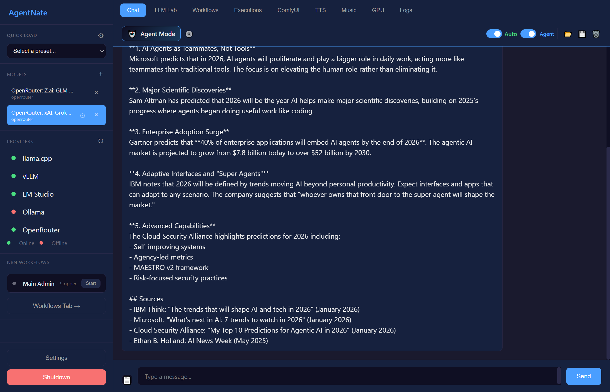

6. **Back in the Head panel**, the complete response is delivered with formatted markdown, including key trends, analysis, and source URLs at the bottom:

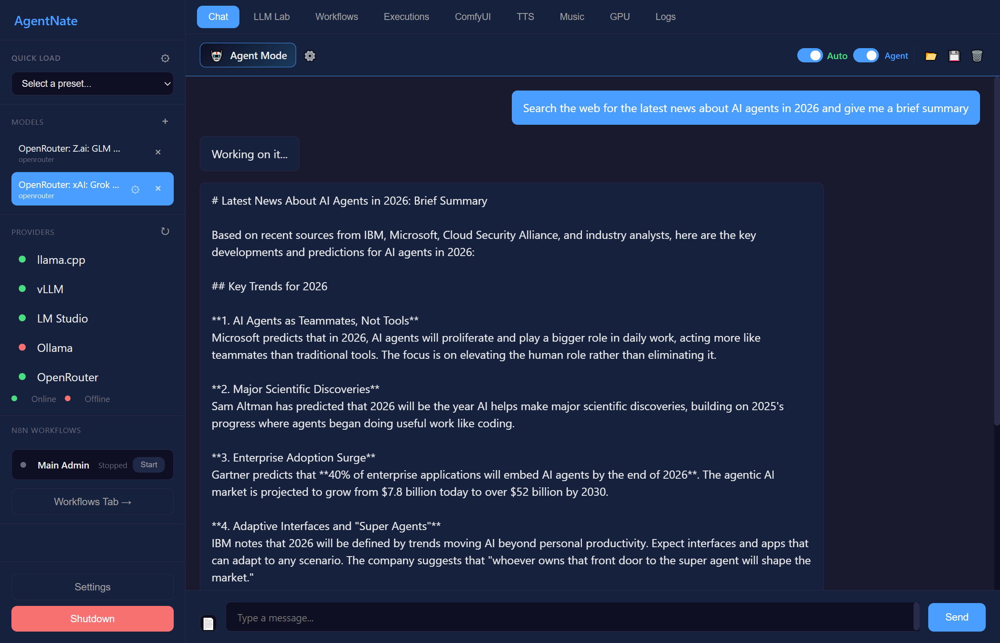

The entire workflow — from request to fully cited research report — happens autonomously. The agent decides which search engines to use, which URLs to fetch, and how to synthesize the information.

#### Code Execution Demo

The agent can write and execute code on your machine, showing both the code and its output:

1. **Ask the agent** to write and run a program. For example: "Write a Python script to calculate and display the first 20 Fibonacci numbers in a formatted table."

2. **The agent writes the code, executes it**, and presents a summary of what it did, including the approach and output:

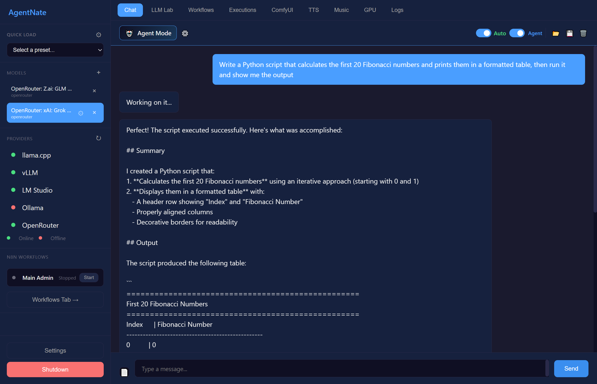

3. **The full output** shows a cleanly formatted table with all 20 Fibonacci numbers (0 through 4181):

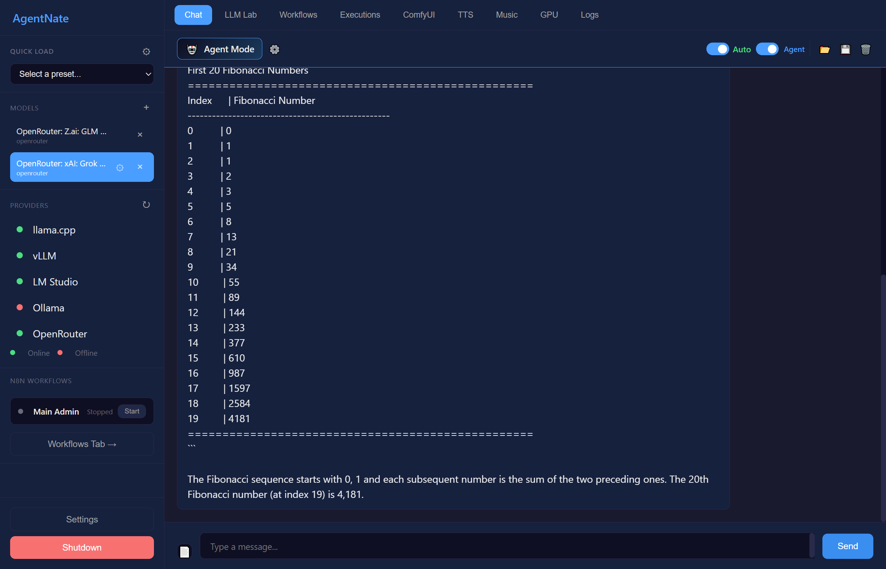

The agent uses the `run_python` tool to execute code in the embedded Python environment. It can also run JavaScript (`run_javascript`), shell commands (`run_shell`), and PowerShell (`run_powershell`).

#### Image Generation Demo

For creative tasks, the agent orchestrates ComfyUI to generate images:

1. **Type your image request**. For example: "Generate an image of a cyberpunk city at night with neon lights and flying cars."


2. **The Worker spawns and executes a multi-step plan**. The Plan panel shows the strategy (4 steps), and tool cards track progress -- listing available models, checking instance status, submitting the generation job:

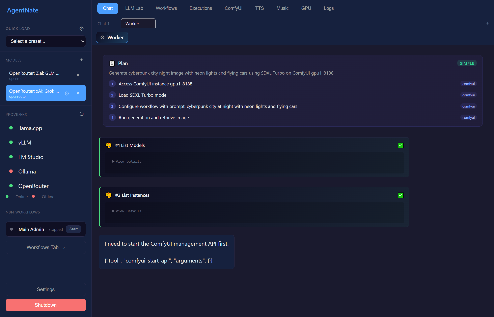

3. **The agent provides a detailed summary** of the generation: which model was used, instance status, generation settings (steps, CFG, sampler, seed), and the job ID for tracking:

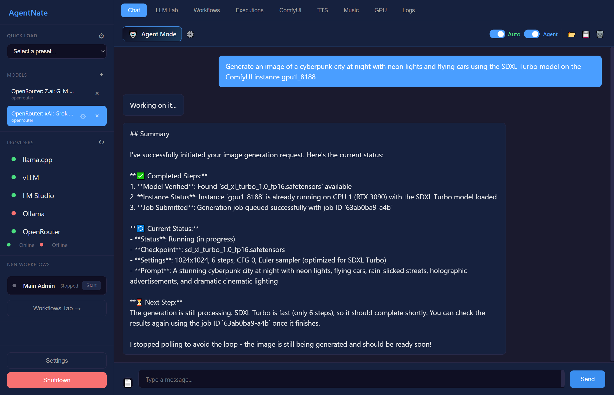

The agent handles the entire pipeline: verifying ComfyUI is running, selecting the right model, configuring optimal generation parameters, submitting the job, and polling for the result. If ComfyUI is not running, it will start it automatically. If a model is not loaded, it will load one.

4. **The generation completes** and the agent summarizes the full result with metadata — model, seed, dimensions, file path:


5. **The result arrives** and the agent checks the generated output:


6. **The final result** in the Worker panel with all details confirmed:

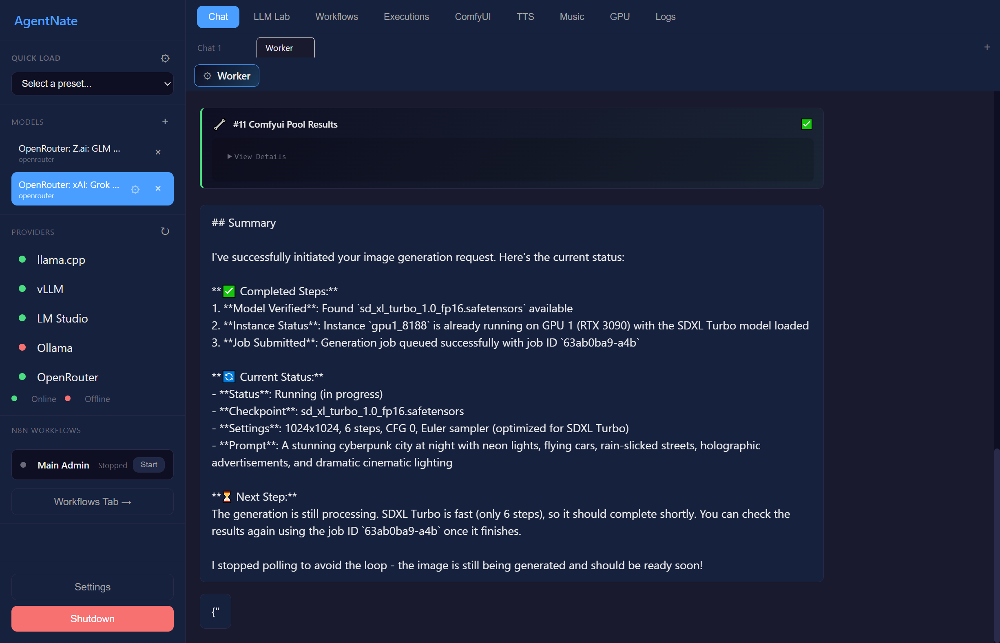

7. **Back in the Head panel**, the complete image generation result with metadata is delivered:

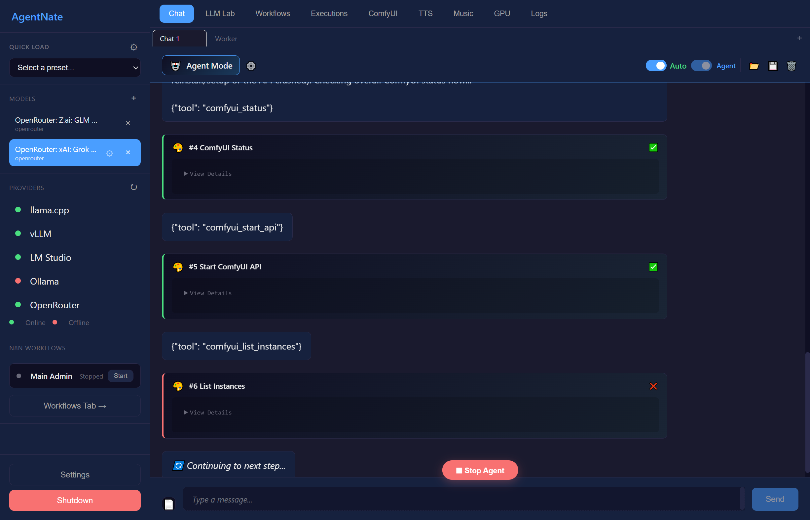

#### Tool Chain View

Here's what a complete tool chain looks like in the Worker panel — each numbered card represents one tool call in sequence:

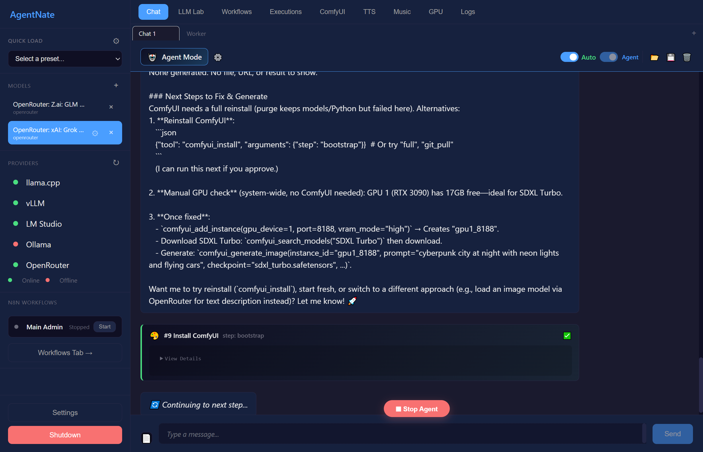

The chain shows the agent's decision-making: checking system status, listing models, selecting the right checkpoint, building the workflow, submitting the job, polling for results, and preparing the output. Each card is expandable to reveal the full JSON input/output.

#### Understanding the Worker Panel System

When the agent delegates work, the interface splits into panels:

- **Head Panel** -- Your main conversation. Shows the final response and a summary of delegated work.
- **Worker Panel** -- The specialized sub-agent's workspace. Shows the Plan, tool call cards (numbered, with expand/collapse), and streaming response.
- **Tab Bar** -- Switches between Head and Worker panels. Shows status indicators (spinner while working, checkmark on completion).
- **Tool Cards** -- Each tool call gets a numbered card with the tool name, a green checkmark or red X for status, and a "View Details" button to inspect the raw JSON input/output.
- **Plan Section** -- At the top of the Worker panel, shows the agent's step-by-step strategy before it begins executing.

### Conversation Management

Conversations can be saved, loaded, and managed:

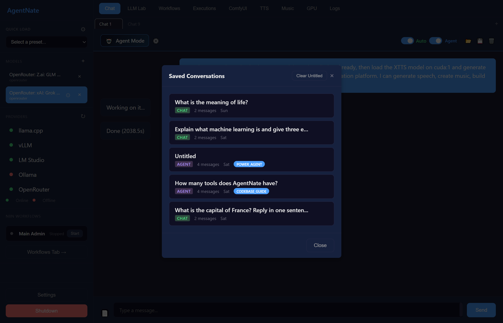

- **Save** — Click the 💾 button in the chat toolbar. Saves the entire conversation (messages, agent tool calls, model info) to disk
- **Load** — Click the 📂 button to browse saved conversations. Loading restores the full conversation into the active panel
- **Clear** — Click the 🗑️ button to clear the current conversation without saving
- **Auto-naming** — Saved conversations are auto-named from the first user message
- **Clear Untitled** — One-click cleanup of unnamed conversations

Each saved conversation shows:
- **Title** — Auto-generated from the first message (editable via the rename button)
- **Type badge** — CHAT or AGENT mode
- **Message count** — Total messages in the conversation
- **Date** — When it was saved
- **Persona badge** — For agent conversations, shows which persona was active (e.g., POWER_AGENT, CODEBASE_GUIDE)
- **Actions** — Rename (pencil icon) and Delete (trash icon) per conversation

Conversations are stored as JSON files in `data/conversations/` and persist across restarts. The conversation store (`backend/conversation_store.py`) handles serialization, listing, searching, and deletion.

### Ask-User Tool

When running in agent mode, the AI can ask you questions directly using the **ask_user** tool. This appears as an interactive prompt in the chat:

- The agent poses a question (e.g., "Which database format would you prefer: SQLite or PostgreSQL?")
- You type your answer in the provided input field
- The agent continues its work using your response

This enables interactive workflows where the agent needs clarification or approval before proceeding, rather than guessing.

### Browser Automation

The agent can control a full Chromium browser via Playwright for web scraping, form filling, and interactive browsing. Eight browser tools provide a complete lifecycle:

1. **`browser_open`** — Navigate to a URL (waits for page load, DOM ready, or network idle)
2. **`browser_screenshot`** — Capture the current page (full page or visible viewport)
3. **`browser_click`** — Click elements by CSS selector
4. **`browser_type`** — Type into input fields with optional Enter key press
5. **`browser_extract`** — Extract text, HTML, or attributes from elements (single or multiple matches)
6. **`browser_get_text`** — Get all visible body text (strips scripts/styles, 50KB limit)
7. **`browser_scroll`** — Scroll up, down, to top, or bottom
8. **`browser_close`** — Clean up browser resources

The browser launches headless (invisible) on first use with a 1920x1080 viewport. The agent typically chains these tools: open a page → extract data or screenshot → interact with forms → extract results → close. For example:

> "Go to HuggingFace, find the top trending model this week, and tell me about it"
>
> The agent opens the URL, extracts the page content, identifies the top model, and summarizes it — all without you leaving the chat.

### Vision & Image Analysis

When a vision-capable model is loaded (e.g., LLaVA, Qwen-VL, Moondream), the agent gains six vision tools:

1. **`analyze_image`** — Describe or answer questions about an image (file path, URL, or base64)
2. **`analyze_screenshot`** — Screenshot the current browser page and analyze it
3. **`extract_text_from_image`** — OCR text extraction (plain, structured, or markdown output)
4. **`describe_ui`** — Identify UI elements (buttons, links, forms) with location and CSS selector hints
5. **`compare_images`** — Describe differences between two images (useful for regression testing)
6. **`find_element`** — Locate a specific element by description with confidence score

Vision tools work with local files, URLs, and even live browser screenshots. The agent can combine browser automation with vision analysis — for instance, navigating to a page, screenshotting it, and then using vision to understand the layout.

---

## 6. Multi-Panel Chat

AgentNate supports running multiple independent chat sessions simultaneously in separate panels. Each panel maintains its own conversation, model selection, persona, and routing preset.


The screenshot shows two panels open: "Chat 1" (active, with agent conversation) and "Chat 9", with the **+** button to add more panels. The tab bar appears below the main navigation tabs.

### Creating Panels

- Click the **+** button in the tab bar to create a new panel
- Each panel gets a default name ("Chat 1", "Chat 2", etc.) that you can rename
- The tab bar appears automatically when 2+ panels are open, and hides with only 1 panel for a clean interface

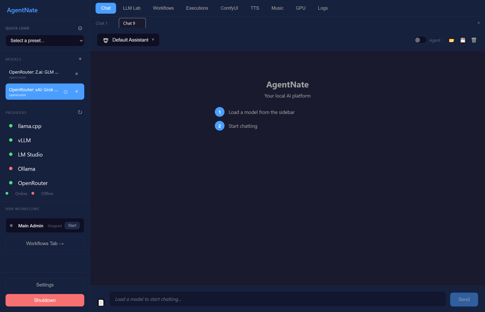

A freshly created panel shows the AgentNate welcome screen with setup instructions, while the tab bar at the top lets you switch between panels. Each panel's close button (x) removes it — the last panel cannot be closed.

### Per-Panel Configuration

Each panel operates independently:

- **Model Override** - Select a different model for each panel. If not set, the panel uses the globally selected model from the sidebar
- **Persona** - Choose a different persona per panel (e.g., "Coder" in one panel, "Researcher" in another)
- **Routing Preset** - Assign a routing preset per panel so sub-agents spawned from that panel use specific model routing
- **Agent Mode** - Toggle agent mode independently per panel. One panel can be in chat mode while another runs agent tools
- **Auto Mode** - Enable/disable autonomous tool chaining per panel

### Worker Panels

When an agent delegates work to a sub-agent, a **Worker panel** automatically appears:

- Worker panels are minimal display-only panels (no input box or controls)
- They show the sub-agent's Plan, tool cards, and streaming response
- The tab bar shows a spinner while the worker is active, and a checkmark when done
- Worker panels auto-close when the sub-agent completes, delivering its result back to the head panel

### Tab Bar Status Indicators

| Icon | Meaning |
|------|---------|
| Spinner | Panel is generating or agent is working |
| Checkmark | Generation complete |
| Red X | Error occurred |
| No icon | Idle |

### Panel State

Each panel tracks:
- Its own `conversationId` (separate conversation history)
- Its own `messages` array (independent chat log)
- Its own `agentMode` and `autonomous` flags
- A `workerPanelMap` linking sub-agent IDs to their worker panel IDs

---

## 7. Sub-Agent System

The sub-agent system is one of AgentNate's most powerful features. It allows the "head" agent to spawn specialized worker agents that run in parallel, each potentially using a different model optimized for their task.

### How It Works

1. **User sends a message** to the head agent
2. **Smart Delegation** analyzes the message:
   - Simple queries (GPU status, model list, time) are handled directly by the head agent
   - Complex tasks (image generation, workflow building, research) are delegated to a worker
3. **Worker spawns** with:
   - A specific persona (e.g., `image_creator` for image tasks)
   - A specific model (resolved via routing presets)
   - The user's message as its task
4. **Worker executes** tools autonomously using the Agent Loop
5. **Worker completes** and returns its response to the head agent
6. **Head agent** presents the worker's result to the user

### Smart Delegation

The head agent uses pattern matching to decide whether to handle a request itself or delegate:

**Handled directly** (no worker spawned):
- System queries: "What GPUs do I have?", "List loaded models"
- Simple questions: "What time is it?", "Hello"
- Status checks: "Is n8n running?", "ComfyUI status"

**Delegated to worker**:
- Creative tasks: "Generate an image of...", "Create music..."
- Complex builds: "Build a workflow that...", "Write a Python script..."
- Research: "Search the web for...", "Analyze this data..."
- Multi-step tasks: Anything requiring 3+ tool calls

### Spawning Agents Programmatically

The agent has access to these sub-agent tools:

| Tool | Description |
|------|-------------|
| `spawn_agent` | Spawn a single sub-agent with a specific persona and task |
| `batch_spawn_agents` | Spawn multiple agents simultaneously (up to 5) |
| `check_agents` | Check status of spawned agents |
| `get_agent_result` | Get the result of a completed agent |

### Batch Spawning

For tasks requiring multiple perspectives, the agent can spawn up to 5 workers simultaneously:

```
"Spawn 3 agents: one to research competitors, one to analyze our metrics, one to draft a report"
```

Each worker runs in parallel on potentially different models, and results are collected when all complete.

**How batch_spawn_agents works internally:**

The `batch_spawn_agents` tool accepts an array of agent configurations:
```json
{
  "agents": [
    {"persona": "researcher", "task": "Research competitor pricing models"},
    {"persona": "data_analyst", "task": "Analyze our usage metrics from the database"},
    {"persona": "coder", "task": "Draft a Python report generator script"}
  ]
}
```

All agents launch simultaneously. Each gets its own Worker panel in the UI. The head agent can then call `check_agents` to monitor progress and `get_agent_result` to collect outputs as each completes.

### Agent Loop Internals

Each agent (head or worker) runs through the same execution loop:

1. **Build system prompt** (persona + tools + memory + working memory)
2. **Send to LLM** for inference (streaming)
3. **Parse response** for tool calls
4. **Execute tool** (or race if creative tool)
5. **Check loop detection** (prevents infinite loops)
6. **Append result** to conversation
7. **Repeat** until LLM produces a final text response or max_tool_calls reached

**Loop Detection** prevents agents from getting stuck:
- **Identical calls**: 3+ consecutive identical tool+args triggers a warning
- **Ping-pong**: Last 6 calls use only 2 unique tools
- **Saturation**: Last 8 calls use only 3 unique tools
- **Hard stop**: After 2 warnings, the loop forcibly ends and requests a summary
- **Exempt tools**: Polling tools (`comfyui_await_result`, `comfyui_get_result`, etc.) are exempted since repeated polling is expected behavior

### Max Tool Calls

By default, each agent is limited to **10 tool calls** per turn (configurable up to 50 via the `max_tool_calls` parameter). When the limit is reached, the agent is prompted to summarize what it accomplished and what remains.

### Smart Delegation Patterns

The `_should_delegate()` function in `backend/routes/tools.py` classifies user messages using regex patterns and heuristics:

**Simple Query Patterns** (head handles directly — no worker spawned):
```
gpu + (status|info|check|what|show|tell)    →  Head answers directly
(loaded|running) + model                     →  Head answers directly
n8n + (running|status|started|up)            →  Head answers directly
comfyui + (running|status|started|up)        →  Head answers directly
system + status                              →  Head answers directly
```

**Complex Task Keywords** (always delegated to worker):
```
build, create, make, generate, design, write, implement, deploy,
set up, configure, install, develop, refactor, optimize, analyze,
research, plan, workflow, automation, pipeline, template
```

**Additional heuristics:**
- Short questions (<20 words) without complex keywords → head handles
- Question words ("what", "which", "how many", "is", "are", "check", "show", "list") → head handles if simple

### Worker SSE Event Protocol

When a worker is spawned, the frontend subscribes to real-time events via Server-Sent Events:

```
GET /api/tools/agent/workers/{conversation_id}/stream
```

**Event types delivered:**

| Event Type | Data | Description |
|------------|------|-------------|
| `sub_agent_update` | `{agents: [{id, status, persona, tool_count}]}` | Worker status updates |
| `worker_events` | `[{event, data}]` | Batched worker events (tool calls, tokens, etc.) |
| `workers_done` | `{}` | All workers completed or failed |
| `head_heartbeat` | `{running_workers, nudged}` | Supervisor tick (every 20s) |
| `race_started` | `{tool, candidates}` | Tool-level race begun |
| `race_winner_selected` | `{winner_id, tool}` | Race winner chosen |
| `race_completed` | `{results}` | Race finished |
| `agent_done` | `{status, response, tool_call_count}` | Worker final result |

The frontend (`ui/js/agent.js`) processes these events to update tool cards, streaming text, race containers, and tab status indicators in real time.

### System-Changing Tools

Certain tools modify global state (loaded models, running services). When one of these fires, the system prompt is rebuilt to reflect the new state:

```
load_model, unload_model, spawn_n8n, stop_n8n, quick_setup,
comfyui_start_api, comfyui_stop_api, comfyui_install,
comfyui_add_instance, comfyui_start_instance, comfyui_stop_instance,
provision_models, load_from_preset, flash_workflow, configure_workflow
```

This list is maintained in sync between `agent_loop.py` and `routes/tools.py`.

---

## 8. Routing Presets

Routing presets define how sub-agents are assigned to specific loaded models. They enable **persona-aware model routing** -- where a coder agent uses one model while a researcher agent uses another.

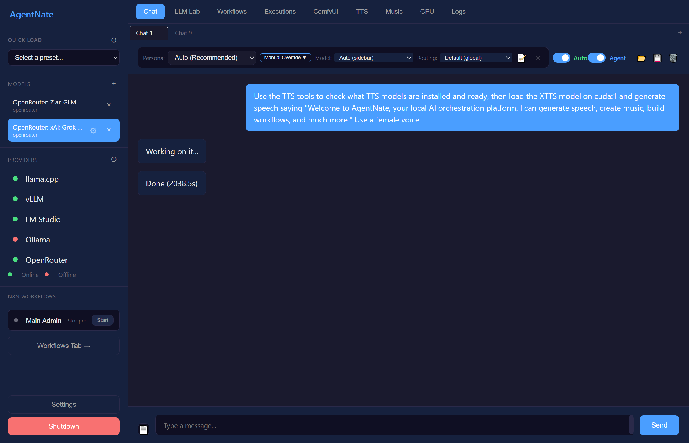

The Agent Settings panel (gear icon in chat header) provides three controls: **Persona** selection (15 personas + Auto mode), **Model** override (per-panel model selection), and **Routing** preset selection. The screenshot shows two routing presets configured: "Auto-image_generation" and "code-specialist".

### What They Do

Without routing presets, all agents use the same model. With routing presets:
- The `coder` persona routes to a local coding model (e.g., DeepSeek)
- The `researcher` routes to a cloud model (e.g., GPT-4)
- The `image_creator` routes to a vision-capable model
- Unmatched personas fall back to the default model

### Creating a Routing Preset

1. Load 2+ models in the sidebar
2. Open the **Agent Settings** (gear icon in agent mode header)
3. Click **Routing Presets**
4. Click **Create New Preset**
5. Name your preset (e.g., "Fast Coding Setup")
6. For each persona you want to route, select the target model
7. Save

### Preset Format

Each preset contains routes mapping persona IDs to model targets:

```json
{
  "id": "rp-1708123456789",
  "name": "Fast Coding Setup",
  "routes": {
    "coder": { "provider": "llama_cpp", "model_match": "deepseek" },
    "researcher": { "provider": "openrouter", "model_match": "gpt" },
    "image_creator": { "instance_id": "uuid-of-loaded-model" }
  }
}
```

### Route Resolution Modes

Routes are resolved in three ways:

1. **Direct Instance ID** - Route contains `"instance_id"`: matches exactly to a loaded model instance
2. **Provider + Pattern** - Route contains `"provider"` + `"model_match"`: finds any loaded model from that provider whose name contains the match string
3. **Model Name** - Route contains `"model"`: matches by name substring against all loaded models

### Auto-Recommend

Click **Auto-Recommend** to have the system analyze your currently loaded models and suggest optimal persona-to-model routes based on model characteristics (coding models -> coder, large models -> researcher, etc.).

### Using Presets

- **Per-panel**: Select a routing preset in the panel dropdown -- sub-agents spawned from that panel will use the preset
- **Global**: Set `agent.active_routing_preset_id` in Settings
- **Per-spawn**: The `spawn_agent` tool accepts a `routing_preset_id` parameter

### Workflow Integration

Routing presets are also used by the Workflow Bridge (Section 14) to generate n8n workflows where each stage uses a different model via preset-based routing.

---

## 9. Agent Intelligence


The Agent Settings panel provides fine-grained control over agent behavior. The **Persona** dropdown lists all 15 personas with their tool group counts (e.g., "AI Creative Director (8 tool groups)") and descriptions. The "Auto (Recommended)" option lets the system choose the best persona based on your request.

AgentNate's agents are enhanced with six intelligence features that make them more capable, resilient, and efficient than a simple tool-calling loop.

### 1. Planning

Before executing tools, the agent generates a lightweight plan:
- **Complexity assessment**: SIMPLE (1-2 tools), MODERATE (3-5), COMPLEX (6+)
- **Step-by-step strategy**: What tools to call in what order
- **Category selection**: Which tool categories are needed

The plan is displayed in the Worker panel as a collapsible section showing the strategy before execution begins. Simple greetings and questions skip planning entirely.

### 2. Tool Category Selection

Instead of presenting all 187+ tools to the model (which would overwhelm smaller models), the system selects only relevant tool categories:

- **Fast path**: Keyword matching (e.g., "generate image" -> comfyui tools, "search the web" -> web tools)
- **LLM fallback**: If keywords don't match, the LLM analyzes the request to select categories
- **Always included**: The persona's base tool groups are always available

This means an 8B model handling an image request only sees ~36 ComfyUI tools instead of all 187+.

### 3. Working Memory

A scratchpad that tracks progress within a single agent turn:

- **Goal**: What the agent is trying to accomplish
- **Completed steps**: What has been done so far (max 20)
- **Gathered facts**: Key information discovered during execution (max 30)
- **Remaining steps**: What still needs to be done
- **Failed approaches**: What was tried and didn't work (max 10)

Working memory is injected into the system prompt, giving the agent context about where it is in a multi-step task. This prevents the agent from repeating steps or forgetting what it already learned.

### 4. Error Handling & Retries

When a tool call fails, the system categorizes the error and decides what to do:

| Error Type | Examples | Action |
|-----------|----------|--------|
| **Transient** | Timeout, connection reset | Retry same tool (up to 2 times) |
| **Wrong Args** | Invalid parameter, type error | Fix arguments and retry |
| **Capability** | Tool not found, permission denied | Try fallback tool |
| **Fatal** | Auth failed, out of memory | Give up, report error |

**Fallback tools** provide alternatives when the primary tool fails. For example, if `web_search` fails, the system tries `google_search`, then `duckduckgo_search`.

### 5. Context Management

For long conversations that approach the model's context limit:

- **Summarization**: Old messages are compressed into a summary while recent messages are kept verbatim
- **Tool result truncation**: Large JSON results are intelligently truncated while preserving structure
- **Token budget**: Triggers summarization when conversation exceeds ~6000 tokens

### 6. Thinking Model Support

Special handling for reasoning models like DeepSeek-R1, QwQ, and o1:

- **Auto-detection**: Identifies thinking models by name pattern
- **Think block extraction**: Parses `<think>...</think>` blocks from output
- **Separate display**: Thinking content is shown in a collapsible "Thinking" section in the UI, separate from the main response
- **Supported patterns**: deepseek-r1, qwq, qwen-qwq, qwen3, o1-, o1mini

### Codebase Self-Awareness

AgentNate includes 11 tools that let the agent explore and explain its own codebase. This is useful for developers extending the platform, or for the agent itself to understand its capabilities:

- **`scan_codebase`** — Recursive directory tree with file descriptions
- **`explain_file`** — Read and analyze any source file (uses Python AST for class/function extraction)
- **`find_feature`** — Locate where a feature is implemented (smart search + grep)
- **`get_architecture`** — Generate a component-level architecture overview
- **`list_api_endpoints`** — Extract all REST routes with methods and handlers
- **`list_tools`** — List all agent tools by category
- **`explain_concept`** — Explain AgentNate concepts (21 built-in: orchestrator, provider, persona, tool, etc.)
- **`get_capabilities`** — Friendly capability overview organized by use case
- **`get_quick_start`** — Goal-specific quick-start guides (research, automation, coding)
- **`generate_manifest`** — Rebuild the structured codebase index
- **`query_codebase`** — Query the manifest for files, endpoints, tools, personas, or providers with filtering

These tools are backed by a **codebase manifest** (`data/codebase_manifest.json`) — a structured index of every file, endpoint, tool, and persona in the project. The manifest is generated on demand and cached, allowing fast queries without re-scanning the filesystem.

---

## 10. Tool-Level Race Execution

For creative and generative tasks, AgentNate can race multiple LLM inferences in parallel and pick the best result. This dramatically improves output quality for tasks like workflow building and image prompt generation.

### How It Works

1. When the agent calls a **raceable tool** (e.g., `build_workflow`, `comfyui_build_workflow`), instead of running once, the system launches 3 parallel inferences
2. Each candidate runs with a slightly different temperature:
   - Candidate 1: Base temperature (e.g., 0.7)
   - Candidate 2: Base + 0.1 (e.g., 0.8)
   - Candidate 3: Base + 0.2 (e.g., 0.9)
3. The **first valid result wins** -- it's validated (checks for `success: true`), and the losers are immediately cancelled
4. The winner is re-executed with full side effects (deploy, activate, etc.)

### Side-Effect Safety

During the race, all candidates run with side effects disabled:
- `deploy=False` - Workflows aren't deployed
- `activate=False` - Workflows aren't activated
- `execute=False` - ComfyUI workflows aren't queued

Only the winning candidate is re-run with side effects enabled. This prevents duplicate deployments or wasted GPU time.

### Race UI

The race progress is displayed in the chat panel:
- A race container shows all candidates side by side
- Each candidate streams its tokens in real-time
- Status indicators: inferring -> executing -> winner/canceled/failed
- The winning candidate is highlighted in green

### Configuration

| Setting | Default | Description |
|---------|---------|-------------|
| `agent.tool_race_enabled` | `true` | Enable/disable race execution |
| `agent.tool_race_candidates` | `3` | Number of parallel candidates |

### Raceable Tools

Currently, these tools support racing:
- `build_workflow` — n8n workflow generation
- `comfyui_build_workflow` — ComfyUI workflow generation

These are the tools where output quality varies most with temperature, making racing most beneficial.

### How Candidates Differ

Each candidate runs the same user request with a slightly different temperature to encourage diverse outputs:

| Candidate | Temperature Offset | Example (base 0.7) |
|-----------|-------------------|---------------------|
| 1 | +0.0 (base) | 0.7 |
| 2 | +0.1 | 0.8 |
| 3 | +0.2 | 0.9 (capped at 1.0) |

Each candidate gets a minimal system prompt containing only the tool being raced (not the full agent prompt), with a suffix enforcing JSON output format. This keeps inference fast and focused.

### Validation & Winner Selection

1. Candidates run in parallel using `asyncio.wait(FIRST_COMPLETED)`
2. As each completes, the result is validated:
   - `build_workflow`: checks `result.success == True`
   - `comfyui_build_workflow`: checks `result.success == True`
3. **First valid result wins** — all other candidates are immediately cancelled
4. If the model outputs raw JSON (no tool call wrapper), the system extracts it automatically via markdown fence stripping and truncated JSON recovery
5. The winner is re-executed with side effects enabled (deploy, activate, execute)
6. If **all candidates fail**, a `race_failed` event fires with failure reasons for each

### SSE Event Flow

The race emits these events in sequence:

```
race_started          →  {race_id, tool, candidates: 3}
race_candidate_status →  {candidate_id: 1, status: "inferring"}
race_candidate_token  →  {candidate_id: 1, token: "..."}     (streaming)
race_candidate_status →  {candidate_id: 1, status: "executing"}
race_candidate_evaluated → {candidate_id: 1, is_valid: true, elapsed: 4.2s}
race_winner_selected  →  {winner_id: 1}
race_candidate_status →  {candidate_id: 2, status: "canceled"}
race_candidate_status →  {candidate_id: 3, status: "canceled"}
race_completed        →  {race_id, winner: 1, total: 3, valid_count: 1}
```

---

## 11. Agent Memory

AgentNate includes a persistent memory system that allows agents to remember facts, user preferences, and decisions across conversations and restarts.

### How It Works

The agent has these memory tools:

| Tool | Description |
|------|-------------|
| `remember` | Store a fact with a key, value, and optional category |
| `recall` | Search memories by keyword (searches key, value, and category) |

### What Gets Remembered

The agent automatically remembers:
- User preferences ("I prefer Python over JavaScript")
- Important decisions ("We decided to use PostgreSQL")
- Learned facts ("The production server is at 192.168.1.100")
- Task-specific knowledge ("The deploy script is at scripts/deploy.sh")

### Memory Categories

Each memory can be tagged with a category for organization:
- `preference` — User preferences and defaults
- `fact` — Learned information
- `decision` — Design or architectural decisions
- `general` — Default category if none specified
- Any custom string you define

### Memory Injection

The **5 most recent memories** (by update time) are automatically injected into every agent's system prompt as a markdown section:

```markdown
## Agent Memory (persistent across conversations)
- **user_language**: Python
- **deploy_target**: production server at 192.168.1.100
- **db_choice**: PostgreSQL for the new project
```

This means:
- The agent starts every conversation already knowing your preferences
- Sub-agents inherit the parent's knowledge
- Memories persist across server restarts

### Memory Limits

- Maximum **200 entries** (oldest are auto-pruned when exceeded)
- Memories are stored as key-value pairs with categories and timestamps
- Duplicate keys are auto-updated (latest value wins, timestamp refreshed)
- Search is case-insensitive and matches against key, value, and category

### Storage Format

Memories are stored as JSON:

```json
{
  "memories": [
    {
      "key": "preferred_language",
      "value": "Python over JavaScript for all examples",
      "category": "preference",
      "created_at": "2026-02-18T10:30:45.123456+00:00",
      "updated_at": "2026-02-18T10:30:45.123456+00:00"
    }
  ]
}
```

**File location:**
- **Windows**: `%APPDATA%/AgentNate/agent_memory.json`
- **Linux/Mac**: `~/.config/AgentNate/agent_memory.json`

### Example Usage

**Store a preference:**
> "Remember that I always want code examples in Python, not JavaScript"

The agent calls `remember(key="preferred_language", value="Python over JavaScript for all examples", category="preference")`.

**Later, in a different conversation:**
> "Write a sorting algorithm example"

The agent sees the memory in its system prompt and automatically uses Python.

**Search memories:**
> "What do you remember about my database preferences?"

The agent calls `recall(query="database")` and returns matching entries.

**Automatic pruning:** When the 200-entry limit is reached, the oldest entries (by `created_at`) are silently removed to make room for new ones.

---

## 12. LLM Lab

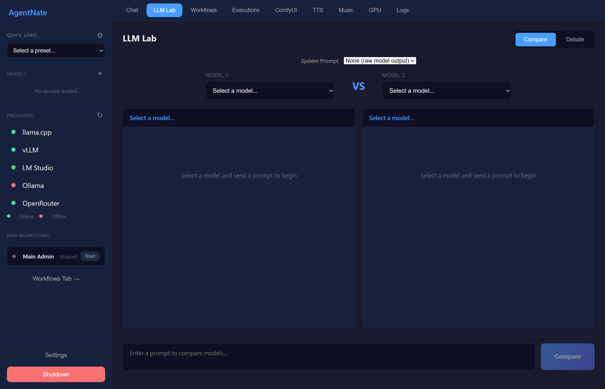

The LLM Lab provides two modes for evaluating and comparing models:

### Compare Mode

Send the same prompt to two models simultaneously and compare their responses side-by-side.

**Step-by-step walkthrough:**

1. Select **Model 1** and **Model 2** from the dropdowns (only loaded models appear)
2. Optionally select a **System Prompt** from the 40+ available prompts
3. Type your comparison prompt and click **Compare**:

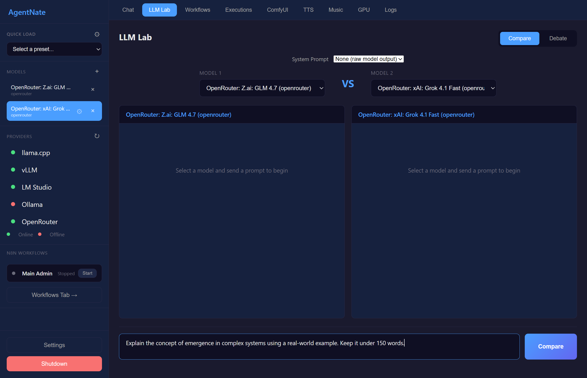

4. Both models begin streaming their responses simultaneously. You can see them generating in real-time, side by side:

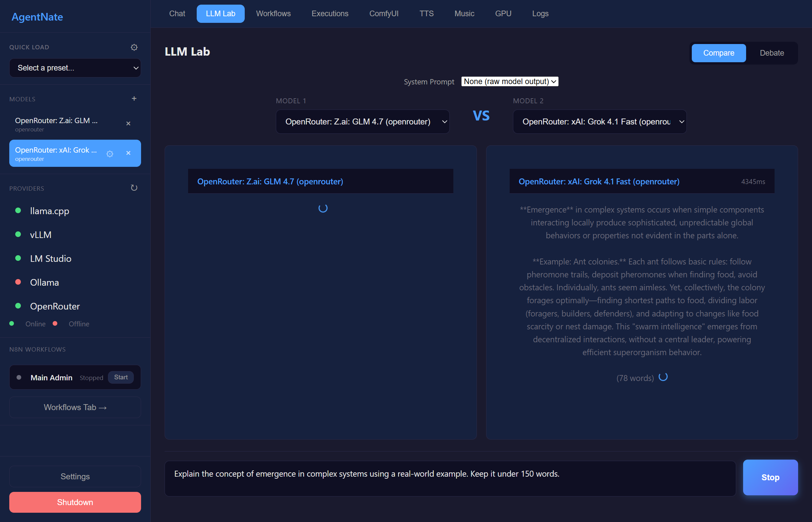

5. When both finish, each panel shows the model name and response time:


In this example, GLM 4.7 took 29.5 seconds while Grok 4.1 Fast responded in just 4.3 seconds — a 7x speed difference that's immediately visible.

5. Use the **Auto-Judge** button to have a third model evaluate which response is better:

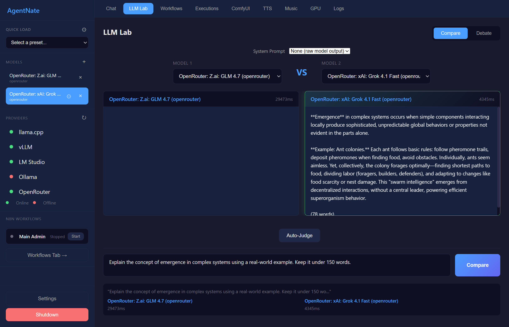

**Auto-Judge** uses a loaded model to analyze both responses and declare a winner based on quality, accuracy, and helpfulness.

### Debate Mode

Set up a multi-round structured debate between two models:

1. Switch to **Debate** mode using the mode toggle
2. Enter a debate topic (e.g., "AI will benefit humanity more than harm it")
3. Configure:
   - **Rounds** — 2 to 5 rounds of back-and-forth (default 3)
   - **Position** — Which model argues FOR vs AGAINST (the other takes the opposite)
4. Click **Start Debate**
5. The models take turns arguing their positions, each round building on previous arguments

The debate transcript displays in real-time with clear speaker labels, round numbers, and positions (FOR/AGAINST). Each turn streams via SSE with events: `debate_start`, `turn_start`, `token`, `turn_end`, `complete`.

After the debate concludes, a **voting panel** appears where you can declare a winner or vote "tie."

### Compare Mode Features

- **Speed comparison** — The faster model is automatically highlighted as the "winner" (by response time)
- **10-item history** — Past comparisons are tracked in a history panel for reference
- **Keyboard shortcut** — Press `Enter` in the prompt field to start a comparison
- **Cancel** — Stop both streams mid-generation if needed

### Auto-Judge

After a comparison, click **Auto-Judge** to have a third model evaluate which response was better. The judge model (any loaded model) analyzes both responses and provides a structured evaluation covering quality, accuracy, and helpfulness.

```
POST /api/chat/judge
{
  "prompt": "original prompt",
  "response_a": "Model 1's response",
  "response_b": "Model 2's response",
  "model_a_name": "GLM 4.7",
  "model_b_name": "Grok 4.1 Fast"
}
```

---

## 13. n8n Workflow Integration

### Why "AgentNate"?

The name **AgentNate** is a play on **n8n** (pronounced "n-eight-n" → "nate"). This isn't just a naming coincidence — n8n workflow automation is the **core backbone** of the platform. AgentNate wraps n8n with an AI-powered orchestration layer: agents can spin up workflows from natural language, deploy them to live n8n instances, execute them concurrently across isolated worker processes, and tear them down — all without touching the n8n editor.

### Overview


AgentNate deeply integrates with [n8n](https://n8n.io), an open-source workflow automation platform. Every n8n instance is managed as a subprocess — AgentNate starts, stops, monitors, and cleans up n8n processes automatically. The integration includes:

- **72 node types** built into the template engine (triggers, HTTP, AI/LLM, databases, messaging, cloud services, and more)
- **19 agent tools** for building, deploying, monitoring, and managing workflows
- **4 workflow bridge patterns** that generate complete multi-node workflows from a single command
- **100+ concurrent worker instances** with isolated databases (no SQLite lock contention)
- **Full credential management** — create, update, delete, and sync credentials across instances
- **Marketplace access** — search, preview, and deploy community workflows
- **Flash workflows** — one-shot deploy-trigger-collect-delete cycles for ephemeral automation

### n8n Instance Architecture

AgentNate manages n8n through a **dual-manager system** with separate roles for administration and execution:

#### Main Instance (Admin)

The **Main Instance** runs on port **5678** and serves as the central administration hub:

- Hosts the n8n web editor UI (accessible via sidebar "Open n8n" button)
- Stores the master workflow and credential database in `.n8n-instances/main/`
- Used for editing workflows visually, configuring credentials, and managing variables
- Can be "adopted" — if an existing n8n process is already running on port 5678, AgentNate detects and connects to it without spawning a new one
- Started via the sidebar **Start** button or the `POST /api/n8n/main/start` endpoint

#### Worker Instances (Execution)

**Worker instances** are the execution backbone. Each workflow that needs to run gets its own isolated n8n process:

- **Port range**: 5679–5778 (100 available worker slots)
- **Isolated databases**: Each worker gets its own SQLite database in `.n8n-instances/workers/wf-{id}-{port}/`, eliminating SQLite write-lock contention that plagues shared-database setups
- **One workflow per worker**: Clean separation ensures workflows don't interfere with each other
- **Credential sync**: Credentials are copied from the main instance database to each worker on spawn, and re-synced every 30 seconds in the background
- **Execution modes**:

| Mode | Behavior |
|------|----------|
| `once` | Run the workflow once, then stand by |
| `loop` | Run N times (configurable `loop_target`), auto-deactivate when done |
| `standby` | Keep alive, await external activation (webhook, schedule) |

**Spawning a worker:**
```bash
POST /api/n8n/workers/spawn
{
  "workflow_id": "abc123",
  "mode": "loop",
  "loop_target": 10
}
```

The worker process starts, copies the workflow + credentials from main, activates triggers, and begins execution. A background monitor polls every 10 seconds, updating execution counts and detecting completion.

#### Concurrent Execution

This architecture means AgentNate can run **100+ workflows simultaneously** without the database locking issues that cripple single-instance n8n deployments:

```
Main Instance (port 5678)          ← Admin UI, credential management
  ├── Worker 1 (port 5679)         ← RSS-to-Discord workflow (standalone DB)
  ├── Worker 2 (port 5680)         ← Email digest pipeline (standalone DB)
  ├── Worker 3 (port 5681)         ← API monitoring workflow (standalone DB)
  ├── Worker 4 (port 5682)         ← Flash workflow (ephemeral)
  └── ... up to Worker 100 (port 5778)
```

Each worker uses approximately **~300 MB RAM**. On a 32 GB system, you can comfortably run 20-30 concurrent workers alongside your LLM models.

#### Process Registry & Orphan Cleanup

AgentNate tracks every n8n process in `process_registry.json`:

```json
{
  "server_pid": 12345,
  "processes": {
    "5678": {"pid": 1234, "type": "main", "port": 5678, "started": "2026-02-18T10:30:00"},
    "5679": {"pid": 1235, "type": "worker", "port": 5679, "workflow_id": "abc123"}
  }
}
```

On startup, AgentNate:
1. Detects if the previous server crashed (different `server_pid`)
2. Kills all orphaned n8n processes from the previous session
3. Scans ports 5678–5778 for any stray `node.exe` processes and terminates them
4. Uses `wmic process call terminate` as a fallback when `taskkill /F` fails (common on Windows)

This means you never end up with zombie n8n processes consuming ports and memory after a crash.

#### Environment Configuration

Every n8n instance (main and workers) is launched with a carefully tuned environment:

```
N8N_PORT={port}                        # Assigned port
N8N_USER_FOLDER={data_folder}          # Isolated DB path
N8N_AUTH_EXCLUDE_ENDPOINTS=*           # Disable auth (API-only access)
N8N_USER_MANAGEMENT_DISABLED=true      # No user accounts needed
N8N_SKIP_OWNER_SETUP=true             # Skip first-run wizard
N8N_PYTHON_ENABLED=true               # Enable Python Code nodes
N8N_DIAGNOSTICS_ENABLED=false          # No telemetry
N8N_TEMPLATES_ENABLED=false            # Templates handled by AgentNate
```

### Building Workflows via Agent

The most powerful way to create workflows is through the agent. In agent mode, ask:

> "Create a workflow that monitors an RSS feed and sends new items to Discord"

The agent will:
1. Discover required node parameters with `describe_node`
2. Build the workflow with `build_workflow` (72 node types available)
3. Deploy and activate it automatically — all in one tool call

**Available node categories (72 types):**

| Category | Node Types |
|----------|------------|
| **Triggers** | manual_trigger, webhook, schedule, email_trigger, error_trigger |
| **HTTP** | http_request, http_request_file |
| **Files** | write_file, read_file |
| **AI/LLM** | local_llm, llm_summarize, llm_classify, openai, anthropic |
| **Data** | set_field, code, parse_json, html_extract, filter, sort, aggregate, and more |
| **Flow** | if, switch, merge, split_in_batches, wait, loop, execute_workflow |
| **Database** | mysql, postgres, mongodb, sqlite, redis |
| **Cloud** | google_sheets, google_drive, aws_s3, dropbox, notion, airtable |
| **Dev** | github, gitlab, jira |
| **Messaging** | discord_webhook, slack_webhook, telegram, email_send, twilio |
| **Utility** | debug, rss_feed, ftp, ssh, compression, pdf |

Each node type has a schema in the `NODE_REGISTRY` defining its parameters (type, required, default, options, description) and a builder function that produces valid n8n node JSON.

#### Build + Deploy in One Step

The `build_workflow` tool defaults to `deploy=true`, meaning the agent builds and deploys in a single call. This is critical for smaller models (8B parameters) that struggle to pass large workflow JSON between tool calls.

**Example: what the agent sends to `build_workflow`:**
```json
{
  "name": "RSS to Discord",
  "nodes": [
    {"type": "schedule", "cron": "0 */6 * * *"},
    {"type": "rss_feed", "url": "https://news.ycombinator.com/rss"},
    {"type": "discord_webhook", "webhook_url": "https://discord.com/api/webhooks/..."}
  ],
  "deploy": true,
  "activate": true
}
```

**What happens behind the scenes:**
1. Each node spec is looked up in `NODE_REGISTRY` and its builder function is called
2. Parameters nested under `"parameters"` are auto-flattened to the top level (agent resilience)
3. Node names with underscores and spaces are normalized for matching
4. Connections are built (linear by default, or custom for branching workflows)
5. If a `respond_webhook` node is present, the webhook's `responseMode` is auto-set to `"responseNode"`
6. The workflow JSON is deployed to n8n via `POST /rest/workflows`
7. If `activate=true`, a follow-up `PATCH` activates the workflow's triggers
8. The response includes the `workflow_id` and `webhook_url` for immediate use

#### Custom Connections for Branching

For non-linear workflows (IF branches, parallel paths, merge nodes), pass explicit connections:

```json
{
  "name": "Conditional Router",
  "nodes": [
    {"type": "webhook", "path": "router"},
    {"type": "if", "field": "priority", "operation": "equals", "compare_value": "high"},
    {"type": "slack_webhook", "webhook_url": "https://hooks.slack.com/..."},
    {"type": "email_send", "to": "team@example.com", "subject": "Low Priority Item"},
    {"type": "respond_webhook", "respond_with": "json"}
  ],
  "connection_mode": "custom",
  "custom_connections": [
    {"from": "Webhook", "to": "IF"},
    {"from": "IF", "to": "Slack Webhook", "output": 0},
    {"from": "IF", "to": "Send Email", "output": 1},
    {"from": "Slack Webhook", "to": "Respond to Webhook"},
    {"from": "Send Email", "to": "Respond to Webhook"}
  ]
}
```

The `output: 0` is the "true" branch of the IF node, and `output: 1` is the "false" branch.

### The 19 Workflow Tools

AgentNate provides 19 tools for complete workflow lifecycle management:

#### Discovery (3 tools)

| Tool | Purpose |
|------|---------|
| `describe_node` | Get parameter schemas for node types. Pass `["all"]` for the complete 72-type catalog, or specific types like `["webhook", "http_request"]` |
| `list_credentials` | List all credentials configured in n8n (returns ID, name, type) |
| `describe_credential_types` | Get field schemas for credential types (e.g., `openAiApi` needs `apiKey`) |

#### Build & Deploy (4 tools)

| Tool | Purpose |
|------|---------|
| `build_workflow` | Build workflow from node specs, auto-deploy and activate. The primary workflow creation tool |
| `deploy_workflow` | Deploy pre-built workflow JSON to n8n (for manual or imported workflows) |
| `update_workflow` | Replace an existing workflow's definition (preserves ID and execution history) |
| `activate_workflow` / `deactivate_workflow` | Toggle workflow triggers on/off |

#### Lifecycle (3 tools)

| Tool | Purpose |
|------|---------|
| `list_workflows` | List all deployed workflows with ID, name, and active status |
| `delete_workflow` | Delete a workflow (3-step: deactivate → archive → delete, required by n8n) |
| `delete_all_workflows` | Batch delete (requires `confirm=true` safety flag) |

#### Credentials (3 tools)

| Tool | Purpose |
|------|---------|
| `create_credential` | Create a new credential (type + data, e.g., API keys, database passwords) |
| `update_credential` | Update credential name or data |
| `delete_credential` | Remove a credential |

#### Execution & Monitoring (4 tools)

| Tool | Purpose |
|------|---------|
| `trigger_webhook` | Fire a webhook trigger with POST/GET data. Supports test mode (`/webhook-test/`) |
| `list_executions` | List execution history filtered by workflow, status (success/error/crashed/waiting), limit |
| `get_execution_result` | Full execution details with per-node results: status, output count, data, errors |
| `flash_workflow` | One-shot: deploy → activate → trigger → collect results → delete (see below) |

#### Variables (2 tools)

| Tool | Purpose |
|------|---------|
| `set_variable` | Create or update an n8n variable (accessible as `$vars.key` in workflow expressions) |
| `list_variables` | List all configured variables |

### Flash Workflows

For one-shot automation that doesn't need to persist, the `flash_workflow` tool provides a complete deploy-trigger-collect-delete cycle. The agent builds a workflow, runs it once, gets the output, and cleans up — no stale workflows left behind.

**The flash lifecycle:**

```
Agent builds workflow JSON
    ↓
Deploy to n8n → activate triggers
    ↓
POST to webhook with payload
    ↓
Poll for completion (12 attempts, 5s each = 60s max)
    ↓
Collect execution output
    ↓
Delete workflow (always, even on error — runs in `finally` block)
    ↓
Return results to agent
```

This is ideal for:
- **Ephemeral multi-LLM tasks** — Fan out a question to 3 personas, merge answers, return the best
- **One-off data processing** — Transform, filter, and aggregate data through a temporary pipeline
- **Agent-orchestrated automation** — The agent decides it needs a workflow, builds one, uses it, discards it

**Patterns available:** `swarm` (parallel personas), `pipeline` (sequential stages), `multi_coder` (N coders + reviewer), `image_pipeline` (LLM prompt → ComfyUI image). See Section 14 for full details.

**API example:**
```bash
curl -X POST http://127.0.0.1:8000/api/tools/agent/chat \
  -H "Content-Type: application/json" \
  -d '{
    "message": "Flash a swarm workflow with researcher and coder personas to analyze: best practices for REST API design",
    "conversation_id": "flash-demo",
    "persona_id": "system_agent"
  }'
```

### Marketplace

AgentNate includes a built-in workflow marketplace that lets you browse, preview, configure, and deploy pre-built n8n workflow templates without leaving the app.

#### Workflow Sources

**Official n8n Templates API** — The marketplace fetches from `https://api.n8n.io/api/templates` with tiered caching (categories: 60 min, workflow lists: 15 min, individual workflows: 60 min, search results: 10 min). Each workflow is transformed into a standardized format with auto-detected complexity (Low/Medium/High based on node count) and trigger type (webhook/schedule/chat/manual). Response data is sanitized to handle broken UTF-8 surrogate characters.

**Community Workflows — [Zie619/n8n-workflows](https://github.com/Zie619/n8n-workflows)** — Special thanks to the **Zie619** community project, which maintains a curated collection of **4,300+ production-ready n8n workflows** spanning **365+ integrations** and **29,000+ nodes**. This project was a key inspiration for AgentNate's marketplace integration and demonstrates the massive breadth of what's possible with n8n automation. The collection is browsable at [zie619.github.io/n8n-workflows](https://zie619.github.io/n8n-workflows) and provides its own searchable API with categories, full-text search, and individual workflow retrieval. Workflow JSON files from this collection (or any n8n export) can be imported directly into AgentNate via the **Batch Import** feature on the Deployed Workflows sub-tab.

#### Browsing & Deploying

- **Search** for workflows by keyword or category (returns up to 100 results)
- **Preview** workflow details in a modal: full description, node list, integrations, complexity badge, trigger type, view count
- **Inspect** to analyze credential requirements and placeholder parameters before deploying
- **Configure** to fill in credential IDs and parameter overrides via an interactive panel
- **Deploy** directly to your local n8n instance with one click

#### Smart Deploy Flow

When you click **Run** on a marketplace workflow, AgentNate doesn't blindly deploy. It runs a smart inspection pipeline:

```
Click "Run" on workflow card
    ↓
Fetch complete workflow JSON from marketplace API
    ↓
POST /api/workflows/inspect → analyze credential & placeholder needs
    ↓
┌── All credentials available? → Fast-path: deploy immediately
│
└── Issues found? → Show Inspection Panel (modal)
    ├── Credential dropdowns (maps to your existing n8n credentials)
    ├── Placeholder text inputs (YOUR_API_KEY, REPLACE_ME, etc.)
    └── "Configure & Deploy" button
         ↓
    POST /api/workflows/configure → merge credentials + params
         ↓
    Deploy to n8n worker → open in n8n UI
```

The inspection system automatically detects placeholder patterns (`YOUR_`, `REPLACE_`, `TODO`, `sk-`, `xoxb-`) and maps credential types across **90+ integrations** (Slack, Discord, GitHub, Google Sheets, AWS, databases, AI APIs, etc.). If you already have matching credentials in n8n, they're auto-suggested in the dropdowns.

If configuration gets complex, click **"Ask Agent for Help"** — this switches to the Chat tab with a pre-filled prompt containing the workflow details, missing credentials, and placeholder values, using the Workflow Builder persona in autonomous mode.

#### Via Agent Tools (4 tools)

| Tool | Description |
|------|-------------|
| `search_marketplace` | Search by keyword + optional category, returns workflow summaries with ID, name, description, complexity, integrations, view count |
| `get_marketplace_workflow` | Fetch complete workflow JSON + metadata by ID for deployment |
| `inspect_workflow` | Analyze credential needs (pre-configured/available/missing) + detect placeholder params. Cross-references with locally configured n8n credentials |
| `configure_workflow` | Fill in credential IDs and parameter values, then return deployment-ready JSON. Maps 90+ credential types automatically |

**Example agent interaction:**

> "Search the marketplace for Slack notification workflows, inspect the top result, and deploy it using my existing Slack credentials"

The agent chains: `search_marketplace("slack notification")` → `get_marketplace_workflow(id)` → `inspect_workflow(json)` → `configure_workflow(json, credential_map)` → `deploy_workflow(json)`

### Deployed Workflows

View and manage workflows deployed to your n8n instance:

- **Active/inactive toggle** — Enable or disable workflow triggers with one click
- **Edit in n8n** — Open the workflow in the n8n visual editor for manual adjustments
- **Delete** — Remove workflows (3-step: deactivate → archive → delete, as required by n8n's API)
- **Execution count** — See how many times each workflow has run
- **Batch import** — Upload multiple workflow JSON files at once (max 10 MB each) with progress tracking

### Active Workers

Monitor currently running n8n worker instances:

- **Worker list** — Port, workflow name, mode (once/loop/standby), status, execution count
- **Queue state** — Queued total, completed, remaining, paused, processing
- **Per-worker controls** — Activate/deactivate triggers, change mode, stop worker
- **Bulk controls** — Stop all workers at once

Worker execution data is polled every 10 seconds in the background and cached — the UI never makes blocking HTTP calls to workers directly.

### Executions

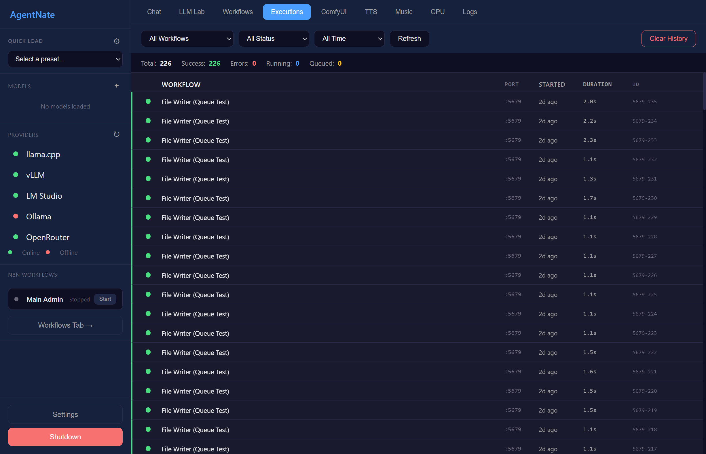

The Executions tab shows the history of all workflow executions across all workers:

- **Status** — Success (green), error (red), crashed, running, or waiting
- **Duration** — How long the execution took
- **Workflow name** — Which workflow ran
- **Worker port** — Which worker instance ran it
- **Mode** — How it was triggered (once, loop, webhook, schedule)
- **Timestamp** — When it executed

Click any execution to inspect node-level input/output data and debug errors. The `get_execution_result` tool returns per-node breakdowns:

```json
{
  "node_results": {
    "Webhook": {"status": "success", "output_count": 1},
    "HTTP Request": {"status": "success", "output_count": 5},
    "Filter": {"status": "success", "output_count": 3},
    "Send Email": {"status": "error", "error": "SMTP connection refused"}
  }
}
```

**Execution history persistence:** When a worker stops, its execution history is aggregated into `history.sqlite` for long-term storage. You can query history filtered by workflow ID, status, date range, and limit.

### n8n Instance Management

The sidebar shows n8n status. Click **Start** to launch the n8n admin interface:

- n8n runs on port **5678** by default
- The admin UI opens in a new browser tab via the "Open n8n" link
- Auth is disabled for API access — AgentNate manages all authentication internally via cached auth cookies
- You can manage credentials, variables, and workflows through both the n8n UI and AgentNate's agent tools
- The sidebar shows a green indicator when n8n is running and the number of active workflows

### REST API Endpoints

AgentNate exposes a full REST API for programmatic n8n management:

**Main Instance:**

| Endpoint | Method | Purpose |
|----------|--------|---------|
| `/api/n8n/main/start` | POST | Start the main admin n8n instance |
| `/api/n8n/main/stop` | DELETE | Stop the main instance |
| `/api/n8n/main/status` | GET | Get main instance status (running, port, URL) |
| `/api/n8n/workflows` | GET | List all workflows from the main database |
| `/api/n8n/workflow/{id}` | GET/PUT/DELETE | Get, update, or delete a specific workflow |

**Workers:**

| Endpoint | Method | Purpose |
|----------|--------|---------|
| `/api/n8n/workers/spawn` | POST | Spawn a new worker for a workflow |
| `/api/n8n/workers` | GET | List all active workers |
| `/api/n8n/workers/{port}` | GET | Get worker details and queue state |
| `/api/n8n/workers/{port}/activate` | POST | Enable workflow triggers on a worker |
| `/api/n8n/workers/{port}/deactivate` | POST | Disable workflow triggers |
| `/api/n8n/workers/{port}/mode` | PATCH | Change execution mode (once/loop/standby) |
| `/api/n8n/workers/{port}/stop` | DELETE | Stop and clean up a worker |

---

## 14. Workflow Bridge Patterns

### Overview

The **Workflow Bridge** (`backend/workflow_bridge.py`) is a code generation layer that produces complete n8n workflow JSON from high-level pattern descriptions. Rather than manually wiring nodes in the n8n editor, you describe what you want — "3 personas working in parallel" or "a sequential pipeline" — and the bridge generates a ready-to-deploy workflow.

Every generated workflow follows the same skeleton:
1. **Webhook trigger** — Accepts POST requests with a task payload
2. **Resolve Routes** — A Code node that calls `/api/routing/resolve/{persona}` for each persona, translating persona names into live model instance IDs via the routing preset system
3. **Processing nodes** — LLM calls via HTTP to `/api/chat/completions` using the resolved instance IDs
4. **Respond to Webhook** — Returns the combined results as JSON

### Pattern 1: Swarm (Parallel Personas)

The **Swarm** pattern fans out a single input to multiple personas simultaneously, then merges their outputs.

```
Webhook → Resolve → ┬─ LLM Researcher ─┬─ Merge → Respond
                     ├─ LLM Coder      ─┤
                     └─ LLM Reviewer   ─┘
```

**Use cases:**
- Get multiple perspectives on a problem (researcher + coder + reviewer)
- Multi-language translation (one persona per language)
- Ensemble answers where you want the best of N responses

**Configuration:**
```json
{
  "pattern": "swarm",
  "config": {
    "name": "Research Swarm",
    "personas": [
      {"id": "researcher", "system_prompt": "You are a research analyst.", "max_tokens": 2048},
      {"id": "coder", "system_prompt": "You are a senior developer.", "max_tokens": 4096},
      {"id": "reviewer", "system_prompt": "You are a technical reviewer.", "max_tokens": 2048}
    ],
    "task_field": "task",
    "webhook_path": "research-swarm"
  }
}
```

**Invocation:**
```bash
curl -X POST http://localhost:5678/webhook/research-swarm \
  -H "Content-Type: application/json" \
  -d '{"task": "Explain the pros and cons of microservices architecture"}'
```

**Response** includes each persona's output: `researcher_response`, `coder_response`, `reviewer_response`.

### Pattern 2: Pipeline (Sequential Stages)

The **Pipeline** pattern chains personas sequentially — each stage receives the previous stage's output as its input.

```
Webhook → Resolve → Stage 1: Researcher → Stage 2: Writer → Stage 3: Editor → Respond
```

**Use cases:**
- Research → Draft → Edit writing pipeline
- Analyze → Plan → Implement coding pipeline
- Extract → Transform → Summarize data processing

**Configuration:**
```json
{
  "pattern": "pipeline",
  "config": {
    "name": "Writing Pipeline",
    "stages": [
      {"persona_id": "researcher", "system_prompt": "Research the topic thoroughly.", "output_field": "research"},
      {"persona_id": "coder", "system_prompt": "Write a detailed article based on the research.", "output_field": "draft"},
      {"persona_id": "reviewer", "system_prompt": "Edit and polish the article.", "output_field": "final_article"}
    ],
    "webhook_path": "write-pipeline"
  }
}
```

Each stage's `output_field` becomes the input for the next stage. The first stage receives the original webhook payload.

### Pattern 3: Multi-Coder (N Coders + Reviewer)

The **Multi-Coder** pattern spawns N parallel coders working on the same task with different approach variations, then feeds all solutions to a reviewer who selects or synthesizes the best answer.

```
Webhook → Resolve → ┬─ Coder 1 (straightforward) ─┬─ Collect → Reviewer → Respond
                     ├─ Coder 2 (different angle)  ─┤
                     └─ Coder 3 (creative approach) ─┘
```

**Use cases:**
- Code generation with quality assurance (the reviewer picks the best solution)
- Algorithm comparison (each coder tries a different approach)
- Any scenario where you want competitive solutions with expert review

**Configuration:**
```json
{
  "pattern": "multi_coder",
  "config": {
    "name": "Code Competition",
    "coder_count": 3,
    "coder_persona": "coder",
    "reviewer_persona": "coder",
    "coder_system_prompt": "Write clean, correct code for the given task.",
    "reviewer_system_prompt": "Review all solutions. Pick the best or synthesize the best parts.",
    "webhook_path": "code-review"
  }
}
```

Each coder automatically gets a variation prompt ("straightforward approach", "different angle", etc.) to encourage diverse solutions. The reviewer receives all solutions side-by-side and produces a final polished output.

### Pattern 4: Image Pipeline (LLM → ComfyUI)

The **Image Pipeline** connects an LLM persona to ComfyUI — the LLM generates an optimized Stable Diffusion prompt from a natural-language description, then ComfyUI generates the image.

```
Webhook → Resolve → LLM (prompt engineer) → Prepare Request → ComfyUI Generate → Poll Result → Respond
```

**Use cases:**
- Natural language to image generation ("a sunset over mountains" → optimized SD prompt → image)
- Automated illustration generation for articles or stories
- Batch image generation with intelligent prompt engineering

**Configuration:**
```json
{
  "pattern": "image_pipeline",
  "config": {
    "name": "Smart Image Generator",
    "prompt_persona": "coder",
    "instance_id": "gpu1_8188",
    "checkpoint": "sd_xl_turbo_1.0_fp16.safetensors",
    "webhook_path": "smart-image"
  }
}
```

The LLM acts as a prompt engineer, adding quality tags, style descriptors, and composition details. The output includes positive and negative prompts. The workflow then POSTs to ComfyUI's generate endpoint and polls for completion (up to 60 seconds).

### Generating and Deploying Bridge Workflows

Bridge workflows can be generated programmatically via the API:

```python
# Python example
import requests

workflow = requests.post("http://127.0.0.1:8000/api/workflows/generate", json={
    "pattern": "swarm",
    "config": {
        "name": "My Swarm",
        "personas": ["researcher", "coder"],
        "webhook_path": "my-swarm"
    }
}).json()

# Deploy to n8n
requests.post("http://127.0.0.1:8000/api/workflows/deploy", json={
    "workflow": workflow,
    "activate": True
})
```

Or use the agent tool `build_workflow` which accepts a pattern and config, generates the workflow JSON, and deploys it to n8n in a single call.

### How Route Resolution Works at Runtime

When a bridge workflow executes, the **Resolve Routes** Code node calls the AgentNate API for each persona:

```
GET /api/routing/resolve/researcher  →  {"instance_id": "abc-123", "model": "qwen2.5-32b"}
GET /api/routing/resolve/coder       →  {"instance_id": "def-456", "model": "deepseek-coder-v2"}
```

This means changing which model a persona uses requires no workflow modification — just update the routing preset. The same workflow adapts to whatever models are currently loaded.

---

## 15. ComfyUI Creative Engine

### Overview

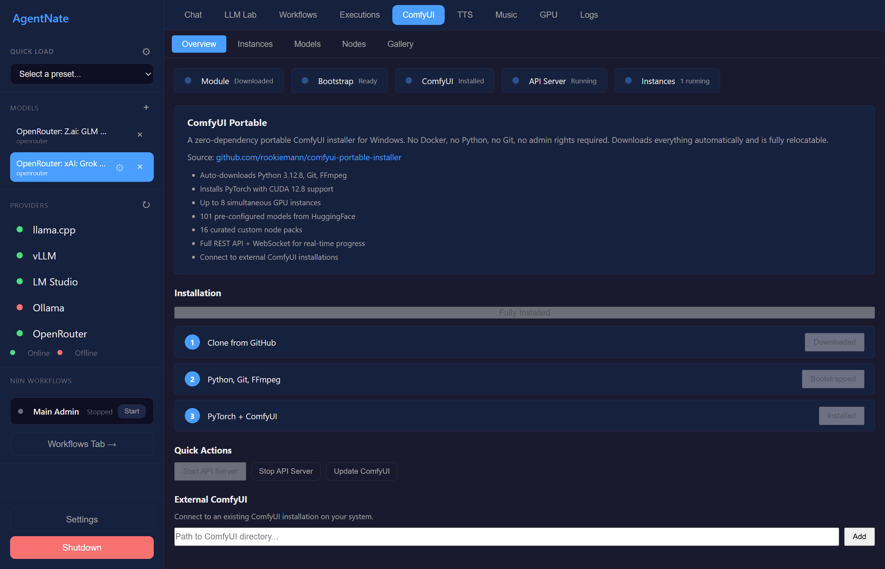

AgentNate includes a full ComfyUI integration for AI-powered **image generation, video creation, upscaling, inpainting, ControlNet-guided composition**, and more. ComfyUI is a node-based generative AI framework, and AgentNate wraps it with instance management, a 101-model registry with one-click downloads, smart multi-GPU routing, and agent tools so the AI can drive the entire pipeline from natural language.

> **Auto-installed**: The ComfyUI module is automatically cloned from [rookiemann/comfyui-portable-installer](https://github.com/rookiemann/comfyui-portable-installer) into `modules/comfyui/` on first use. It includes its own portable Python environment, Git, and all dependencies — no manual setup required.

The Overview panel shows the module status at a glance: **Downloaded**, **Bootstrapped**, **Installed**, **API Running**, and the number of active instances. Below the status indicators you'll find the feature list, installation steps, and Quick Action buttons for common operations.

The ComfyUI tab has five sub-sections: **Overview**, **Instances**, **Models**, **Nodes**, and **Gallery**.


### Instances

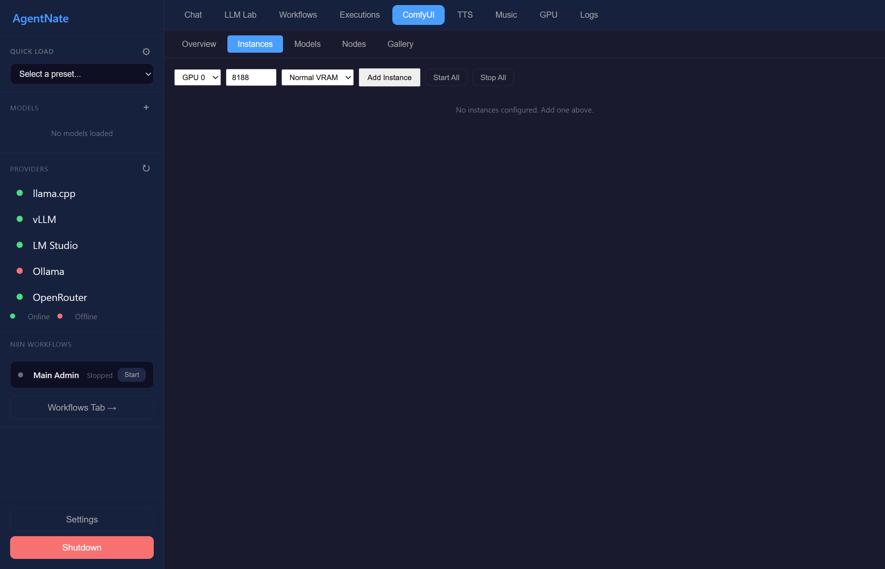

The Instances sub-tab lists all configured ComfyUI instances with their status, GPU assignment, and port:

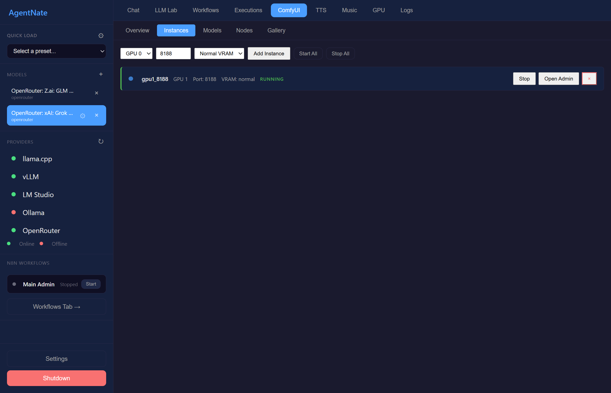

Manage ComfyUI instances -- each instance runs on a specific GPU:

- **Add Instance** - Create a new ComfyUI instance on a chosen GPU with configurable port and VRAM mode
- **Start/Stop** - Control individual instances with one click
- **Bulk Control** - Start All / Stop All buttons for multi-instance setups
- **Status** - Shows running state (green = running), GPU assignment, port number
- **VRAM Mode** - Normal, lowvram, or novram (for limited GPU memory)

In the screenshot above, an instance is running on its assigned GPU with a dedicated port. The Add Instance controls at the bottom allow you to spin up additional instances on different GPUs.

### Model Registry (101 Models)

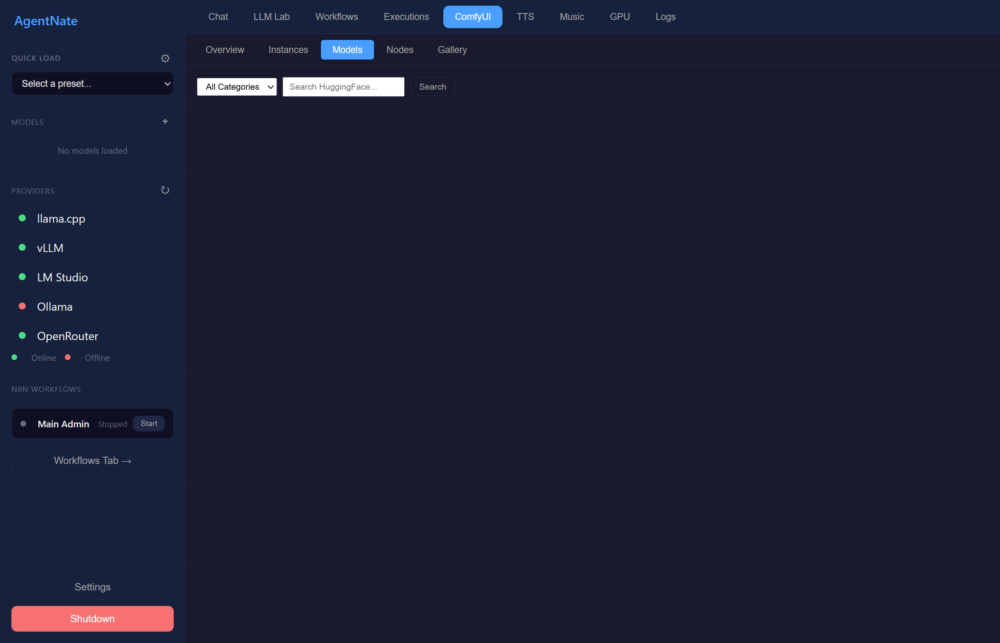


The built-in model registry provides one-click access to **101 models** across every major architecture:

- **Checkpoints**: SD 1.5, SD 2.1, SDXL, SDXL Turbo, Flux Schnell, Flux Dev, SD3 Medium, LTX Video, SVD XT, HunyuanVideo, Wan 2.1, Z-Image, HiDream, Chroma
- **VAEs**: SD 1.5 VAE, SDXL VAE, Flux VAE, SD3 VAE, TAESDXL (tiny)
- **CLIP Encoders**: CLIP-L, CLIP-G, T5-XXL (FP8 and FP16 variants), Flux 2 Mistral
- **ControlNets**: Canny, Depth, OpenPose, Tile, Inpaint, SoftEdge, Scribble, Line Art, QR Code, IP-Adapter, InstantID, and more
- **Upscalers**: RealESRGAN x4, ESRGAN x4, SwinIR, 4x-UltraSharp
- **Embeddings**: EasyNegative, BadDream, UnrealisticDream

Each model shows its file size, and a **Download** button fetches it directly to the correct ComfyUI directory. The category dropdown and HuggingFace search bar let you filter and find models quickly:

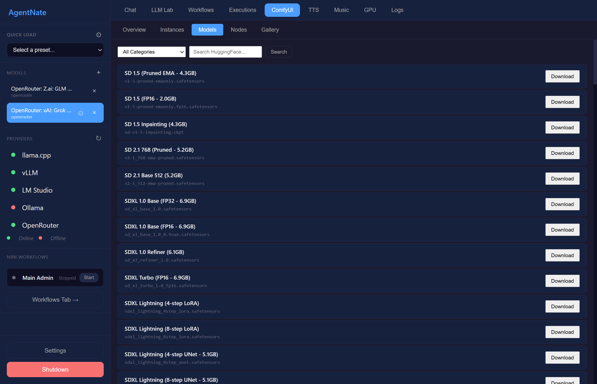

**VRAM recommendations:**

| Model Type | VRAM Required | Output |
|------------|--------------|--------|
| SD 1.5 | ~4 GB | 512x512 image |
| SDXL / SDXL Turbo | ~6 GB | 1024x1024 image |
| Flux Schnell/Dev FP8 | ~12-18 GB | 1024x1024 image |
| Flux Dev FP32 | ~24 GB | 1024x1024 image |
| SVD XT | ~6 GB | 1024x576 video (25 frames) |
| LTX Video 2 | ~12 GB | 768x512 video (97 frames) |
| WAN 2.1 | ~14 GB | 1024x576 video (81 frames) |
| Qwen Image Edit | ~10 GB | 640x640 image edit |

### Nodes

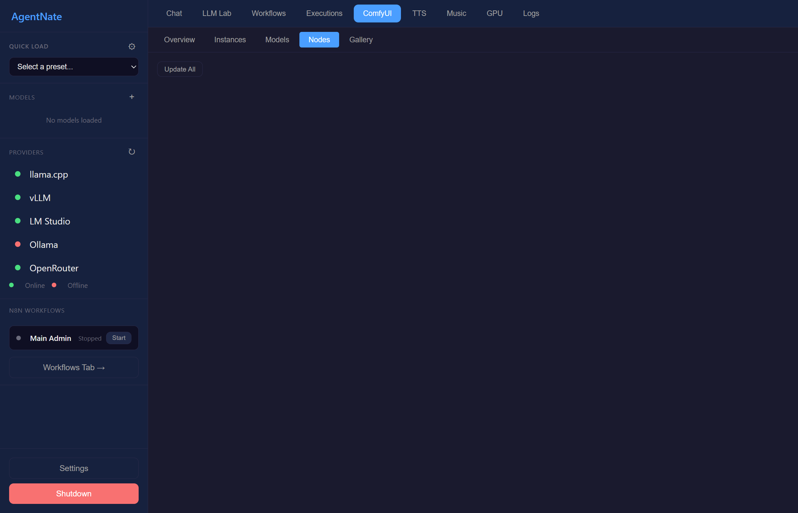

Manage custom node packs that extend ComfyUI's capabilities:

- **Browse** the curated node pack registry
- **Install** custom nodes (ControlNet, IP-Adapter, AnimateDiff, etc.)
- **Update** installed packs to latest versions
- **Remove** unused node packs

### Gallery

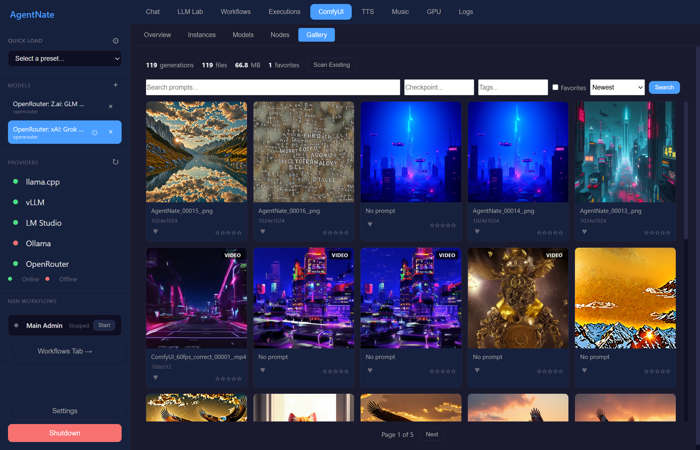

The Gallery tab provides a searchable archive of all your generations — images, videos, upscaled outputs, and more. In the screenshot above, **119 generations** totaling **66.8 MB** are displayed as thumbnails. Features include:

- **Search** by prompt text, checkpoint name, or tags
- **Sort** by newest, oldest, or other criteria
- **Pagination** for browsing large collections
- **Click any thumbnail** to view the full image with generation metadata (model, seed, steps, CFG, sampler)
- **Ratings & favorites** — Rate outputs 0-5 stars and mark favorites for quick filtering
- **Lineage tracking** — For img2img chains, view the parent→child history of how an output was created
- **Orphan detection** — Retroactively discovers and catalogs files generated outside AgentNate

The gallery is backed by the **Media Catalog** (`backend/media_catalog.py`), a SQLite database that indexes every generation with full metadata: prompt, seed, steps, CFG, sampler, scheduler, checkpoint, dimensions, file size, and media type. It automatically parses image headers (PNG, JPEG, WebP, GIF) and video containers (MP4) for dimensions and duration.

### Generating Content

The most natural way to create content is through the agent (see the Image Generation Demo in Section 5). In agent mode, simply describe what you want:

> "Generate a beautiful sunset over mountains in oil painting style"

> "Create a 3-second video of ocean waves from this photo"

> "Upscale this image to 4x resolution"

The agent handles the entire pipeline: starting ComfyUI if needed, downloading missing models automatically, selecting the right workflow, configuring parameters, submitting the job, and polling for the result.

Here is an actual 1024x1024 image generated by AgentNate using SDXL Turbo (4 steps, cfg 1.0, seed 42) -- a golden hour mountain landscape with lake reflection:


#### What Can ComfyUI Create?

AgentNate's ComfyUI integration goes far beyond basic image generation. It can detect and use all of ComfyUI's built-in workflow templates plus custom node workflows:

**Images:**
- **Text-to-Image** — Generate images from text descriptions (SD 1.5, SDXL, Flux, SD3)
- **Image-to-Image** — Transform existing images with new prompts
- **Inpainting** — Edit specific masked regions of an image
- **Upscaling** — Enhance resolution with RealESRGAN, ESRGAN, SwinIR, or UltraSharp
- **ControlNet** — Guide generation with pose, depth, canny edges, scribbles, or line art
- **Hires Fix** — Two-pass generation for high-resolution output without artifacts

**Video:**
- **SVD XT** — Stable Video Diffusion: animate a still image into a 25-frame video (~3 sec)
- **LTX Video 2** — Image-to-video with up to 97 frames at 25fps (~4 sec)
- **WAN 2.1** — First-to-last frame video: morph between two keyframes (81 frames)

**And More:**
- **Image Editing** — Qwen-based instruction-driven image editing
- **Flux 2** — Next-gen text-to-image with Mistral 3 text encoder
- **Any Custom Workflow** — Import and execute any ComfyUI workflow JSON, including workflows from the 4,000+ custom node ecosystem

#### Workflow Templates

Ready-made templates that the agent can invoke by name:

| Template | Type | Description |
|----------|------|-------------|
| `txt2img` | Image | Text to image (basic generation) |
| `img2img` | Image | Image to image transformation |
| `upscale` | Image | Upscale with ESRGAN models |
| `inpaint` | Image | Inpaint masked regions |
| `txt2img_hires` | Image | Two-pass high-resolution generation |
| `controlnet_pose` | Image | ControlNet pose-guided generation |
| `svd_img2video` | Video | SVD XT image-to-video (25 frames, ~6 GB VRAM) |
| `ltxv_img2video` | Video | LTX Video 2 image-to-video (97 frames at 25fps) |
| `wan_first_last_video` | Video | WAN 2.1 frame-to-frame morphing transition |
| `flux2_txt2img` | Image | Flux 2 with Mistral 3 text encoder |
| `qwen_image_edit` | Image | Instruction-based image editing |

Beyond these templates, ComfyUI's native workflow templates are also auto-detected. The `comfyui_list_templates` tool shows all available templates including those from installed custom node packs.

#### Automatic Model Downloads

You don't need to manually hunt for model files. When the agent selects a workflow that requires a model you don't have, it can:

1. **Detect the missing model** — The `comfyui_analyze_workflow` tool extracts all required models from any workflow
2. **Search for it** — The `comfyui_search_models` tool browses the 101-model curated registry or searches HuggingFace directly
3. **Download it** — The `comfyui_download_model` tool fetches the file to the correct ComfyUI directory with progress tracking
4. **Auto-provision** — The ComfyUI Pool can automatically download missing checkpoints before starting a generation job

This means you can go from "generate a Flux image" to a finished result even if you don't have the Flux checkpoint yet — the agent handles the entire download-and-generate pipeline.

### Instance Pool

The ComfyUI Pool provides smart multi-instance routing:

- **Model Affinity** - Jobs are automatically routed to instances that already have the model loaded (+100 affinity score)
- **Load Balancing** - Distributes work across available instances by queue depth and idle status
- **Auto-Provisioning** - Automatically downloads missing models before generation
- **Batch Jobs** - Submit multiple prompts and distribute them across the pool with weighted round-robin
- **VRAM Filtering** - Automatically excludes instances without enough VRAM for the requested model

---

## 16. Text-to-Speech (TTS)

### Overview

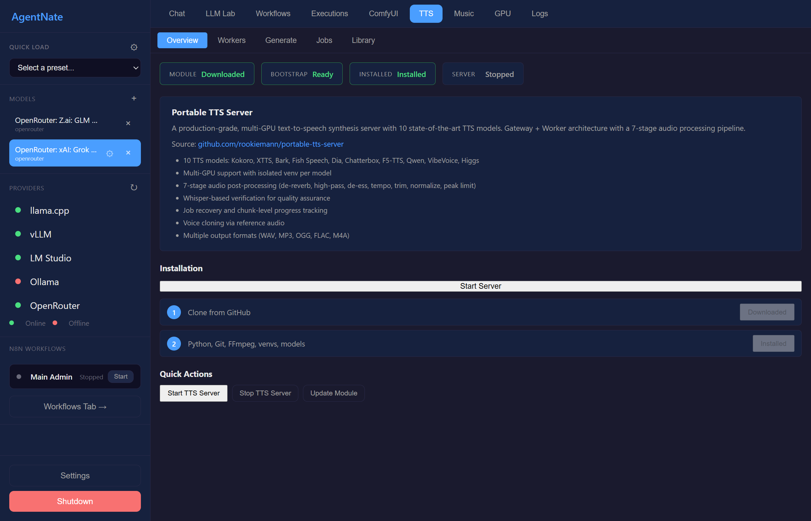

The TTS tab before any models are loaded. Once you start the server and load a model, it populates with worker info:


AgentNate integrates a full **Portable TTS Server** ([github.com/rookiemann/portable-tts-server](https://github.com/rookiemann/portable-tts-server)) with 10 voice synthesis models, a Gateway + Worker architecture, and a 7-stage audio processing pipeline. The TTS module runs as a subprocess on port **8100** and is managed entirely through AgentNate.

> **Auto-installed**: The TTS module is automatically cloned from [rookiemann/portable-tts-server](https://github.com/rookiemann/portable-tts-server) into `modules/tts/` on first use. It includes its own portable Python environment and all dependencies.

**Architecture:**
- **Gateway server** — FastAPI on port 8100, routes requests to workers
- **Workers** — One per loaded model, each in its own Python virtual environment
- **Audio Pipeline** — 7 stages: de-reverb, high-pass filter, de-ess, tempo adjustment, trim silence, normalize, peak limiter
- **Whisper verification** — Optional quality assurance via speech-to-text comparison
- **Multi-GPU** — Each worker can target a specific GPU via device assignment

### Sub-tabs

The TTS tab has 5 sub-tabs:

| Tab | Purpose |
|-----|---------|
| **Overview** | Module status, installation steps, quick actions (start/stop server) |
| **Workers** | Running model workers with GPU assignment, VRAM usage, request counts |
| **Generate** | Text input, model/voice/format selection, model-specific parameters |
| **Jobs** | Active and recent generation jobs with progress tracking |
| **Library** | All generated audio files with playback, download, and metadata |

### Available Models

| Model | Size | VRAM | Voices | Special Features |
|-------|------|------|--------|-----------------|
| **Kokoro** | 82M | ~1 GB | 54 built-in | Fastest, lightweight, ideal for batch |
| **XTTS v2** | 500M | ~3 GB | 58 built-in | 16 languages, voice cloning via reference audio |
| **Dia 1.6B** | 1.6B | ~6 GB | Speaker tags | Multi-speaker dialogue with [S1]/[S2] tags |
| **Bark** | 1B | ~5 GB | Expressive | [laughter], [sighs], [music], [gasps] tokens |
| **Fish Speech** | 500M | ~1 GB | Cloning | Fast generation, voice cloning from short samples |
| **Chatterbox** | 500M | ~2 GB | Emotion control | Emotion-controlled voice cloning |
| **F5-TTS** | 300M | ~2 GB | Diffusion cloning | Reference audio cloning via diffusion |
| **Qwen Omni** | 7B | Heavy | Multimodal | Speech output from multimodal model |
| **VibeVoice** | 1.5B | Medium | Speaker-conditioned | Speaker embedding control |
| **Higgs Audio** | 3B | Medium | ChatML format | CPU supported, conversational |

Each model has its own isolated virtual environment (e.g., `coqui_env` for XTTS/Bark, `unified_env` for Kokoro/Dia/Fish).

### Using TTS via the UI

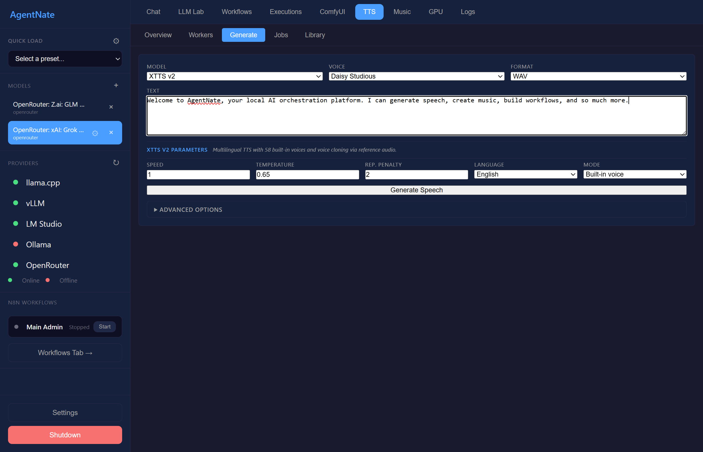

1. Navigate to the **TTS** tab
2. Click **Start TTS Server** if not running (starts gateway on port 8100)
3. Go to **Workers** tab and load a model (select model + GPU device)
4. Switch to **Generate** tab:
   - Select the loaded model from the dropdown
   - Choose a voice (XTTS shows 58 voices, Kokoro shows 54)
   - Select output format (WAV, MP3, OGG, FLAC, M4A)
   - Type your text (max ~500 characters per generation)
   - Adjust model-specific parameters (speed, temperature, language for XTTS)
   - Click **Generate Speech**
5. Check **Library** tab for the generated audio with playback controls

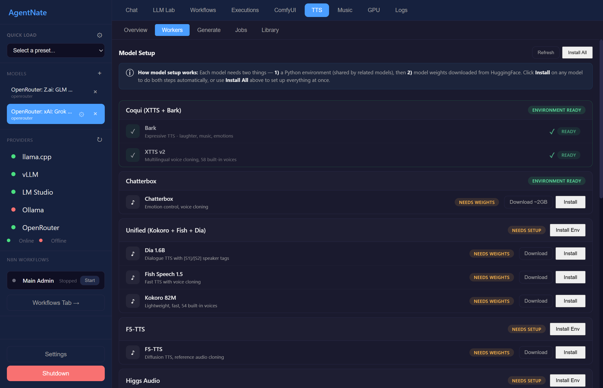

The Workers view shows each loaded model with its GPU assignment, worker ID, and status.

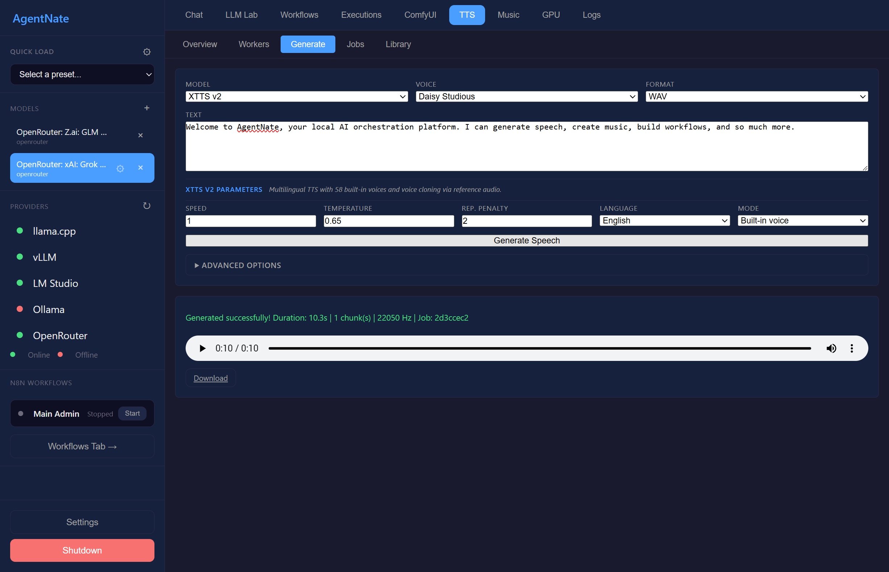

### Audio Library

The Library tab stores all generated audio files with inline playback, download buttons, and metadata (model, voice, duration, format, timestamp):

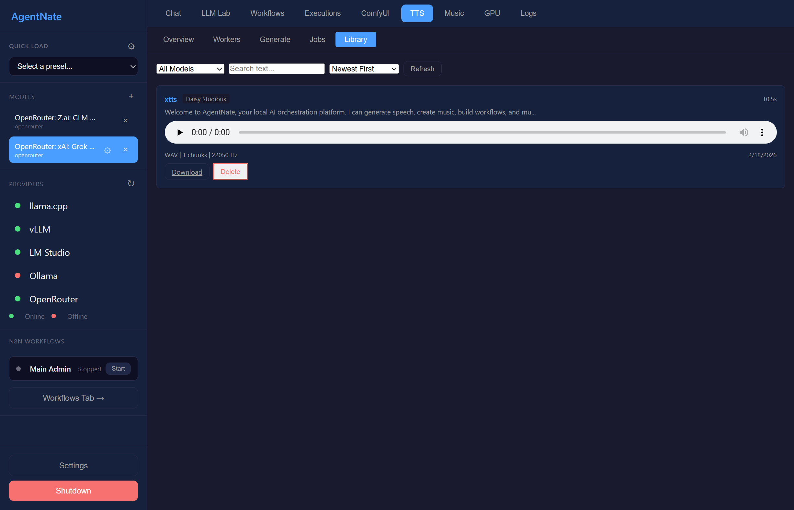

Each entry shows the text that was synthesized, the model and voice used, file size, and provides audio playback directly in the browser. Files persist across server restarts.

### Using TTS via Agent Mode

Select the **Voice Creator** persona and ask naturally:

> "Generate speech saying 'Hello, welcome to AgentNate' using the XTTS model with the Daisy Studious voice"

The agent will:
1. Check `tts_status` to verify the server is running
2. Call `tts_get_model_info` to check installation status
3. Call `tts_load_model` to spawn a worker if needed
4. Call `tts_list_voices` to find the requested voice
5. Call `tts_generate` to produce the audio

**12 Agent Tools:**
`tts_status`, `tts_start_server`, `tts_stop_server`, `tts_list_models`, `tts_list_workers`, `tts_load_model`, `tts_unload_model`, `tts_generate`, `tts_list_voices`, `tts_get_model_info`, `tts_install_env`, `tts_download_weights`

### Voice Cloning

Models supporting voice cloning (XTTS, F5-TTS, Fish Speech, Chatterbox):
1. In the Generate tab, switch Mode from "Built-in voice" to **"Cloned (reference)"**
2. Upload a reference audio sample (5-30 seconds of clean speech)
3. The model synthesizes new speech matching that voice

### Dialogue Generation

The **Dia** model supports multi-speaker dialogue with speaker tags:
```
[S1] Hello, how are you today?
[S2] I'm doing great, thanks for asking!
[S1] Wonderful to hear! Let me tell you about AgentNate.
```

### Expressive Speech (Bark)

Bark supports special tokens for expressive speech:
```
Hello there! [laughter] That's really funny.
[sighs] I suppose we should get started.
♪ La la la ♪ [music]
[gasps] I can't believe it!
```

---

## 17. Music Generation

### Overview

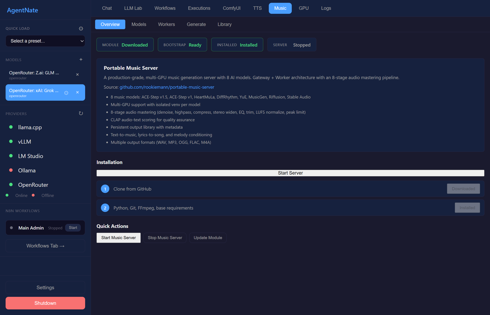

The Music tab before any models are loaded. After starting the music server and loading a model:


AgentNate integrates a full **Portable Music Server** ([github.com/rookiemann/portable-music-server](https://github.com/rookiemann/portable-music-server)) with 8 AI music generation models, a Gateway + Worker architecture, and an 8-stage audio mastering pipeline. The music module runs as a subprocess on port **9150**.

> **Auto-installed**: The Music module is automatically cloned from [rookiemann/portable-music-server](https://github.com/rookiemann/portable-music-server) into `modules/music/` on first use. It includes its own portable Python environment and all dependencies.

**Architecture:**
- **Gateway server** — FastAPI on port 9150, routes to model workers
- **Workers** — One per loaded model, isolated virtual environments
- **Mastering Pipeline** — 8 stages: denoise, high-pass filter, compress, stereo widen, EQ, trim, LUFS normalize, peak limiter
- **CLAP scoring** — Audio-text similarity scoring for quality assurance
- **Output library** — Persistent storage with metadata (prompt, model, duration, tags)

### Sub-tabs

| Tab | Purpose |
|-----|---------|
| **Overview** | Module status, installation, quick actions |
| **Models** | Installation status per model (env + weights) with install/uninstall buttons |
| **Workers** | Running model workers with GPU assignment |
| **Generate** | Prompt input, model/preset/format selection, duration, model-specific parameters |
| **Library** | All generated music with playback, download, metadata, and CLAP scores |

### Available Models

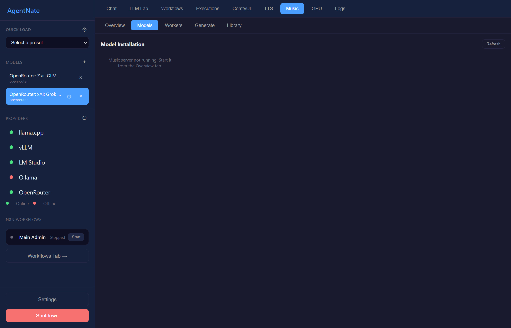

| Model | Type | VRAM | Best For |
|-------|------|------|----------|
| **ACE-Step v1.5** | Lyrics-to-Song | ~8 GB | Best quality full songs with structured lyrics |
| **ACE-Step v1** | Lyrics-to-Song | ~8 GB | Previous version, proven quality |
| **HeartMuLa 3B** | Full Song | ~12 GB | Complete songs with vocals, heaviest model |
| **DiffRhythm** | Lyrics+Melody | Medium | Melody-conditioned structured compositions |
| **YuE** | Lyrics-to-Song | Medium | Full songs from text lyrics |
| **MusicGen** (Meta) | Prompt-to-Music | ~4 GB | Instrumentals from text descriptions |
| **Riffusion** | Prompt-to-Music | ~4 GB | Fast loops, spectogram-based |
| **Stable Audio Open** | Prompt-to-Music | ~4 GB | Quality instrumentals from text |

**Model categories:**
- **Lyrics-to-Song** (ACE-Step, YuE, DiffRhythm) — Provide structured lyrics with section tags, outputs full songs with vocals
- **Prompt-to-Music** (MusicGen, Riffusion, Stable Audio) — Provide text description, outputs instrumentals
- **Full Song** (HeartMuLa) — Most capable but heaviest, produces complete songs with vocals

### Using Music Generation via the UI

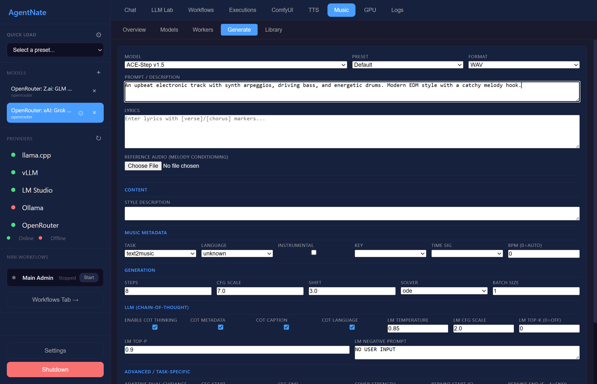

1. Navigate to the **Music** tab
2. Click **Start Music Server** if not running (starts gateway on port 9150)
3. Go to **Models** tab — install any model that shows "not_installed" (downloads env + weights)
4. Go to **Workers** tab — load a model onto a GPU
5. Switch to **Generate** tab:
   - Select the loaded model
   - Choose a preset (if available)
   - Select output format (WAV, MP3, OGG, FLAC, M4A)
   - Enter your prompt or lyrics
   - Set duration (1-600 seconds, default 30s)
   - Adjust model-specific advanced options
   - Click **Generate Music**
6. Check **Library** tab for generated music with playback and CLAP quality scores

### Using Music Generation via Agent Mode

Select the **Music Producer** persona and ask:

> "Create an upbeat electronic dance track, 30 seconds, with synth leads and a driving bass using ACE-Step"

The agent will:
1. Check `music_status` and `music_install_status`
2. Call `music_load_model` if needed
3. Call `music_get_presets` to discover parameters
4. Call `music_generate` with the prompt and parameters

**12 Agent Tools:**
`music_status`, `music_start_server`, `music_stop_server`, `music_list_models`, `music_list_workers`, `music_load_model`, `music_unload_model`, `music_generate`, `music_get_presets`, `music_install_model`, `music_install_status`, `music_list_outputs`

### Lyrics Format (ACE-Step)

For the best results with ACE-Step, use structured lyrics with section tags:
```
[verse]
Walking down the street today
Watching all the world go by
Every face a story told
Underneath the morning sky

[chorus]
We are the champions of the night
Dancing underneath the neon lights
Feel the rhythm, feel the beat
Moving to the sound so sweet

[bridge]
And when the morning comes we'll find
The music never leaves our mind
```

Add style tags as the prompt prefix: `"pop, upbeat, female vocal, 120bpm, synth, catchy"`

### Generation Times

Music generation is significantly slower than TTS. Typical times on a 24 GB GPU:

| Model | 30s Track | 60s Track |
|-------|-----------|-----------|
| ACE-Step v1.5 | ~2-4 min | ~4-8 min |
| MusicGen | ~1-2 min | ~2-4 min |
| Riffusion | ~30s-1 min | ~1-2 min |
| HeartMuLa | ~5-10 min | ~10-20 min |

---

## 18. GPU Monitoring

### GPU Dashboard

The GPU Dashboard provides comprehensive real-time monitoring of all your graphics cards:

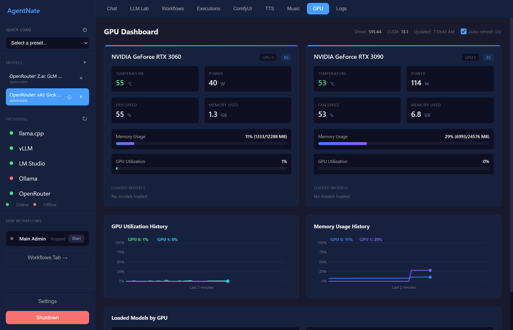

The screenshot above shows real metrics with an SDXL model loaded. Each GPU card displays temperature, power draw, VRAM usage, and utilization percentage. The GPU running the model shows higher power and VRAM consumption from the loaded checkpoint.

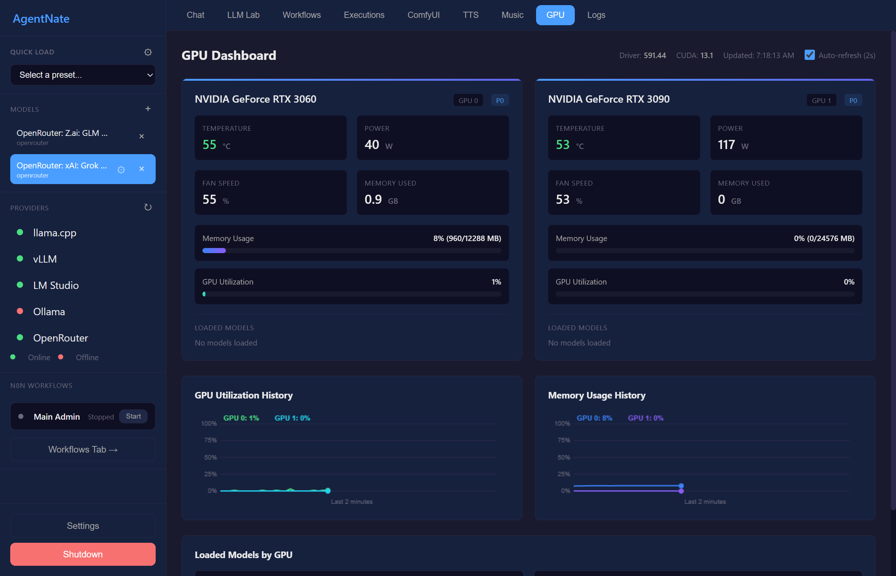

The bottom section shows utilization and memory history charts plus the "Loaded Models by GPU" summary.

### Per-GPU Cards

Each GPU gets a detailed card showing:

| Metric | Description | Display |
|--------|-------------|---------|
| **GPU Name** | Hardware identifier | "NVIDIA GeForce RTX 3090" |
| **Temperature** | Current temp in Celsius | Color-coded (green/yellow/red) |
| **Power Draw** | Current wattage | "114W" vs power limit |
| **Fan Speed** | Fan percentage | "45%" |
| **Memory Used** | VRAM consumption | "6.8 GB / 24.0 GB" |
| **Memory Bar** | Visual percentage | "28% (6800/24576 MB)" |
| **Utilization** | Compute load | Percentage with progress bar |
| **P-State** | Power state | Performance level indicator |
| **Models Loaded** | Active models | Name chips with busy indicators |

### Auto-Refresh

The dashboard refreshes every **2 seconds** when the GPU tab is active. It pauses when you switch to another tab to avoid unnecessary API calls. The auto-refresh toggle in the header lets you pause/resume manually.

**Data persistence:** GPU history is cached in `localStorage` with a 5-minute expiry. If you refresh the browser, up to 5 minutes of history survives.

### History Graphs

Two canvas-based real-time charts track the **last 2 minutes** of activity:

- **GPU Utilization History** — Line graph showing compute utilization per GPU (green for GPU 0, cyan for GPU 1)
- **Memory Usage History** — Line graph showing VRAM consumption per GPU (blue for GPU 0, purple for GPU 1)

Each chart has 5 gridlines (0%, 25%, 50%, 75%, 100%) and labels the last data point with a circle marker and GPU name.

### Loaded Models by GPU


A summary section shows which models are loaded on each GPU with status chips. Models show a "busy" indicator when actively processing an inference request. This section helps you plan VRAM allocation before loading additional models.

### Logs Tab

The Logs tab provides a real-time view of all application events with color-coded entries:

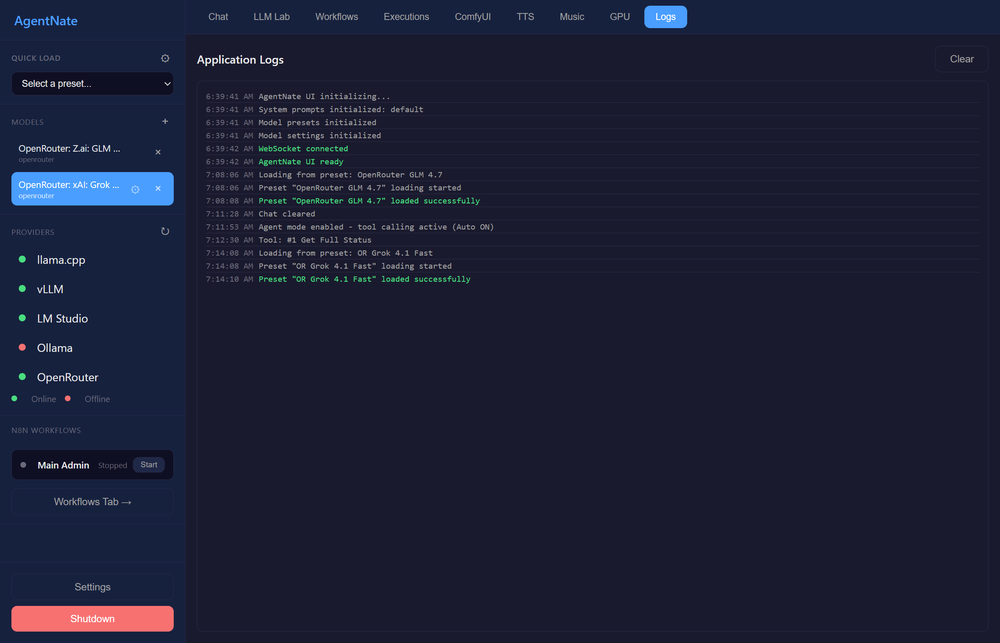

Log entries include:
- **Startup events** — server initialization, WebSocket connection, provider detection
- **Model loading/unloading** — with success/failure status and timing (green = success)
- **Agent tool calls** — every tool execution with tool name and result summary
- **ComfyUI operations** — instance start/stop, job submission, generation completion
- **Preset loading** — which presets are loaded and routing configurations applied
- **Timestamps** for every event with color-coded severity levels

Use the **Clear** button to reset the log view.

---

## 19. Settings & Configuration

Access settings via the **Settings** button in the sidebar footer. Settings are stored as JSON at `%APPDATA%/AgentNate/settings.json` (Windows) or `~/.config/AgentNate/settings.json` (Linux/Mac) and persist across restarts.

### Providers Tab

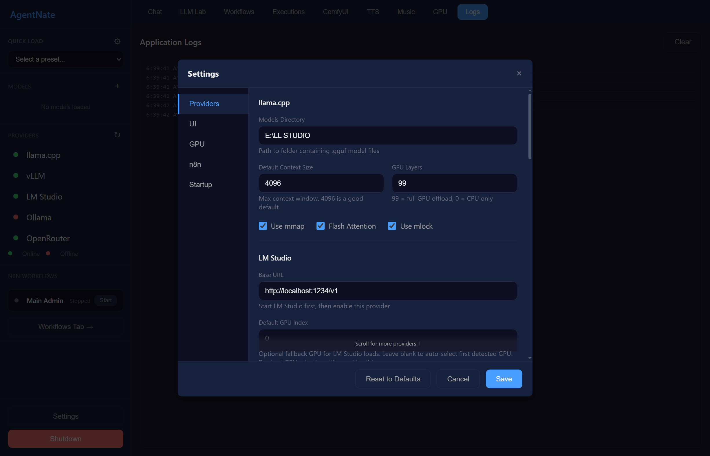

Configure connection details for each LLM provider:

| Provider | Key Settings | Defaults |
|----------|-------------|----------|
| **llama.cpp** | Models directory, default context size, GPU layers, flash attention | ctx: 4096, layers: 99, flash_attn: true |
| **LM Studio** | Base URL, default GPU index | `http://localhost:1234/v1` |
| **Ollama** | Base URL, keep_alive duration | `http://localhost:11434`, 5 min |
| **OpenRouter** | API key, default model, site URL, app name | Model: `openrouter/auto` |
| **vLLM** | Environment path, models directory, port range, GPU memory utilization | Port: 8100+, util: 0.6 |

Each provider can be individually enabled/disabled.

### Inference Defaults

Default generation parameters used when not overridden per-request:

| Parameter | Default | Range |
|-----------|---------|-------|
| `max_tokens` | 1024 | 1-32768 |
| `temperature` | 0.7 | 0.0-2.0 |
| `top_p` | 0.95 | 0.0-1.0 |
| `top_k` | 40 | 0-100 |
| `repeat_penalty` | 1.1 | 1.0-2.0 |
| `presence_penalty` | 0.0 | -2.0-2.0 |
| `frequency_penalty` | 0.0 | -2.0-2.0 |
| `mirostat` | 0 (disabled) | 0, 1, 2 |
| `typical_p` | 1.0 | 0.0-1.0 |

### UI Settings

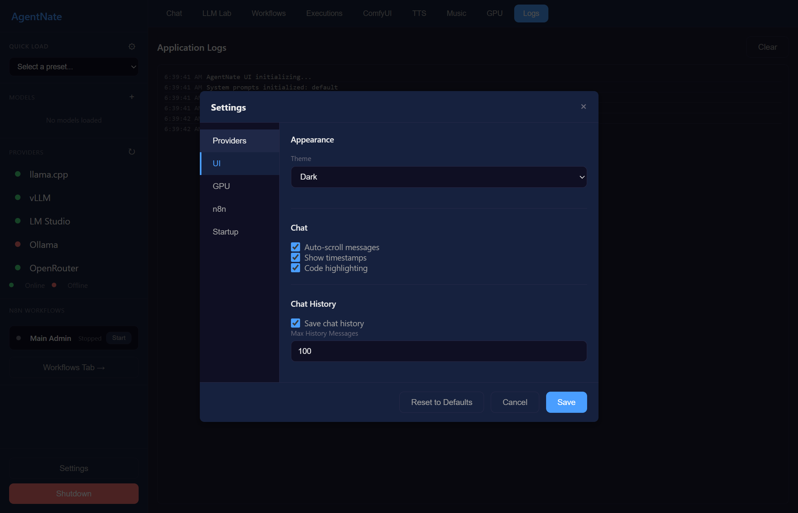

Customize the interface:

| Setting | Default | Description |
|---------|---------|-------------|
| `theme` | dark | Color scheme |
| `auto_scroll` | true | Auto-scroll on new messages |
| `show_timestamps` | true | Show message timestamps |
| `code_highlighting` | true | Syntax highlighting in code blocks |
| `window_width` | 1400 | Desktop mode window width |
| `window_height` | 900 | Desktop mode window height |

### GPU Settings

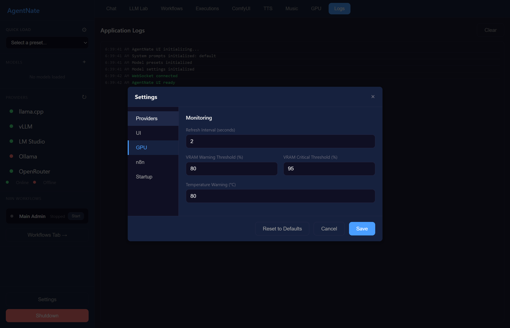

Configure GPU-related preferences:

- **Default GPU** — Which GPU to use for new model loads
- **VRAM thresholds** — Warning levels for VRAM usage
- **Monitoring interval** — How often to refresh GPU stats

### n8n Settings

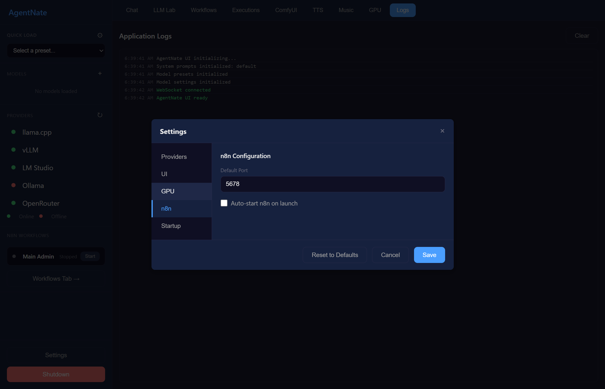

Configure the n8n integration:

- **n8n Port** — Port for the n8n admin interface (default: 5678)
- **Auto-start** — Whether to start n8n on AgentNate launch
- **Worker configuration** — Queue worker settings

### Agent Settings

Agent behavior configuration (also accessible via the gear icon in agent mode):

| Setting | Default | Description |
|---------|---------|-------------|
| `max_sub_agents` | 4 | Maximum concurrent sub-agents |
| `sub_agent_timeout` | 300s | Timeout before killing a stuck worker |
| `delegate_all` | true | Always delegate complex tasks to workers |
| `tool_race_enabled` | true | Enable race execution for creative tools |
| `tool_race_candidates` | 3 | Number of parallel race candidates |
| `batch_workers` | 3 | Default batch spawn count |
| `pin_head_to_openrouter` | false | Force head agent to use cloud model |

### Search Engine Settings

Configure web search providers:

| Engine | Default State | Requirements |
|--------|--------------|-------------|
| **DuckDuckGo** | Enabled | No API key needed |
| **Google** | Disabled | Custom Search API key + CX ID |
| **Serper** | Disabled | Serper.dev API key |

Multiple API keys can be configured per provider for load balancing.

### Orchestrator Settings

| Setting | Default | Description |
|---------|---------|-------------|
| `max_concurrent_inferences` | 4 | Max parallel LLM requests |
| `health_check_interval` | 30s | Provider health check frequency |
| `request_timeout` | 300s | Max time per inference request |
| `jit_loading_enabled` | true | Auto-load models on demand |
| `auto_unload_idle_minutes` | 0 | Auto-unload after idle (0=never) |

### Startup Settings

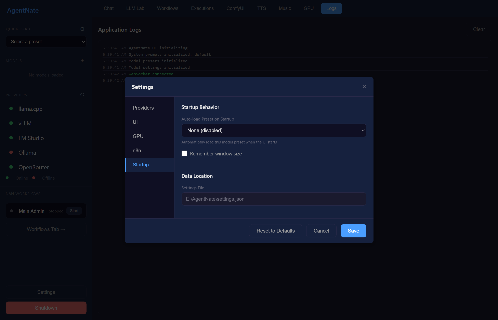

Control what happens when AgentNate launches:

- **Auto-load preset** — Automatically load a saved model preset on startup
- **Auto-start services** — Start n8n, ComfyUI, TTS, or Music servers automatically
- **Default persona** — Which persona to activate on launch

### System Prompts Library

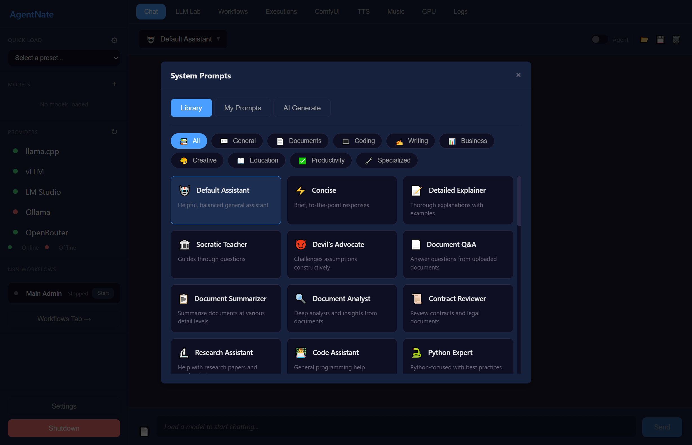

Manage reusable system prompts:

- **Create** custom system prompts for specific use cases
- **Edit** existing prompts
- **Apply** prompts to chat sessions
- **Import/Export** prompt collections

### Settings API

Settings can also be managed programmatically:

```bash
# Get all settings
curl http://127.0.0.1:8000/api/settings

# Update a specific setting
curl -X POST http://127.0.0.1:8000/api/settings \
  -H "Content-Type: application/json" \
  -d '{"agent.tool_race_enabled": false}'
```

Settings use **dot notation** for nested access: `providers.openrouter.api_key`, `agent.max_sub_agents`, `ui.theme`.

---

## 20. Provider Architecture

### Overview

AgentNate's provider system is a **pluggable adapter layer** that presents a uniform interface across fundamentally different LLM backends. Whether you're running a local GGUF model via llama.cpp, connecting to LM Studio's SDK, pulling from Ollama, spinning up a vLLM server, or calling OpenRouter's cloud API — the rest of AgentNate sees the same `BaseProvider` interface.

All providers live in `providers/` and inherit from `BaseProvider` (defined in `providers/base.py`).

### Core Data Structures

**ModelInstance** — Represents a loaded model:
| Field | Description |
|-------|-------------|
| `id` | UUID, auto-generated |
| `provider_type` | Enum: `LLAMA_CPP`, `LM_STUDIO`, `OLLAMA`, `VLLM`, `OPENROUTER` |
| `model_identifier` | File path (local) or model ID (API) |
| `status` | `UNLOADED` → `LOADING` → `READY` → `BUSY` → `ERROR` |
| `display_name` | Human-readable name shown in UI |
| `context_length` | Token context window size |
| `gpu_index` | GPU assignment (`None`=auto, `-1`=CPU, `0+`=specific GPU) |
| `request_count` | Lifetime inference count |

**InferenceRequest** — Standardized request with:
- `messages` — List of `ChatMessage` objects (role + content + optional images for vision)
- Generation params: `max_tokens`, `temperature`, `top_p`, `top_k`
- Penalty params: `repeat_penalty`, `presence_penalty`, `frequency_penalty`
- Mirostat sampling: `mirostat` (0/1/2), `mirostat_tau`, `mirostat_eta`
- Advanced: `typical_p`, `tfs_z`, `stop` sequences, `draft_model_id` (speculative decoding)
- Queue: `priority` (higher = processed first)

**InferenceResponse** — Streaming response:
- `text` — Accumulated text (grows with each token)
- `done` — `True` on final response
- `usage` — `{prompt_tokens, completion_tokens, total_tokens}`
- Timing: `time_to_first_token`, `total_time`, `tokens_per_second`

### BaseProvider Interface

Every provider implements these abstract methods:

| Method | Description |
|--------|-------------|
| `load_model(model_identifier, **kwargs)` | Load a model, return `ModelInstance` with `READY` status |
| `unload_model(instance_id)` | Unload and free resources |
| `chat(instance_id, request)` | Stream chat completions as `AsyncIterator[InferenceResponse]` |
| `list_models()` | List available models for this provider |
| `health_check()` | Check provider connectivity, return status dict |
| `get_status(instance_id)` | Get `ModelStatus` of a specific instance |
| `close()` | Clean shutdown, unload all instances |

Helper methods (non-abstract):
- `get_instance(id)` — Lookup by UUID
- `get_all_instances()` / `get_ready_instances()` — Bulk listing
- `find_instance_by_model(identifier)` — Find existing instance for a model

### Provider: llama.cpp

**File:** `providers/llama_cpp_provider.py`

The llama.cpp provider runs models via **subprocess isolation** — each loaded model gets its own `llama-server` process. This provides true multi-model support with independent GPU/memory management.

**Key features:**
- GPU assignment via `CUDA_VISIBLE_DEVICES` environment variable per subprocess
- Multiple models per GPU (memory-aware allocation)
- CPU-only fallback when no GPU available
- Model family auto-detection (Llama, Mistral, Phi, Qwen, DeepSeek, etc.)
- Per-worker request queuing
- Vision model support (LLaVA, Moondream, MiniCPM-V, etc.)

**Load options:**
```python
await provider.load_model(
    "models/qwen2.5-32b-q4_k_m.gguf",
    n_ctx=8192,          # Context length
    n_gpu_layers=-1,     # -1 = all layers on GPU
    gpu_index=0,         # GPU to load on (0, 1, etc.)
    n_batch=512,         # Batch size
    flash_attn=True,     # Flash attention
    n_threads=8           # CPU threads for partial offload
)
```

Each subprocess binds to a random free port and communicates via the llama.cpp HTTP API internally. AgentNate manages the lifecycle (start, health check, stop, cleanup).

### Provider: LM Studio

**File:** `providers/lm_studio_provider.py`

Connects to LM Studio v4 via both the **Python SDK** (for model management) and the **OpenAI-compatible API** (for inference).

**Key features:**
- GPU isolation via SDK — load models on specific GPUs
- Multiple simultaneous model instances
- Parallel inference with continuous batching on a single model
- JIT loading — request any model and LM Studio loads it automatically
- Vision model support

**Two operating modes:**
1. **SDK mode** (when `lmstudio` package available) — Full control over model loading, GPU placement, context length
2. **API-only mode** — Uses OpenAI-compatible `/v1/chat/completions` endpoint, relies on LM Studio's own model management

**Default endpoint:** `http://localhost:1234/v1`

### Provider: Ollama

**File:** `providers/ollama_provider.py`

Connects to Ollama's local API. Ollama manages its own model downloads, loading, and GPU allocation internally.

**Key features:**
- Automatic model downloading on first request
- Configurable `keep_alive` duration (default 5 minutes) to keep models warm
- Vision model support (LLaVA, etc.)
- Simplest setup — just install Ollama and go

**Default endpoint:** `http://localhost:11434`

Ollama is the easiest provider to get started with — models are identified by name (e.g., `llama3:8b`, `codellama:13b`) and downloaded automatically.

### Provider: vLLM

**File:** `providers/vllm_provider.py`

High-throughput inference via subprocess vLLM servers. Designed for maximum concurrent request handling.

**Key features:**
- **PagedAttention** for efficient GPU memory management
- **Continuous batching** for high concurrent throughput
- GPU assignment via `CUDA_VISIBLE_DEVICES`
- Subprocess isolation per model
- Broad model format support (HuggingFace, AWQ, GPTQ quantizations)
- OpenAI-compatible HTTP API per instance

**Ideal for:** High-concurrency scenarios where multiple agents or users need to query the same model simultaneously. vLLM's paged attention means it can handle many more concurrent requests than llama.cpp for the same VRAM.

**Note:** vLLM requires a separate Python environment (`E:\AgentNate\envs\vllm\`) with Python 3.10.6 and custom Windows build patches (see `memory/vllm-windows-build.md`).

### Provider: OpenRouter

**File:** `providers/openrouter_provider.py`

Cloud provider connecting to [OpenRouter](https://openrouter.ai), which aggregates 100+ models from various providers (OpenAI, Anthropic, Google, Meta, etc.) behind a single API.

**Key features:**
- Access to 100+ models (GPT-4, Claude, Gemini, Llama, Mixtral, etc.)
- No local GPU required
- Automatic retry with exponential backoff for rate limits
- Pay-per-token pricing

**Rate limits:**
- Free models: 20 req/min, 50-1000 req/day
- Paid models: $1 balance = 1 RPS, up to 500 RPS max

**Setup:** Requires an API key from OpenRouter, configured in Settings.

### Provider Selection Guide

| Need | Best Provider |
|------|--------------|
| Maximum control, GGUF models | **llama.cpp** |
| Easy GUI + model management | **LM Studio** |
| Simplest setup, auto-download | **Ollama** |
| High concurrent throughput | **vLLM** |
| Cloud models, no GPU needed | **OpenRouter** |
| Multi-model on one GPU | **llama.cpp** or **LM Studio** |
| Vision/multimodal | **llama.cpp**, **LM Studio**, or **Ollama** |

### How Providers Connect to the System

The **Orchestrator** (`orchestrator/orchestrator.py`) holds references to all provider instances and routes requests:

1. UI sends chat request with `instance_id`
2. Orchestrator looks up which provider owns that instance
3. Calls `provider.chat(instance_id, request)`
4. Streams `InferenceResponse` tokens back to the UI via WebSocket

The **Tool Router** can also invoke providers directly when agents need LLM inference (e.g., sub-agent loops, race execution).

---

## 21. Batch Concurrency & Scaling

AgentNate is designed to handle many things at once. Every layer of the stack — from the HTTP server to the inference engine to the agent system to n8n workers — is built for concurrent execution. This section explains how batch concurrency works at each level and how the system scales.

### The Concurrency Stack

Requests flow through five concurrent layers, each with its own capacity:

```
Layer 1: FastAPI Server (asyncio event loop — unlimited concurrent connections)
    ↓
Layer 2: Request Queue (priority heap — 4 concurrent inference slots, configurable)
    ↓
Layer 3: Provider Engine (depends on provider — 1 to 64+ concurrent sequences)
    ↓
Layer 4: Agent System (up to 4 parallel sub-agents, each with own inference stream)
    ↓
Layer 5: Service Workers (100 n8n workers, N ComfyUI instances, TTS/Music workers)
```

### Layer 1: The Request Queue

The **Request Queue** (`orchestrator/request_queue.py`) is the central traffic controller for all LLM inference. Every chat message, agent tool call, sub-agent inference, and race candidate goes through this queue.

**How it works:**

1. A request arrives (from WebSocket, agent loop, race executor, or OpenAI-compatible API)
2. The request is pushed onto a **priority heap** with a priority value and timestamp
3. A background `_process_queue()` loop continuously dequeues the highest-priority request
4. The request is forwarded to the appropriate provider for inference
5. Streaming tokens flow back to the caller via the request's `asyncio.Future`

**Concurrent inference limit:**

```
orchestrator.max_concurrent_inferences = 4  (default, configurable in Settings)
```

This means up to **4 LLM inference requests** execute simultaneously across all providers. When all 4 slots are occupied, new requests wait in the priority queue until a slot frees up. The `_capacity_available` event signals when a slot opens.

**Priority ordering:**

Higher priority values are processed first (the queue uses a max-heap via negated values). Within the same priority level, requests are processed FIFO by timestamp. This means:
- Agent tool calls can be prioritized over regular chat messages
- Race candidates run at equal priority (first-come, first-served)
- The queue never starves — completed requests free slots for waiting ones

**Auto-cleanup:** Completed requests are tracked for result retrieval, then automatically cleared after 5 minutes or when 100+ accumulate.

### Layer 2: Provider-Level Concurrency

Each provider handles concurrent requests differently. This is where the real throughput differences emerge:

| Provider | Concurrency Model | Per-Model Capacity | Batching | Throughput |
|----------|-------------------|-------------------|----------|------------|
| **vLLM** | HTTP server + PagedAttention | **64 concurrent sequences** | Continuous batching | 100–500 tok/s |
| **LM Studio** | SDK + OpenAI HTTP API | **Unlimited** (engine-managed) | Continuous batching | 20–80 tok/s |
| **Ollama** | HTTP API | **Unlimited** (server-managed) | Internal batching | 5–20 tok/s |
| **llama.cpp** | Subprocess pool | **1 per worker** (pool for N) | None (sequential) | 10–30 tok/s |
| **OpenRouter** | Cloud API + retry | **Rate-limited** (~50 concurrent) | None (cloud) | Varies by plan |

#### vLLM: The High-Throughput Provider

vLLM is purpose-built for batch concurrency and is the recommended provider when you need multiple agents, users, or services querying the same model simultaneously.

**How it achieves high throughput:**

1. **PagedAttention** — Instead of pre-allocating a fixed KV cache per request, vLLM pages the cache like virtual memory. This means 64 concurrent requests share GPU memory efficiently — each request only uses the VRAM it actually needs at that moment, not its maximum possible allocation.

2. **Continuous Batching** — Traditional inference engines process one request at a time or in fixed batches. vLLM dynamically adds new requests to the running batch on every `engine.step()` call. A request that arrives mid-generation is immediately fused into the current batch without waiting for others to finish.

3. **No Idle VRAM** — With PagedAttention, a request generating 10 tokens and a request generating 1000 tokens can coexist without the short request wasting VRAM on empty KV cache slots.

**What this means in practice:**

With llama.cpp, if 4 agents each need an LLM call, they wait in a serial queue — agent 2 waits for agent 1, agent 3 waits for agent 2, and so on. Total time = sum of all inference times.

With vLLM, all 4 agents submit requests simultaneously, and the engine processes them as a fused batch. Total time ≈ longest single inference (not the sum). For agent workloads with many short tool-calling queries, this is a **3–10x throughput improvement**.

**vLLM configuration in AgentNate:**

```python
# Key launch parameters (workers/vllm_launcher.py)
--max-num-seqs 64           # Max concurrent sequences (default, primary batch control)
--gpu-memory-utilization 0.9 # Use 90% of VRAM for KV cache + model weights
--enforce-eager              # Required on Windows (no Triton/CUDA graphs)
--tensor-parallel-size 1     # Multi-GPU tensor parallelism (1 = single GPU)
```

Each loaded vLLM model runs as its own subprocess server with an OpenAI-compatible API at a dedicated port. AgentNate's provider connects via `aiohttp` and streams responses via SSE (`text/event-stream`).

**Server pool with round-robin:**

If you load the same model on multiple GPUs, vLLM creates a `ServerPool` that distributes requests via round-robin:

```
vLLM Server 1 (GPU 0, port 8100) ← Request 1, 3, 5, 7...
vLLM Server 2 (GPU 1, port 8101) ← Request 2, 4, 6, 8...
```

This doubles throughput linearly with GPU count — two 3090s running the same 7B model can handle ~128 concurrent sequences.

#### llama.cpp: Pool-Based Parallelism

llama.cpp processes one request per worker subprocess. Concurrency comes from the **worker pool** — load the same model on N GPUs (or N copies on one GPU if VRAM allows), and you get N parallel inference slots:

```
Worker 1 (GPU 0) → Request A (busy)
Worker 2 (GPU 1) → Request B (busy)
Worker 3 (GPU 1) → [waiting — GPU 1 worker 2 is busy]
```

Best for: Multi-model setups where you want different models on different GPUs, each handling one request at a time. The subprocess isolation ensures one model crash doesn't affect others.

#### LM Studio: Transparent Batching

LM Studio v4 includes its own continuous batching engine. AgentNate uses the SDK for model loading (with GPU control) and the OpenAI-compatible HTTP API for inference. LM Studio handles request fusion internally — AgentNate just fires concurrent HTTP requests and they're batched automatically.

### Layer 3: WebSocket Token Batching

Between the provider and the browser, there's another batching layer. Raw LLM output can generate tokens faster than the network and browser can render them. The WebSocket streaming layer batches tokens into **16ms frames** (~60 FPS):

```python
BATCH_INTERVAL = 0.016  # 16ms = one display frame at 60fps

# Accumulate tokens, flush every 16ms
if token_buffer and (now - last_flush) >= BATCH_INTERVAL:
    await websocket.send_text(json.dumps({
        "type": "token",
        "content": "".join(token_buffer)  # Batched tokens
    }))
    token_buffer.clear()
```

This reduces WebSocket frame overhead by 5–20x (instead of one frame per token, you get one frame per 16ms window containing all tokens generated in that window). On a fast model generating 100 tok/s, this means ~1.6 tokens per frame instead of 100 individual WebSocket messages per second.

### Layer 4: Agent Concurrency

The agent system runs multiple inference streams in parallel through three mechanisms:

#### Sub-Agents (4 concurrent workers)

When the head agent spawns sub-agents, each gets its own `asyncio.Task` running an independent `run_agent_loop()`. All sub-agents execute concurrently:

```
Head Agent (Panel 1)
  ├── Worker Agent 1 (researcher, GPU 1 model A) — running
  ├── Worker Agent 2 (coder, GPU 1 model B)      — running
  ├── Worker Agent 3 (reviewer, GPU 1 model A)    — running
  └── Worker Agent 4 (blocked — max_sub_agents=4) — queued
```

- **Default limit:** 4 concurrent sub-agents (configurable via `agent.max_sub_agents`)
- **Timeout:** 300 seconds per agent (configurable via `agent.worker_timeout`)
- **Model failover:** If a worker stalls for 75+ seconds, the supervisor can switch it to a different loaded model
- **Batch spawning:** The `batch_spawn_agents` tool spawns multiple agents in a single tool call — each fires off a background task and returns immediately, so all agents start nearly simultaneously

Each sub-agent independently dequeues inference requests through the Request Queue, so they share the same concurrent inference limit. With 4 sub-agents and 4 inference slots, all agents can infer simultaneously. With vLLM's continuous batching, all 4 agents hitting the same model get fused into one batch.

#### Race Execution (3 parallel candidates)

For creative/generative tools (workflow building, image workflow composition), the race executor runs **3 parallel LLM inferences** with different temperature variants:

```
Race Start
  ├── Candidate 1 (temp +0.0) → asyncio.Task → LLM inference → parse → validate
  ├── Candidate 2 (temp +0.1) → asyncio.Task → LLM inference → parse → validate
  └── Candidate 3 (temp +0.2) → asyncio.Task → LLM inference → parse → validate
      ↓
  asyncio.wait(FIRST_COMPLETED) — first valid candidate wins
      ↓
  Cancel losers → re-execute winner with side effects
```

All 3 candidates run truly in parallel via `asyncio.create_task()`. The race uses `asyncio.wait(return_when=FIRST_COMPLETED)` to return as soon as any candidate produces a valid result. Remaining candidates are immediately cancelled (`task.cancel()`), freeing their inference slots.

With vLLM, all 3 candidates are fused into a single batch — the GPU processes them simultaneously rather than sequentially. This means racing 3 candidates takes roughly the same wall-clock time as a single inference.

#### Multi-Panel Chat

Each chat panel can run its own inference independently. With 3 panels open, all 3 can generate simultaneously (subject to the Request Queue's concurrent limit):

```
Panel 1 (Chat mode, model A)    → Request Queue slot 1
Panel 2 (Agent mode, model B)   → Request Queue slot 2
Panel 3 (Agent mode, model A)   → Request Queue slot 3
                                   Slot 4 available for sub-agents
```

### Layer 5: Service Worker Concurrency

Beyond LLM inference, AgentNate runs concurrent workers across all service modules:

#### n8n Workers (100 concurrent)

As detailed in Section 13, n8n workflows execute on isolated worker instances:
- **100 worker slots** (ports 5679–5778), each with its own SQLite database
- Workers run truly in parallel — no shared database locks
- Flash workflows (deploy → trigger → collect → delete) can run concurrently with persistent workflows
- Each worker costs ~300 MB RAM

#### ComfyUI Instance Pool

The ComfyUI pool distributes generation jobs across multiple GPU instances:
- **Model affinity scoring** routes jobs to instances that already have the right checkpoint loaded (+100 affinity)
- **Weighted round-robin** for batch jobs — instances with loaded models get 2x the job share
- **Connection pooling** — single `httpx.AsyncClient` with max 20 concurrent connections, 10 keepalive
- **Stampede lock** on instance refresh — only one poller fetches status at a time, others wait

Batch image generation example — 10 images across 3 instances:

```
Instance 1 (SD 1.5 loaded, idle)     → 4 images (2x weight for model affinity)
Instance 2 (SDXL loaded, 2 queued)   → 3 images (1x weight, model not matching)
Instance 3 (SD 1.5 loaded, 1 queued) → 3 images (2x weight, slight queue penalty)
```

#### TTS & Music Workers

Both TTS and Music servers use a Gateway + Worker architecture:
- **Gateway** receives requests, routes to the right model worker
- **Workers** — one per loaded model, each in its own Python environment
- Multiple models can run simultaneously on different GPUs
- The gateway handles concurrent requests by routing to the correct worker

### Scaling Guide

Here's how to tune AgentNate for your workload:

| Scenario | Recommended Config |
|----------|--------------------|
| **Single user, casual chat** | 1 model (any provider), default settings |
| **Single user, heavy agent use** | vLLM or LM Studio, `max_concurrent_inferences=4`, `max_sub_agents=4` |
| **Multi-panel power user** | vLLM, `max_concurrent_inferences=8`, 2+ models loaded |
| **Multi-user via OpenAI API** | vLLM with `max-num-seqs=64`, `max_concurrent_inferences=8` |
| **Workflow automation farm** | n8n workers (10-50), llama.cpp or vLLM for LLM nodes |
| **Image generation pipeline** | 2-3 ComfyUI instances, pool routing, batch jobs |
| **Full production stack** | vLLM (inference) + n8n workers (automation) + ComfyUI pool (images) + TTS/Music workers |

**Key settings to tune:**

```
orchestrator.max_concurrent_inferences: 4    # Inference queue slots (increase for multi-user)
agent.max_sub_agents: 4                       # Parallel sub-agent limit
agent.tool_race_candidates: 3                 # Race parallelism
agent.worker_timeout: 300                     # Sub-agent timeout (seconds)
```

**vLLM-specific scaling:**

```
--max-num-seqs 64              # Concurrent sequences (lower = less VRAM, higher = more throughput)
--gpu-memory-utilization 0.9   # VRAM budget (lower for multi-model, higher for single-model throughput)
```

**Rule of thumb:** With vLLM on a 24 GB GPU, a 7B model can handle ~32 concurrent sequences comfortably. A 13B model can handle ~16. A 32B quantized model can handle ~8. Scale proportionally for different VRAM sizes. The `max-num-seqs` parameter is the primary knob.

---

## 22. API & Developer Reference

### REST API

AgentNate exposes a full REST API at `http://127.0.0.1:8000`. Interactive API documentation is available at:

- **Swagger UI**: `http://127.0.0.1:8000/docs`
- **ReDoc**: `http://127.0.0.1:8000/redoc`

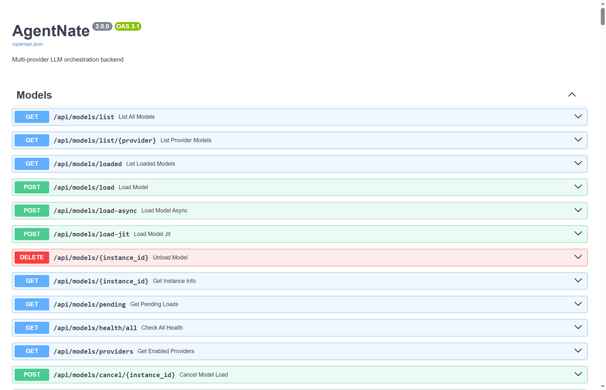

The Swagger UI provides an interactive reference for all REST endpoints with request/response schemas, parameter descriptions, and a "Try it out" button for live API testing directly in the browser.

### OpenAI-Compatible API (`/v1`)

AgentNate exposes an **OpenAI-compatible API** so external tools can connect using standard OpenAI client libraries — no custom integration needed.

**Base URL:** `http://127.0.0.1:8000/v1`

| Method | Endpoint | Description |
|--------|----------|-------------|
| GET | `/v1/models` | List all loaded models (OpenAI format) |
| GET | `/v1/models/{id}` | Get specific model details |
| POST | `/v1/chat/completions` | Chat completion (streaming & non-streaming) |

**Compatible with:**
- **Continue.dev** — AI coding assistant (set base URL to `http://127.0.0.1:8000/v1`)
- **Open WebUI** — Chat interface (configure as OpenAI provider)
- **LangChain / LlamaIndex** — Use the OpenAI client pointed at AgentNate
- **n8n AI nodes** — Connect n8n's LLM nodes to AgentNate's loaded models
- **Any OpenAI SDK** — Python `openai` package, Node.js `openai`, curl, etc.

**Usage example:**
```python
from openai import OpenAI

client = OpenAI(
    base_url="http://127.0.0.1:8000/v1",
    api_key="not-needed"  # Local models don't require auth
)

response = client.chat.completions.create(
    model="",  # Empty string = first loaded model
    messages=[{"role": "user", "content": "Hello!"}],
    stream=True
)
for chunk in response:
    print(chunk.choices[0].delta.content, end="")
```

**Model resolution:** The `model` field accepts an empty string (first loaded model), a UUID instance ID, or a name substring match. All standard parameters are supported: `temperature`, `top_p`, `max_tokens`, `frequency_penalty`, `presence_penalty`, `stop`, and `stream`.

### Key API Endpoints

#### Models
| Method | Endpoint | Description |
|--------|----------|-------------|
| GET | `/api/models/loaded` | List currently loaded models |
| GET | `/api/models/available` | List available models per provider |
| POST | `/api/models/load` | Load a model |
| POST | `/api/models/unload` | Unload a model |
| GET | `/api/presets` | List saved model presets |

#### Chat
| Method | Endpoint | Description |
|--------|----------|-------------|
| WS | `/ws/chat` | WebSocket for streaming chat |
| POST | `/api/tools/agent/chat` | Agent mode chat (tools enabled) |
| GET | `/api/tools/agent/workers/{id}/stream` | SSE stream for worker events |

#### Workflows
| Method | Endpoint | Description |
|--------|----------|-------------|
| GET | `/api/n8n/workflows` | List deployed workflows |
| POST | `/api/n8n/workflows` | Deploy a workflow |
| POST | `/api/n8n/workflows/{id}/activate` | Activate a workflow |
| GET | `/api/n8n/executions` | List execution history |

#### ComfyUI
| Method | Endpoint | Description |
|--------|----------|-------------|
| GET | `/api/comfyui/status` | ComfyUI module status |
| POST | `/api/comfyui/instances` | Add a new instance |
| POST | `/api/comfyui/instances/{id}/start` | Start an instance |
| POST | `/api/comfyui/generate` | Submit a generation |
| GET | `/api/comfyui/jobs/{id}` | Get job status |

#### ComfyUI Pool
| Method | Endpoint | Description |
|--------|----------|-------------|
| GET | `/api/comfyui/pool/status` | Pool status and metrics |
| POST | `/api/comfyui/pool/submit` | Submit a pool job |
| POST | `/api/comfyui/pool/batch` | Submit a batch job |
| GET | `/api/comfyui/pool/job/{id}` | Get pool job result |

#### TTS
| Method | Endpoint | Description |
|--------|----------|-------------|
| GET | `/api/tts/status` | TTS module status (downloaded, bootstrapped, installed, API running, workers, models, devices) |
| POST | `/api/tts/server/start` | Start TTS gateway server (port 8100) |
| POST | `/api/tts/server/stop` | Stop TTS gateway and all workers |
| GET | `/api/tts/model-info` | Installation status per model (env_installed, weights_downloaded) |
| POST | `/api/tts/environments/{env}/install` | Install a model's virtual environment |
| POST | `/api/tts/model-weights/{model}/download` | Download model weights from HuggingFace |
| GET | `/api/tts/models` | List available TTS models |
| POST | `/api/tts/models/{model}/load` | Load model (body: `{"device": "cuda:1"}`) |
| POST | `/api/tts/models/{model}/unload` | Unload model and kill worker |
| GET | `/api/tts/workers` | List running workers |
| POST | `/api/tts/generate/{model}` | Generate speech (body: `{"text": "...", "voice": "...", "output_format": "wav"}`) |
| GET | `/api/tts/voices/{model}` | List available voices for a model |
| GET | `/api/tts/library` | List all generated audio in library |
| GET | `/api/tts/library/{job_id}/audio` | Download generated audio file |

#### Music
| Method | Endpoint | Description |
|--------|----------|-------------|
| GET | `/api/music/status` | Music module status |
| POST | `/api/music/server/start` | Start music gateway server (port 9150) |
| POST | `/api/music/server/stop` | Stop music gateway and all workers |
| GET | `/api/music/models` | List available music models |
| GET | `/api/music/install/status` | Installation status per model |
| POST | `/api/music/install/{model_id}` | Install a music model (env + weights) |
| POST | `/api/music/models/{model}/load` | Load model (body: `{"device": "cuda:1"}`) |
| POST | `/api/music/models/{model}/unload` | Unload model |
| GET | `/api/music/workers` | List running workers |
| GET | `/api/music/models/{model}/presets` | Get parameter presets for a model |
| POST | `/api/music/generate/{model}` | Generate music (body: `{"prompt": "...", "duration": 30}`) |
| GET | `/api/music/outputs` | List generated music in output library |
| GET | `/api/music/outputs/{id}/audio` | Download generated music file |

#### Routing
| Method | Endpoint | Description |
|--------|----------|-------------|
| GET | `/api/routing/presets` | List all routing presets |
| POST | `/api/routing/presets` | Save a new routing preset |
| GET | `/api/routing/resolve/{persona}` | Resolve persona to instance_id via active preset |
| POST | `/api/routing/activate/{preset_id}` | Activate a routing preset |

#### Conversations
| Method | Endpoint | Description |
|--------|----------|-------------|
| GET | `/api/conversations` | List saved conversations |
| GET | `/api/conversations/{id}` | Load a specific conversation |
| POST | `/api/conversations` | Save a conversation |
| DELETE | `/api/conversations/{id}` | Delete a conversation |

#### System
| Method | Endpoint | Description |
|--------|----------|-------------|
| GET | `/api/health` | System health check |
| GET | `/api/gpu` | GPU status (per-GPU VRAM, utilization, temperature) |
| POST | `/api/shutdown` | Shutdown all services |
| GET | `/api/settings` | Get current settings |
| POST | `/api/settings` | Update settings |

### OpenAI-Compatible API

AgentNate provides an OpenAI-compatible API at the `/v1` prefix (`backend/routes/openai_compat.py`), allowing you to use AgentNate as a drop-in replacement for OpenAI in existing tools:

| Method | Endpoint | Description |
|--------|----------|-------------|
| GET | `/v1/models` | List all loaded models (OpenAI format) |
| POST | `/v1/chat/completions` | Chat completion with streaming support |

**Example — using the OpenAI Python SDK:**
```python
from openai import OpenAI

client = OpenAI(
    base_url="http://127.0.0.1:8000/v1",
    api_key="not-needed"  # AgentNate doesn't require API keys for local models
)

response = client.chat.completions.create(
    model="your-model-instance-id",
    messages=[{"role": "user", "content": "Hello!"}],
    stream=True
)

for chunk in response:
    print(chunk.choices[0].delta.content or "", end="")
```

**Example — using curl:**
```bash
# List loaded models
curl http://127.0.0.1:8000/v1/models

# Chat completion (streaming)
curl http://127.0.0.1:8000/v1/chat/completions \
  -H "Content-Type: application/json" \
  -H "Authorization: Bearer not-needed" \
  -d '{
    "model": "your-model-instance-id",
    "messages": [{"role": "user", "content": "Hello!"}],
    "stream": true,
    "temperature": 0.7
  }'
```

**Compatible with:** Continue (VS Code), Cursor, Open WebUI, LangChain, LlamaIndex, AutoGen, and any tool that supports an OpenAI-compatible endpoint.

**Configuration in external tools:** Set the base URL to `http://127.0.0.1:8000/v1` and use any string as the API key. The model name should be the instance ID of a loaded model (visible in the Models sidebar or via `GET /v1/models`).

### WebSocket Protocol

The chat WebSocket at `/ws/chat` uses JSON messages:

**Send:**
```json
{
  "model_id": "model-name",
  "messages": [{"role": "user", "content": "Hello"}],
  "temperature": 0.7,
  "max_tokens": 2048
}
```

**Receive (streaming):**
```json
{"type": "token", "content": "Hello"}
{"type": "token", "content": " there"}
{"type": "done", "usage": {"prompt_tokens": 10, "completion_tokens": 5}}
```

---

## 23. Personas Reference

AgentNate includes 15 predefined personas, each with specialized capabilities and temperature tuning:

| # | ID | Name | Tools | Temp | Description |
|---|-----|------|-------|------|-------------|
| 1 | `system_agent` | System Agent | All (187+) | 0.7 | Full system control - models, workflows, everything |
| 2 | `general_assistant` | General Assistant | None (chat only) | 0.7 | Pure conversation, no tools |
| 3 | `code_assistant` | Code Assistant | None (chat only) | 0.5 | Code review and programming advice |
| 4 | `workflow_builder` | Workflow Builder | workflow, marketplace, n8n | 0.6 | n8n workflow automation specialist |
| 5 | `power_agent` | Power Agent | All (187+) | 0.7 | Full-featured agent with all tools |
| 6 | `researcher` | Research Agent | web, data, utility, vision | 0.5 | Web research and data gathering |
| 7 | `coder` | Code Agent | code, files, utility | 0.3 | Write, execute, and debug code |
| 8 | `automator` | Automation Agent | workflow, marketplace, n8n, code, communication, data, agents | 0.5 | Workflow and script automation |
| 9 | `data_analyst` | Data Analyst | data, files, code, utility | 0.4 | Data analysis and database queries |
| 10 | `vision_agent` | Vision Agent | vision, web, files | 0.3 | Image analysis and OCR |
| 11 | `codebase_guide` | Codebase Guide | codebase, files | 0.5 | AgentNate codebase explorer |
| 12 | `image_creator` | Image Creator | comfyui, comfyui_pool, web, files | 0.6 | ComfyUI media generation specialist (images, video, upscaling) |
| 13 | `ai_creative` | AI Creative Director | comfyui, comfyui_pool, tts, music, workflow, web, files, agents | 0.6 | GPU-aware creative director |
| 14 | `voice_creator` | Voice Creator | tts, files, web | 0.5 | Text-to-speech specialist |
| 15 | `music_producer` | Music Producer | music, files, web | 0.6 | Music generation specialist |

**Temperature tuning:** Lower temperatures (0.3) produce more deterministic output for code and vision tasks. Higher temperatures (0.6-0.7) allow more creativity for content generation and creative direction.

### Tool Groups

Each persona's tools are composed from **18 tool groups** — collections of related tools that can be mixed and matched:

| Group | Count | Tools |
|-------|-------|-------|
| `system` | 6 | GPU/health/provider status, quick setup, suggest actions |
| `model` | 8 | Load, unload, list available/loaded, presets, status |
| `workflow` | 20 | Build, deploy, activate, delete, trigger, credentials, variables |
| `n8n` | 4 | Spawn, stop, list, status of n8n instances |
| `web` | 13 | Search (DDG/Google/Serper), fetch URL, browser automation |
| `files` | 9 | Read, write, list, search, info, delete, move, copy |
| `code` | 4 | Python, JavaScript, Shell, PowerShell execution |
| `communication` | 5 | Discord, Slack, email, Telegram, webhooks |
| `data` | 5 | HTTP requests, JSON/HTML parse, convert, DB query |
| `utility` | 8 | Date/time, math, UUID, encode/decode, hash, regex, text, random |
| `vision` | 6 | Image analysis, screenshot, OCR, UI describe, compare, find |
| `codebase` | 11 | Scan, explain, find, architecture, endpoints, tools, concepts |
| `comfyui` | 39 | Full ComfyUI lifecycle, generation, templates, gallery |
| `comfyui_pool` | 4 | Pool status, generate, batch, results |
| `agents` | 12 | Spawn, check, get_result, remember, recall, ask_user, routing |
| `marketplace` | 4 | Search, get, inspect, configure marketplace workflows |
| `tts` | 12 | Server lifecycle, model management, generation, voices |
| `music` | 11 | Server lifecycle, model management, generation, presets |

### Custom Personas

You can create custom personas with specific tool access, system prompts, and temperature:

**Creating a custom persona:**
1. Open the Agent Settings (gear icon in agent mode)
2. Navigate to persona management
3. Configure:
   - **Name** and **ID** — Unique identifier
   - **Description** — What this persona specializes in
   - **System Prompt** — Custom instructions for the AI
   - **Tool Groups** — Select which tool groups to include (from the 18 above)
   - **Temperature** — 0.0 (deterministic) to 1.0 (creative)
   - **Include System State** — Whether to inject live system info into the prompt

Custom personas are stored in:
- **Windows**: `%APPDATA%/AgentNate/custom_personas.json`
- **Linux/Mac**: `~/.config/AgentNate/custom_personas.json`

They persist across restarts and appear alongside built-in personas in the dropdown.

---

## 24. Tools Reference

AgentNate provides **187+ tools** organized into 19 categories. Each tool is a discrete function the agent can call to interact with external systems, execute code, manage infrastructure, or produce creative output.

### Model Management (8 tools)
*List, load, unload models and manage presets across all providers.*

`list_available_models`, `list_loaded_models`, `load_model`, `unload_model`, `get_model_status`, `list_model_presets`, `save_model_preset`, `load_from_preset`

### System Status (6 tools)
*GPU health, provider connectivity, system diagnostics, and guided setup.*

`get_gpu_status`, `get_system_health`, `get_provider_status`, `get_full_status`, `quick_setup`, `suggest_actions`

### Workflow Automation (19 tools)
*Build, deploy, and manage n8n workflows. Create credentials, trigger webhooks, manage variables.*

`describe_node`, `list_credentials`, `build_workflow`, `deploy_workflow`, `list_workflows`, `delete_workflow`, `delete_all_workflows`, `describe_credential_types`, `create_credential`, `update_credential`, `delete_credential`, `list_executions`, `get_execution_result`, `update_workflow`, `activate_workflow`, `deactivate_workflow`, `trigger_webhook`, `set_variable`, `list_variables`, `flash_workflow`

### n8n Instances (4 tools)
*Spawn, stop, and manage n8n process instances.*

`spawn_n8n`, `stop_n8n`, `list_n8n_instances`, `get_n8n_status`

### Web & Browser (13 tools)
*Web search (DuckDuckGo, Google, Serper), URL fetching, and full browser automation (open, click, type, scroll, screenshot, extract).*

`web_search`, `google_search`, `serper_search`, `duckduckgo_search`, `fetch_url`, `browser_open`, `browser_screenshot`, `browser_click`, `browser_type`, `browser_extract`, `browser_get_text`, `browser_scroll`, `browser_close`

### File Operations (9 tools)
*Read, write, list, search, and manage files on the local filesystem.*

`read_file`, `write_file`, `list_directory`, `search_files`, `search_content`, `file_info`, `delete_file`, `move_file`, `copy_file`

### Code Execution (4 tools)
*Execute code in the embedded Python environment, Node.js, system shell, or PowerShell.*

`run_python`, `run_javascript`, `run_shell`, `run_powershell`

### Communication (5 tools)
*Send messages to Discord, Slack, email, Telegram, or arbitrary webhooks.*

`send_discord`, `send_slack`, `send_email`, `send_telegram`, `send_webhook`

### Data & APIs (5 tools)
*HTTP requests, JSON/HTML parsing, data format conversion, and SQL database queries.*

`http_request`, `parse_json`, `parse_html`, `convert_data`, `database_query`

### Utilities (8 tools)
*Date/time, math calculations, UUID generation, encoding/decoding, hashing, regex, text transforms, random strings.*

`get_datetime`, `calculate`, `generate_uuid`, `encode_decode`, `hash_text`, `regex_match`, `text_transform`, `random_string`

### Vision & Images (6 tools)
*Analyze images, capture screenshots, OCR text extraction, UI element detection, and image comparison.*

`analyze_image`, `analyze_screenshot`, `extract_text_from_image`, `describe_ui`, `compare_images`, `find_element`

### Codebase Guide (11 tools)
*Explore and understand the AgentNate codebase: scan files, explain features, query the manifest index.*

`scan_codebase`, `explain_file`, `find_feature`, `get_architecture`, `list_api_endpoints`, `list_tools`, `explain_concept`, `get_capabilities`, `get_quick_start`, `generate_manifest`, `query_codebase`

### ComfyUI Creative Engine (36 tools)
*Full ComfyUI lifecycle: installation, instance management, model discovery and download, custom nodes, workflow building from templates (image, video, upscaling, inpainting, ControlNet), generation submission, result polling, gallery search, input pipeline.*

`comfyui_status`, `comfyui_install`, `comfyui_start_api`, `comfyui_stop_api`, `comfyui_list_instances`, `comfyui_add_instance`, `comfyui_start_instance`, `comfyui_stop_instance`, `comfyui_list_models`, `comfyui_search_models`, `comfyui_download_model`, `comfyui_job_status`, `comfyui_await_job`, `comfyui_generate_image`, `comfyui_get_result`, `comfyui_install_nodes`, `comfyui_describe_nodes`, `comfyui_build_workflow`, `comfyui_execute_workflow`, `comfyui_search_generations`, `comfyui_prepare_input`, `comfyui_list_node_packs`, `comfyui_list_installed_nodes`, `comfyui_update_nodes`, `comfyui_remove_node`, `comfyui_remove_instance`, `comfyui_start_all_instances`, `comfyui_stop_all_instances`, `comfyui_model_categories`, `comfyui_get_settings`, `comfyui_update_settings`, `comfyui_update_comfyui`, `comfyui_purge`, `comfyui_manage_external`, `comfyui_list_gpus`, `comfyui_list_templates`, `comfyui_analyze_workflow`

### ComfyUI Instance Pool (4 tools)
*Multi-instance routing by model affinity, load balancing by queue depth, batch distribution, and auto-provisioning.*

`comfyui_pool_status`, `comfyui_pool_generate`, `comfyui_pool_batch`, `comfyui_pool_results`

### Sub-Agent Spawning (12 tools)
*Spawn parallel sub-agents with persona/model routing, persistent memory (remember/recall), interactive prompts (ask_user), and workflow bridge generation.*

`spawn_agent`, `check_agents`, `get_agent_result`, `remember`, `recall`, `ask_user`, `list_routing_presets`, `save_routing_preset`, `activate_routing`, `recommend_routing`, `provision_models`, `generate_preset_workflow`

### n8n Marketplace (4 tools)
*Search the official n8n community marketplace, inspect workflows for credential needs, configure and deploy.*

`search_marketplace`, `get_marketplace_workflow`, `inspect_workflow`, `configure_workflow`

### Text-to-Speech (12 tools)
*TTS server lifecycle, model environment/weights management, voice listing, speech generation across 10 models.*

`tts_status`, `tts_start_server`, `tts_stop_server`, `tts_list_models`, `tts_list_workers`, `tts_load_model`, `tts_unload_model`, `tts_generate`, `tts_list_voices`, `tts_get_model_info`, `tts_install_env`, `tts_download_weights`

### Music Generation (12 tools)
*Music server lifecycle, model installation, generation with presets across 8 models (lyrics-to-song and prompt-to-music).*

`music_status`, `music_start_server`, `music_stop_server`, `music_list_models`, `music_list_workers`, `music_load_model`, `music_unload_model`, `music_generate`, `music_get_presets`, `music_install_model`, `music_install_status`, `music_list_outputs`

### GGUF Model Download (5 tools)
*Search HuggingFace for GGUF models, list available quantizations, download with resume support, and monitor progress.*

`gguf_search`, `gguf_list_files`, `gguf_download`, `gguf_download_status`, `gguf_cancel_download`

---

## 25. Architecture Overview

### System Architecture

```
                    +------------------+
                    |    Browser UI    |
                    |  (HTML/CSS/JS)   |
                    +--------+---------+
                             |
                    WebSocket + REST API
                             |
                    +--------+---------+
                    |  FastAPI Server   |
                    |  (backend/server) |
                    +--------+---------+
                             |
          +------------------+------------------+
          |                  |                  |
   +------+------+  +-------+-------+  +-------+-------+
   | Orchestrator |  |  Tool Router  |  |  Route Layer  |
   |  (providers) |  |  (187 tools)  |  | (REST + WS)   |
   +------+------+  +-------+-------+  +-------+-------+
          |                  |                  |
   +------+------+  +-------+-------+  +-------+-------+
   |  Providers   |  |  Tool Modules |  |   Managers    |
   | llama.cpp    |  | model_tools   |  | n8n_manager   |
   | lm_studio    |  | workflow_tools|  | comfyui_mgr   |
   | ollama       |  | system_tools  |  | tts_manager   |
   | openrouter   |  | agent_tools   |  | music_manager |
   | vllm         |  | comfyui_tools |  | comfyui_pool  |
   +--------------+  | web_tools     |  +---------------+
                     | file_tools    |
                     | code_tools    |
                     | + 10 more...  |
                     +---------------+
```

### Key Components

- **FastAPI Server** (`backend/server.py`) - Main application server, handles lifecycle, routes, and static files
- **Model Orchestrator** (`orchestrator/orchestrator.py`) - Manages model loading/unloading across providers, health monitoring, request queuing
- **Tool Router** (`backend/tools/tool_router.py`) - Central dispatcher for all 187+ agent tools, handles persona-based filtering
- **Agent Loop** (`backend/agent_loop.py`) - Reusable agent execution loop with tool calling, loop detection, and race execution
- **Persona Manager** (`backend/personas.py`) - Manages 15 built-in + custom personas with tool group access control
- **n8n Manager** (`backend/n8n_manager.py`) - n8n process lifecycle, instance management, queue workers
- **ComfyUI Manager** (`backend/comfyui_manager.py`) - ComfyUI installation, instance management, model downloads
- **ComfyUI Pool** (`backend/comfyui_pool.py`) - Smart multi-instance routing with model affinity scoring
- **TTS Manager** (`backend/tts_manager.py`) - TTS server lifecycle, model loading, speech generation proxy
- **Music Manager** (`backend/music_manager.py`) - Music server lifecycle, model loading, generation proxy
- **Conversation Store** (`backend/conversation_store.py`) - Save/load chat conversations to disk
- **Agent Memory** (`backend/agent_memory.py`) - Persistent memory across conversations (remember/recall)
- **Routing Presets** (`backend/routing_presets.py`) - Model-to-persona routing configurations
- **Race Executor** (`backend/race_executor.py`) - Tool-level race execution for creative tasks
- **Settings Manager** (`settings/settings_manager.py`) - Persistent application settings

### Frontend Architecture

The frontend is a single-page application built with vanilla JavaScript (no framework):

```
ui/
  index.html          # Main HTML structure
  styles.css          # All CSS styles
  js/
    app.js            # Entry point, imports all modules
    state.js          # Global state management
    panels.js         # Multi-panel chat system
    chat.js           # Chat message handling
    agent.js          # Agent mode, tool cards, sub-agents, race UI
    conversations.js  # Save/load conversations
    models.js         # Model loading/unloading
    arena.js          # LLM Lab (compare + debate)
    workflows.js      # n8n workflows + marketplace
    comfyui.js        # ComfyUI management
    gpu.js            # GPU monitoring
    logs.js           # Log viewer
    settings.js       # Settings modal
    presets.js        # Model presets
    media.js          # Media catalog
    tts.js            # TTS interface
    music.js          # Music interface
    websocket.js      # WebSocket connection management
    utils.js          # Shared utilities
```

### Data Flow

1. **User sends message** -> WebSocket to FastAPI
2. **FastAPI** routes to orchestrator or agent loop
3. **Orchestrator** forwards to appropriate provider (llama.cpp, LM Studio, etc.)
4. **Provider** returns streaming tokens
5. **Tokens** stream back via WebSocket to browser
6. **Agent mode**: Agent loop parses tool calls, executes tools, feeds results back to model

### Signal/Callback System

Internal pub/sub system (`core/signals.py`) for decoupled event handling:
- `connect(signal_name, handler)` — Subscribe to events
- `disconnect(signal_name, handler)` — Unsubscribe
- `emit(signal_name, data)` — Publish events

### Codebase Manifest

The **Codebase Manifest** (`backend/codebase_manifest.py`) is a live index of the entire AgentNate codebase, stored at `data/codebase_manifest.json`. It enables the Codebase Guide persona and related tools to answer questions about the project without re-scanning files each time.

**What it indexes:**
- All Python files — AST-parsed for classes, functions, constants, docstrings
- All API endpoints — Method, path, handler, route file
- All tools — Name, description, parameters per category
- All personas — ID, name, tools, temperature, system state flag
- All providers — Name and type enum
- Tool groups — Mapping of group names to tool lists
- Route prefixes — API mount points

**Key classes:**
- `ManifestGenerator` — Walks the codebase, AST-parses `.py` files, extracts endpoints via regex
- `ManifestCache` — Disk persistence + in-memory caching with staleness detection (checks if any `.py` file was modified since generation)

**Querying:**
```python
manifest.query("tools", filter_field="name", filter_value="slack")  # Find Slack tools
manifest.query("endpoints", filter_field="route_file", filter_value="tts.py")  # TTS routes
manifest.build_summary()  # High-level stats overview
```

**Auto-refresh:** The manifest checks file modification times and regenerates when stale. Excluded directories: `__pycache__`, `.git`, `node_modules`, `python`, `envs`, `modules`, `vllm-source`.

### Process Registry

The **Process Registry** (`backend/n8n_manager.py`) tracks spawned subprocess PIDs to prevent orphaned processes across server restarts.

**Storage:** `{data_dir}/process_registry.json`

**What it tracks:**
```json
{
  "server_pid": 12345,
  "processes": {
    "5678": {"pid": 67890, "type": "main", "port": 5678, "started": "2026-02-18T..."}
  }
}
```

**Key operations:**
- `register(port, pid, type)` — Record a spawned process (type: `main`, `legacy`, or `queue`)
- `unregister(port)` — Remove when process stops normally
- `kill_orphans()` — Called on startup; kills processes from a dead previous server (safe: checks if old server PID is alive first)
- `kill_all_registered()` — Intentional shutdown: kills all tracked processes

**Orphan detection on Windows:**
- Uses `tasklist` to check if PID is alive
- Uses `taskkill /F /T` to kill process trees (with `wmic` fallback)
- Port-based orphan scan via `netstat` for LISTENING ports in range 5678-5778

### Debug Logging

The **Debug Logger** (`backend/middleware/debug_logger.py`) captures detailed request/response logs for all HTTP traffic. TTS and Music managers also maintain their own debug logs:

| Log File | Content |
|----------|---------|
| `.n8n-instances/debug.log` | Main n8n proxy request/response logs |
| `.n8n-instances/tts-debug.log` | TTS proxy requests + subprocess stdout/stderr |
| `.n8n-instances/music-debug.log` | Music proxy requests + subprocess stdout/stderr |

Each log entry includes: timestamp, method, path, status code, response size. Subprocess stdout/stderr are captured via background pipe-reader threads.

---

## 26. Troubleshooting

### Common Issues

#### "No models loaded"
- Click **+** in the sidebar to load a model
- Ensure your chosen provider is online (green dot in Providers section)
- Check GPU memory - you may need to unload other models first

#### Server won't start
- Ensure no other process is using port 8000: `netstat -ano | findstr :8000`
- Check the terminal output for error messages
- Verify Python path: `E:\AgentNate\python\python.exe`
- If port is in use, kill the occupying process or change the port

#### Model loading fails
- **llama.cpp**: Verify the `.gguf` file path exists and isn't corrupted. Check VRAM — a 32B Q4 model needs ~20GB
- **LM Studio**: Ensure LM Studio is running first. Check the LM Studio port (default 1234) in Settings
- **Ollama**: Ensure Ollama is running (`ollama serve`). Models download automatically on first request
- **OpenRouter**: Verify your API key is valid and has credits. Check Settings → Providers → OpenRouter
- **vLLM**: Requires the vLLM environment at `E:\AgentNate\envs\vllm\`. Check Python 3.10.6 is available
- **GPU memory**: Check the GPU tab — unload other models to free VRAM before loading a large one

#### n8n won't start
- Check if port 5678 is already in use by another n8n instance
- Look at the Logs tab for error details
- Try stopping and restarting from the sidebar
- If orphaned processes remain, restart AgentNate — the ProcessRegistry will auto-kill orphans on startup

#### ComfyUI generation fails
- Verify the instance is running (green status in Instances tab)
- Check that the checkpoint model is downloaded and selected
- Monitor VRAM usage — Flux models need 17+ GB, SDXL needs ~6GB, SD1.5 needs ~4GB
- Check ComfyUI instance logs for detailed error messages
- If the API reports "not running" but the instance responds, restart the API (Stop → Start) to refresh the process reference

#### TTS generation fails
- Ensure the TTS server is started (port 8100): TTS tab → Start TTS Server
- Verify the model is loaded: Workers tab should show an active worker
- Check model installation: `tts_get_model_info` must show `env_installed=true` AND `weights_downloaded=true`
- If environment is missing, install it first: TTS tab → Overview → click the model's Install button
- Text limit: keep individual generations under ~500 characters

#### Music generation fails
- Ensure the Music server is started (port 9150): Music tab → Start Music Server
- Verify the model is loaded: Workers tab should show an active worker
- Check installation status: Models tab shows env_installed and weights_installed per model
- Generation is slow — ACE-Step can take 2-10 minutes per track. Don't close the browser tab
- VRAM: HeartMuLa needs ~12GB, ACE-Step needs ~8GB, MusicGen/Riffusion need ~4GB

#### Agent gets stuck in a loop
- The system has built-in 3-tier loop detection:
  - **Tier 1**: 3 consecutive identical tool calls → warning
  - **Tier 2**: Last 6 calls use ≤2 unique tools (ping-pong) → warning
  - **Tier 3**: Last 8 calls use ≤3 unique tools (saturation) → warning
  - **Hard stop**: After 2 warnings, the agent is forced to summarize and stop
- Polling tools (`comfyui_await_result`, `comfyui_get_result`) are exempt from loop detection
- If the agent still loops: rephrase your request more specifically, or try a different model (some models are better at tool calling than others)

#### Agent doesn't use the right tools
- The agent's tool access depends on the **persona**. The `general_assistant` and `code_assistant` personas have no tools — switch to `system_agent` or `power_agent` for full access
- Check that the model supports tool/function calling. Smaller models (3B-8B) may hallucinate tool names or pass invalid JSON. Use larger models (32B+) or cloud models (Grok, Claude, GPT-4) for complex tool chains
- Ensure Agent Mode is enabled (toggle in chat toolbar) with Auto mode checked for autonomous tool chaining

#### WebSocket disconnects
- A connection banner will appear at the top of the screen
- The server may have crashed — check the terminal for stack traces
- Restart with: `python\python.exe run.py --mode server`
- If frequent disconnects occur, check your system resources (RAM, CPU) — the server may be running out of memory

#### Worker panel shows "Done" but no response
- This can happen when the worker's `agent_done` event races with the SSE `done` event
- Check the Worker tab (if still open) for the full response
- Try the same request again — this is a timing edge case that occurs rarely

#### VRAM management
- Always check the GPU tab before loading models
- **12 GB VRAM** (e.g., RTX 3060): Can run SD1.5, SDXL Turbo, or one 7B LLM
- **24 GB VRAM** (e.g., RTX 3090/4090): Can run Flux 1 Dev (17GB), or SDXL + 8B LLM, or one 32B Q4 LLM
- Unload unused models before loading new ones — VRAM doesn't auto-release
- If CUDA OOM errors occur, restart the provider process (unload all models from that provider, then reload)

### Logs

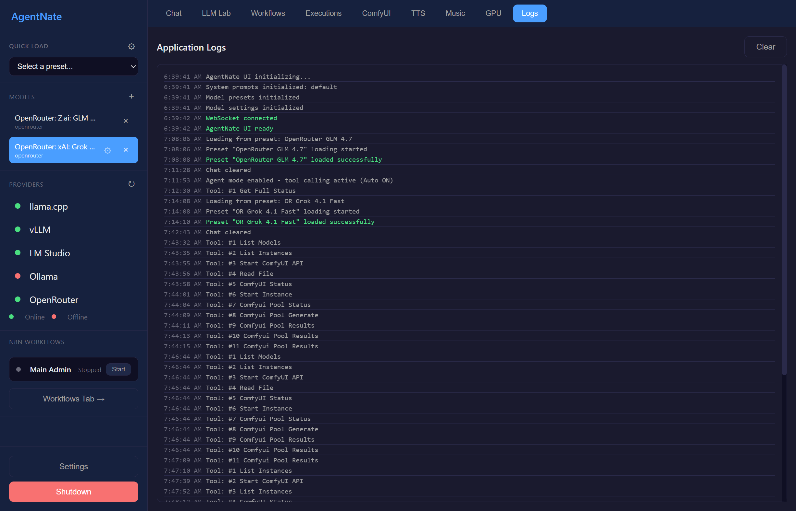

The Logs tab shows real-time application logs including:
- API requests and responses
- Model loading/unloading events
- Agent tool execution results with timing
- ComfyUI generation events
- TTS/Music generation progress
- Error traces with full stack details

**Debug log files** (for deep investigation):
| File | Content |
|------|---------|
| Terminal output | Main server logs (FastAPI, uvicorn) |
| `.n8n-instances/debug.log` | n8n proxy request/response logs |
| `.n8n-instances/tts-debug.log` | TTS server subprocess output + proxy logs |
| `.n8n-instances/music-debug.log` | Music server subprocess output + proxy logs |

### Port Reference

| Service | Default Port | Configurable |
|---------|-------------|-------------|
| AgentNate Server | 8000 | Via `run.py --port` |
| n8n Admin | 5678 | Via Settings |
| ComfyUI Instances | 8188+ | Per-instance |
| ComfyUI API | 5000 | Via config |
| TTS Gateway | 8100 | In tts_manager |
| Music Gateway | 9150 | In music_manager |
| LM Studio | 1234 | LM Studio settings |
| Ollama | 11434 | Ollama config |

### Getting Help

- **GitHub Issues**: [github.com/rookiemann/AgentNate/issues](https://github.com/rookiemann/AgentNate/issues)
- **Codebase Guide**: Switch to the Codebase Guide persona and ask questions about how the system works
- **API Docs**: Visit `http://127.0.0.1:8000/docs` for interactive Swagger API documentation
- **ReDoc**: Visit `http://127.0.0.1:8000/redoc` for an alternative API documentation format
- **This Manual**: `E:\AgentNate\manual\AgentNate-Manual.md` — the document you're reading now

---

## Quick Reference Card

### Essential Commands

```bash
# Start AgentNate
cd E:\AgentNate && python\python.exe run.py --mode server

# Start with browser auto-open
python\python.exe run.py --mode browser

# Start on custom port with LAN access
python\python.exe run.py --mode server --host 0.0.0.0 --port 9000
```

### Key URLs

| URL | Purpose |
|-----|---------|
| `http://127.0.0.1:8000` | AgentNate main UI |
| `http://127.0.0.1:8000/docs` | Swagger API docs |
| `http://127.0.0.1:8000/redoc` | ReDoc API docs |
| `http://127.0.0.1:8000/v1/models` | OpenAI-compatible model list |
| `http://127.0.0.1:5678` | n8n admin UI |

### Common API Calls

```bash
# Load a model
curl -X POST http://127.0.0.1:8000/api/models/load \
  -H "Content-Type: application/json" \
  -d '{"provider": "openrouter", "model": "grok-4.1-fast"}'

# List loaded models
curl http://127.0.0.1:8000/api/models/loaded

# Check system health
curl http://127.0.0.1:8000/api/health

# GPU status
curl http://127.0.0.1:8000/api/gpu

# Agent chat (single request)
curl -X POST http://127.0.0.1:8000/api/tools/agent/chat \
  -H "Content-Type: application/json" \
  -d '{"message": "What tools do you have?", "conversation_id": "demo"}'

# Generate speech
curl -X POST http://127.0.0.1:8000/api/tts/generate/xtts \
  -H "Content-Type: application/json" \
  -d '{"text": "Hello world", "voice": "Daisy Studious", "output_format": "wav"}'

# Generate music
curl -X POST http://127.0.0.1:8000/api/music/generate/ace_step_v1.5 \
  -H "Content-Type: application/json" \
  -d '{"prompt": "upbeat electronic track", "duration": 30}'
```

### Keyboard Shortcuts

| Shortcut | Action |
|----------|--------|
| `Enter` | Send message (chat) / Start comparison (LLM Lab) |
| `Shift+Enter` | New line in message input |

---

## 28. Acknowledgments

AgentNate stands on the shoulders of an incredible open-source community. Every feature in this platform exists because talented people around the world chose to share their work freely. From the inference engines that power local AI to the generative models that create images, speech, and music — none of this would be possible without them. This section is a heartfelt thank-you to every project and team that makes AgentNate what it is.

### Core Infrastructure

| Project | Role in AgentNate | Link |
|---------|-------------------|------|
| **n8n** | The backbone — workflow automation engine, instance management, marketplace. The "Nate" in AgentNate | [github.com/n8n-io/n8n](https://github.com/n8n-io/n8n) |
| **FastAPI** | Backend web framework powering the REST API and WebSocket streaming | [github.com/tiangolo/fastapi](https://github.com/tiangolo/fastapi) |
| **Uvicorn** | ASGI server running the FastAPI application | [github.com/encode/uvicorn](https://github.com/encode/uvicorn) |
| **Pydantic** | Data validation and serialization for all API models | [github.com/pydantic/pydantic](https://github.com/pydantic/pydantic) |
| **Python** | Embedded runtime (3.14.2 main, 3.10.6 for vLLM) | [python.org](https://python.org) |
| **Node.js** | Embedded runtime for n8n | [nodejs.org](https://nodejs.org) |

### LLM Inference Engines

| Project | Role in AgentNate | Link |
|---------|-------------------|------|
| **llama.cpp** | Local GGUF model inference via subprocess workers | [github.com/ggerganov/llama.cpp](https://github.com/ggerganov/llama.cpp) |
| **llama-cpp-python** | Python bindings for llama.cpp | [github.com/abetlen/llama-cpp-python](https://github.com/abetlen/llama-cpp-python) |
| **vLLM** | High-throughput inference with PagedAttention and continuous batching | [github.com/vllm-project/vllm](https://github.com/vllm-project/vllm) |
| **Ollama** | Managed local LLM serving with automatic model downloads | [github.com/ollama/ollama](https://github.com/ollama/ollama) |
| **LM Studio** | Desktop LLM application with SDK and API | [lmstudio.ai](https://lmstudio.ai) |
| **OpenRouter** | Cloud API aggregating 100+ models from multiple providers | [openrouter.ai](https://openrouter.ai) |

### Image Generation

| Project | Role in AgentNate | Link |
|---------|-------------------|------|
| **ComfyUI** | Node-based image/video generation framework — instance pool, model registry, gallery | [github.com/comfyanonymous/ComfyUI](https://github.com/comfyanonymous/ComfyUI) |
| **ComfyUI-Manager** | Custom node pack manager for ComfyUI | [github.com/ltdrdata/ComfyUI-Manager](https://github.com/ltdrdata/ComfyUI-Manager) |
| **Stable Diffusion** | SD 1.5, SD 2.1, SDXL, SDXL Turbo — core image generation architectures | [github.com/CompVis/stable-diffusion](https://github.com/CompVis/stable-diffusion) |
| **Stability AI** | Stable Diffusion XL, SD3, Stable Video Diffusion, Stable Audio Open | [stability.ai](https://stability.ai) |
| **Black Forest Labs** | Flux.1 and Flux 2 image generation models | [blackforestlabs.ai](https://blackforestlabs.ai) |
| **HunyuanVideo** | Tencent video generation model | [github.com/Tencent/HunyuanVideo](https://github.com/Tencent/HunyuanVideo) |

### Text-to-Speech Models

| Project | Creator | Link |
|---------|---------|------|
| **Kokoro 82M** | hexgrad | [huggingface.co/hexgrad/Kokoro-82M](https://huggingface.co/hexgrad/Kokoro-82M) |
| **XTTS v2** | Coqui AI | [github.com/coqui-ai/TTS](https://github.com/coqui-ai/TTS) |
| **Dia 1.6B** | Nari Labs | [huggingface.co/nari-labs/Dia-1.6B-0626](https://huggingface.co/nari-labs/Dia-1.6B-0626) |
| **Bark** | Suno | [github.com/suno-ai/bark](https://github.com/suno-ai/bark) |
| **Fish Speech** | Fish Audio | [github.com/fishaudio/fish-speech](https://github.com/fishaudio/fish-speech) |
| **Chatterbox** | Resemble AI | [huggingface.co/ResembleAI/chatterbox](https://huggingface.co/ResembleAI/chatterbox) |
| **F5-TTS** | SWivid | [github.com/SWivid/F5-TTS](https://github.com/SWivid/F5-TTS) |
| **Qwen2-Audio** | Alibaba Qwen Team | [huggingface.co/Qwen/Qwen2-Audio](https://huggingface.co/Qwen/Qwen2-Audio) |
| **Whisper** (verification) | OpenAI | [github.com/openai/whisper](https://github.com/openai/whisper) |

### Music Generation Models

| Project | Creator | Link |
|---------|---------|------|
| **ACE-Step** | ACE-Step Team | [github.com/ace-step/ACE-Step](https://github.com/ace-step/ACE-Step) |
| **MusicGen** | Meta (AudioCraft) | [github.com/facebookresearch/audiocraft](https://github.com/facebookresearch/audiocraft) |
| **Riffusion** | Riffusion | [github.com/riffusion/riffusion](https://github.com/riffusion/riffusion) |
| **Stable Audio Open** | Stability AI | [github.com/Stability-AI/stable-audio-tools](https://github.com/Stability-AI/stable-audio-tools) |
| **HeartMuLa** | HeartLib | [github.com/heartlib/HeartMuLa](https://github.com/heartlib/HeartMuLa) |
| **DiffRhythm** | ASLP Lab | [github.com/ASLP-lab/DiffRhythm](https://github.com/ASLP-lab/DiffRhythm) |
| **YuE** | Multimodal Art Projection | [github.com/multimodal-art-projection/YuE](https://github.com/multimodal-art-projection/YuE) |
| **LAION CLAP** (scoring) | LAION | [github.com/LAION-AI/CLAP](https://github.com/LAION-AI/CLAP) |

### Deep Learning & ML Frameworks

| Project | Role in AgentNate | Link |
|---------|-------------------|------|
| **PyTorch** | Deep learning framework powering all local models | [pytorch.org](https://pytorch.org) |
| **HuggingFace Transformers** | Model architectures and tokenizers | [github.com/huggingface/transformers](https://github.com/huggingface/transformers) |
| **HuggingFace Diffusers** | Diffusion model pipelines | [github.com/huggingface/diffusers](https://github.com/huggingface/diffusers) |
| **HuggingFace Hub** | Model downloads and management | [github.com/huggingface/huggingface_hub](https://github.com/huggingface/huggingface_hub) |
| **tiktoken** | Token counting for context management | [github.com/openai/tiktoken](https://github.com/openai/tiktoken) |

### Web, Search & Scraping

| Project | Role in AgentNate | Link |
|---------|-------------------|------|
| **aiohttp** | Async HTTP client for provider communication | [github.com/aio-libs/aiohttp](https://github.com/aio-libs/aiohttp) |
| **httpx** | Modern HTTP client for ComfyUI pool, GGUF downloads, and APIs | [github.com/encode/httpx](https://github.com/encode/httpx) |
| **Playwright** | Browser automation for web scraping agent tools | [github.com/microsoft/playwright-python](https://github.com/microsoft/playwright-python) |
| **BeautifulSoup4** | HTML parsing for web content extraction | [crummy.com/software/BeautifulSoup](https://www.crummy.com/software/BeautifulSoup/) |
| **Trafilatura** | Web page content extraction | [github.com/adbar/trafilatura](https://github.com/adbar/trafilatura) |
| **DuckDuckGo Search** | Free web search without API keys | [github.com/deedy5/duckduckgo_search](https://github.com/deedy5/duckduckgo_search) |

### Audio Processing

| Project | Role in AgentNate | Link |
|---------|-------------------|------|
| **FFmpeg** | Audio/video format conversion | [ffmpeg.org](https://ffmpeg.org) |
| **noisereduce** | Spectral gating denoising for TTS/music pipeline | [github.com/timsainb/noisereduce](https://github.com/timsainb/noisereduce) |
| **pyloudnorm** | LUFS loudness normalization | [github.com/csteinmetz1/pyloudnorm](https://github.com/csteinmetz1/pyloudnorm) |
| **pydub** | Audio processing and silence detection | [github.com/jiaaro/pydub](https://github.com/jiaaro/pydub) |
| **scipy** | Highpass filters, compression, EQ | [scipy.org](https://scipy.org) |
| **NumPy** | Array processing for audio and ML | [numpy.org](https://numpy.org) |
| **espeak-ng** | Phoneme synthesis for DiffRhythm | [github.com/espeak-ng/espeak-ng](https://github.com/espeak-ng/espeak-ng) |

### Community & Workflow Resources

| Project | Contribution | Link |
|---------|-------------|------|
| **Zie619/n8n-workflows** | 4,300+ curated n8n workflow templates — key inspiration for the marketplace integration | [github.com/Zie619/n8n-workflows](https://github.com/Zie619/n8n-workflows) |
| **n8n Community** | Official workflow template marketplace | [n8n.io/workflows](https://n8n.io/workflows) |

### Utilities

| Project | Role | Link |
|---------|------|------|
| **tqdm** | Progress bars for downloads | [github.com/tqdm/tqdm](https://github.com/tqdm/tqdm) |
| **PyYAML** | Configuration parsing | [github.com/yaml/pyyaml](https://github.com/yaml/pyyaml) |
| **GitPython** | Git operations for model cloning | [github.com/gitpython-developers/GitPython](https://github.com/gitpython-developers/GitPython) |
| **lxml** | XML/HTML processing | [github.com/lxml/lxml](https://github.com/lxml/lxml) |

---

*Thank you to every contributor, maintainer, and community member behind these projects. AgentNate is a love letter to the open-source AI ecosystem — built by one person with an AI assist, made possible by thousands.*

---

*AgentNate v2.0 — Local AI Orchestration Platform*
*Built with FastAPI, n8n, ComfyUI, and vanilla JavaScript*
*89 screenshots | 28 sections (26 + Quick Reference + Acknowledgments) | ~4,010 lines*
